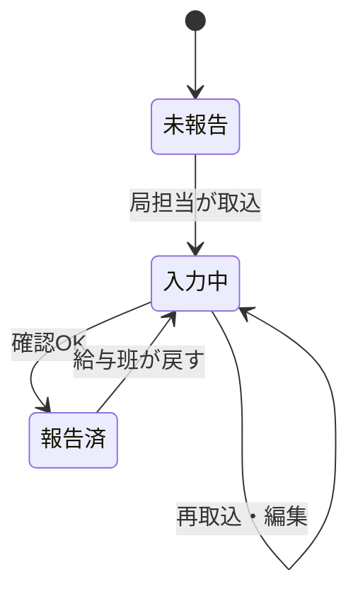

# SCR-003 勤務時間報告・Excel取込 設計候補（2026-09-29）
対象: StaffMaster-Automation-Test / App ID `204a48dc-7f23-43dd-b934-4654a3cfa306`。変更要求 `CHANGE-20260929-SCR003-ATTENDANCE-IMPORT`。正式実装の公開版検証前であり、実装済みとは記さない。

## 確定した業務条件
- 画面右上「Excel取込」→添付モーダル→「取込実行」。Excelは架空の `勤務時間報告書_テストデータ.xlsx`、`テストデータ` シート、Excelテーブル `TestData`、20列10行を正の入力例とする。
- 報告状態の単位は局×勤務月。新規取込時は「入力中」。局担当者は入力中の明細を編集し、確認ダイアログのOKで「報告済」。通知なし。報告済の取込・局担当者の編集は不可。給与班のみ「入力中」へ戻す。
- 入力中の再取込は同じ局×勤務月の明細を全件置換する。報告済には適用しない。
- 給与班は全局を閲覧し、局担当者は自局を閲覧。非常勤職員は画面到達・データ取得とも禁止。他局の一覧行を押した局担当者には権限なしと表示し、旧選択データを消す。
- 左の局×勤務月一覧はSCR-002型の開閉領域。右は報告書のヘッダ・明細。勤務期間は勤務月の1日から月末まで。課室はその報告の明細に存在する課室名から選び、既定の「すべて」で全課室、個別選択で該当課室だけ表示する。
- 勤務月はSCR-006で会計課給与班が報告対象=trueに設定した月だけ選べる。SCR-006の当該機能は未実装で、今回の変更の依存範囲。
- 職員番号は12桁数字の文字列。数値由来の短い番号は意味が明確な場合に左0埋めし、原本に12桁文字列があればそのまま保持。欠勤時間は0以上の整数。超過勤務時間の0は小数を出さず「0」。非0は最大3桁の小数を表示。

## データ境界
[列契約](../../config/dataverse/scr003-attendance-columns.json)に、局×勤務月の報告ヘッダ、課室・氏名・時間を持つ明細、報告対象月の3表を分ける。テストExcelは局×勤務月が共通だが、課室と所属長は複数あるため、所属課室名・所属長氏名・勤務時間管理員氏名は**明細側**に置く。課室「すべて」では明細ごとの値を表示し、単一の課室ヘッダを捏造しない。勤務月・所属局の一致、行番号と職員番号の重複、必須と桁数、整数・小数、日数・時間上限、報告対象月、アカウント所属局を保存前に照合する。

保存処理は、入力Excelの全行を解析・検証した後、同じ局×勤務月の入力中報告を一回の要求として全件置換する。途中失敗で旧明細を消したまま成功表示しないため、サーバー側の原子性または旧版保持・復旧を必要条件とする。Canvasの行単位Patch+削除だけではこの条件を満たさない。二重実行・同時編集では報告版を照合して競合を拒否する。報告済への直接Dataverse更新を画面非活性だけに依存させない。

## 画面状態とテスト条件

| ケース | 独立期待値 |
|---|---|
| 正常初回 | 10行、職員番号000000000001～010、5課室の値を保持し、入力中。勤務期間2026-08-01～31。 |
| 再取込 | 入力中の旧明細を全件置換し、旧行が残らず新行だけを表示。重複行を増やさない。 |
| 表示 | 「すべて」では局内の全課室、課室指定でその行だけ。超過勤務0は「0」、33.167は33.167、欠勤時間は整数。 |
| 報告 | 局担当の確認OKで局×月全体を報告済にし、局担当の編集・取込不可。キャンセルでは入力中を維持。 |
| 戻し | 給与班のみ入力中へ戻せる。戻した操作の主体・時刻を保持。 |
| 権限 | 給与班は全局、局担当は自局、他局選択は権限なし、非常勤職員は画面・Dataverseとも拒否。直接アクセスも試験。 |
| 失敗 | 対象外月、異局データ、列不足・型誤り、職員番号不正、重複、報告済・同時更新、フロー失敗では既存の報告・明細を維持。 |

## 残る実装上の確認
1. **アカウント→局・給与班の権威ある対応**。Entraの属性名（例: department）だけでなく、実際の値、複数局兼務、給与班を示すグループ／Dataverseロール、局担当アカウントの試験主体を特定し、Dataverseの行単位アクセスまで照合する。確認用所属UIは使わない。
2. SCR-006の報告対象月を誰が追加・無効化し、既に入力中／報告済の月を無効化した際の扱い。表示だけなら既存報告は残す候補。
3. 報告済から戻す際の理由入力、監査履歴と再報告の運用。少なくとも主体・日時・版を保持する候補。
4. 添付Excelの「所属部局名」がログイン者の局と一致するかを名称のみで判定せず、権威ある局識別子へ対応付ける方法。テスト値「秘書課」は架空例として扱う。

実環境のMakerテーブル検索では「勤務時間」0件、「報告」0件、「勤務」2件（給与勤務条件と_STUDIOのみ）。新規表として扱う。元の正式マスタや既存行は変更しない。PoCの `ImportPoCTest` は別契約であり正式入力に流用しない。
