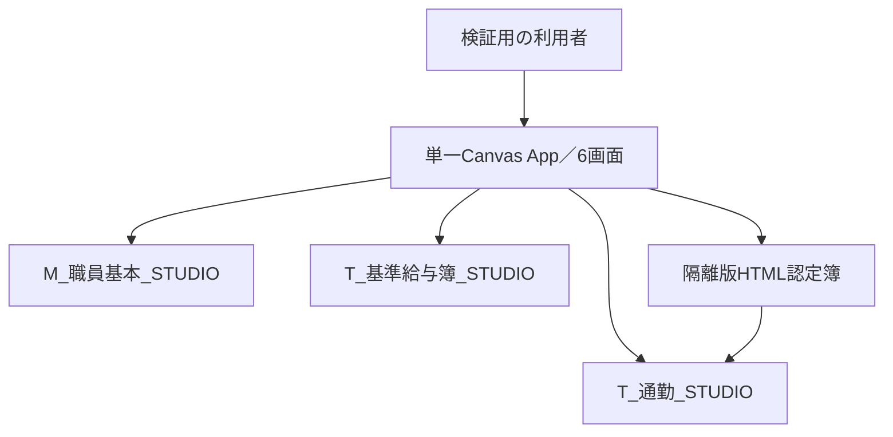

# 基本設計書 v1.11

> 主対象：現行の単一編集・公開アプリ（旧版・ハンドメイド向けの設計履歴を併録）

本書は旧v1.11・v1.14の設計と、現行の単一アプリ向けに承認されたSCR-002軽量化設計を収録する。承認済みの設計と現行アプリへの実装・公開・受入は別の状態である。

現行要件IDから基本設計・詳細設計・試験の対応と不足箇所は[要件・設計・試験対応表](../requirements/traceability-matrix.md)を参照する。

非機能の既定条件と未決の目標値は[非機能要件・判定基準整理](../requirements/non-functional-requirements.md)を参照する。以下の全体構成・データの流れは設計上の関係であり、公開Playerでの全経路の動作確認を意味しない。

## 適用区分と参照順

| 区分 | 本書の節 | 扱い |
|---|---|---|
| 現行の構成整理と承認済み設計 | 「現行アプリの全体構成」「軽量化後の構成」「現行画面の機能・状態・データ境界」「軽量化後の配置」「職員検索サイドバー」 | 全体構成は確認できた接続・未設計の境界を示す。SCR-002の承認済み設計は2026-09-24時点。2026-09-25の[画面要件9.7・9.8](../requirements/screen-requirements.md#97-画面表示編集の追加要件2026-09-25確定)と異なる操作・表示は画面要件を優先する。本版の機能・状態設計はその追加要件を反映した設計であり、実機実装確認とは区別する。 |
| 旧版の設計・回帰根拠 | 「構成」「配置」「状態と実装」「v1.11の具体化」「自動テストアプリv1.14の配置」 | 内蔵データ、Canvas認定簿PDF・モーダル、旧給与詳細、固定サマリー、TSV、差分配布の当時の設計。旧版を現行アプリへの実装指示として適用しない。 |
| 将来の検討事項 | 狭幅での1列化、本番用のデータ・権限への切替等 | 旧版の「追加対応候補」を今回の実装済み機能または完成条件にしない。 |

現行アプリは[単一アプリ運用](../operations/single-app-workflow.md)のApp ID `204a48dc-7f23-43dd-b934-4654a3cfa306`で、`_STUDIO`隔離データと隔離版HTMLを参照する。公開PlayerとGitHub設計の一致、試験・残件は[STATUS](../handoff/STATUS.md)で別途確認する。旧S01～S04と新S01～S01-Pの画面領域IDは異なる版の定義であり、同時に配置する指示ではない。

## 構成

> **旧版履歴：** v1.11の内蔵データ、旧Canvas認定簿、TSVに基づく構成。旧版の回帰根拠として保持する。

キャンバス画面が埋込テストデータを参照し、検索結果と選択を保持。履歴は職員番号で参照。PDFは認定簿専用領域から生成し、保存のみ任意接続のPower Automateを使用。旧LiveData/HTMLホスト/JavaScriptは移植しない。

| ID | 画面領域 | 内容 |
|---|---|---|
| S01 | 職員検索 | 紺ヘッダー、開閉可能な左検索/一覧、残幅へ伸縮する右詳細 |
| S02 | 認定簿モーダル | 2枚縦並び、PDF作成・保存・閉じる |
| S03 | 基準給与簿詳細 | 全項目と出力 |
| S04 | 出力ダイアログ | 現行TSVコピー。XLSXとの差を説明 |

右側は基本情報→給与・勤務条件→通勤支給予定→社会保険→住民税→税・固定控除→基準給与簿の順。
基本情報9項目は職員番号、氏名、組織正式名称、略称、生年月日、性別、採用日、退職日、在籍状態。生成画像の6項目に削減しない。

## 軽量化後の構成

> **現行の承認済み設計：** 旧「構成」のCanvasモーダル・固定給与詳細に代わるSCR-002の構成。画面要件9.7の追加事項は優先して参照する。

| ID | 画面領域 | 内容 |
|---|---|---|
| S01 | `scrStaffMasterSearch` | 左に開閉式の検索・職員一覧、右に選択職員サマリーと6タブ。旧`Screen1`の改名先 |
| S01-D | 共通詳細領域 | 基本情報、勤務条件、通勤の選択レコード詳細、社会保険、税固定控除を共通ギャラリーで2列表示。履歴区分は一覧選択＋選択レコード詳細 |
| S01-C | 通勤タブ | 認定レコード一覧、選択状態、HTML認定簿起動。帳票本体は別タブHTML |
| S01-P | 基準給与簿 | 163項目を縦、選択した開始月～終了月内の登録済み給与レコードを横列で動的表示。同月の複数レコードは別列。SCR-005支給明細とは別機能 |

タブは「基本情報」「勤務条件」「通勤」「社会保険」「税固定控除」「給与簿」の順とする。6個の完成パネルを非表示で重ねず、共通のタブ、履歴一覧、詳細ギャラリーをデータで切り替える。通勤の帳票表示は、認定レコード選択後に別ブラウザータブの正式HTMLを開く。

Canvas内の旧認定簿2ページ、PDFViewer、PDF生成・保存、旧PoC入口、給与163項目固定モーダル、非表示住民税領域は軽量化実装時に正式機能版から除去する。旧ソースと検証記録はGit履歴・検証資料として保持する。

## 現行アプリの全体構成

> **接続先と設計範囲の整理：** [単一アプリ運用](../operations/single-app-workflow.md#対象)で確認したApp ID、環境、隔離接続先を基準とする。画面要件のうち実装・接続が未確認の部分は、実装済みとして図に補わない。[ガイド第7章の基本設計の構成例](https://www.digital.go.jp/assets/contents/node/basic_page/field_ref_resources/e2a06143-ed29-4f1d-9c31-0f06fca67afc/0af5ce68/20260715_resources_standard_guidelines_guideline_05.pdf)にいう全体図・データの流れ・機能とデータの対応を、このアプリ向けに整理する。

図の矢印は**接続・設計上のデータ経路**で、各画面の全操作・権限検査・公開版との一致を示す実測結果ではない。SCR-002からHTMLへは選択した通勤レコードのGUIDを渡し、HTML側で隔離データを再取得する設計。帳票はブラウザーの印刷からA4横2ページ・1PDFとし、Canvas内の旧PDFViewerや自動PDF格納フローを現行構成へ戻さない。GitHubの設計文書・ソース・試験fixtureは版管理／投入候補の保管場所であり、GitHubの文書更新がDataverseや公開アプリに自動で同期する経路ではない。

### 画面・機能とデータの流れ

| 画面・機能 | 入力／取得 | 処理・出力と境界 | 設計状態 |
|---|---|---|---|
| SCR-001 ホーム | ログイン者の情報、確認用所属・権限 | 各画面への遷移。確認用の所属切替だけで実際の閲覧権限を拡張しない。 | ログイン属性・管理者区分の取得元とサーバー側権限判定は[画面要件5・6章](../requirements/screen-requirements.md#5-権限制御)で未定義。 |
| SCR-002 検索・詳細 | `M_職員基本_STUDIO`から職員番号12桁文字列をキーに職員を検索し、選択職員の通勤・給与簿を各`_STUDIO`テーブルから取得する設計。 | 検索0件・別職員選択では以前の詳細・認定GUID・給与値を破棄。取得失敗時は旧職員の値や時刻を新しい取得結果として表示しない。 | [詳細設計10.1・10.6](detailed-design.md#10-scr-002軽量化設計2026-09-24)。現行の検索試験には[FAIL／BLOCKED](../testing/current-app-search-observation.md)がある。 |
| SCR-002 通勤・認定簿 | 選択した認定GUIDと選択職員・通勤親の照合。 | GUIDを隔離HTMLへ渡し、HTMLが権限・GUIDを確認して隔離Dataverseを再読取り。画面内PDF生成ではない。 | [詳細設計10.4](detailed-design.md#104-通勤html)。HTML側のアクセス条件・PDF実測は別に確認。 |
| SCR-002 給与簿 | `T_基準給与簿_STUDIO`の選択職員・指定年月の登録済み行。 | 163項目×取得した行GUIDの列を表示。未登録月を列にせず、同月複数行、0／負値／NULLを区別する。 | [詳細設計10.5](detailed-design.md#105-基準給与簿163項目動的支給月)。この画面からの給与簿書込みは要件で禁止。 |
| SCR-002 編集 | 基本情報・勤務条件・通勤・社会保険・税固定控除の選択値と所属権限。 | [画面要件9.7](../requirements/screen-requirements.md#97-画面表示編集の追加要件2026-09-25確定)は変更分保存→再取得、失敗時の入力保持・破棄確認を要求。 | 勤務・社会保険・税固定控除の現行テーブル、保存先とトランザクション、権限検査の詳細は未設計。接続済み3表があるだけで編集可能と判断しない。 |
| SCR-003／004／006 | 画面一覧と遷移は[画面要件1～3章](../requirements/screen-requirements.md#1-画面一覧)。 | 勤務時間報告／期末勤勉支給率／メンテナンスの内部入出力は画面一覧からは確定できない。 | 各機能のデータ取得・更新元、書込み可否を後続で定義。 |
| SCR-005 支給明細 | 選択職員番号・支給対象月をSCR-002と受渡し。[画面要件8章](../requirements/screen-requirements.md#8-scr-005-支給明細画面canvas-ui作成要件)は内蔵仮例での再計算・表示を定義。 | 試算表示のみで保存・確定・支払実行をしない。SCR-002の163項目の基準給与簿と混同しない。 | 現行単一アプリにおける計算用データの取得元・実装状態は未照合。隔離の給与簿テーブルから実額を自動計算すると推定しない。 |

### データモデルと更新範囲（CRUD）

`R`＝参照の設計／既存接続、`U要件`＝更新の要求はあるが保存経路・公開版での成立は未確認、`—`＝当該機能からの操作を求めない、`?`＝取得・更新元を未定義。`—`は他機能も含むテーブル全体の操作禁止を意味しない。表は**画面機能×データ群**の整理であり、全列の物理データ辞書、権限表、実アプリの操作ログではない。

| 機能 | 職員基本 `_STUDIO` | 通勤 `_STUDIO` | 基準給与簿 `_STUDIO` | その他の勤務・保険・税／試算 |
|---|---|---|---|---|
| SCR-002 検索・基本詳細 | R | — | — | ? |
| SCR-002 通勤一覧・HTML表示 | R（親の照合） | R（Canvas・HTMLの再取得） | — | — |
| SCR-002 給与簿 | R（職員選択） | — | R（163項目・行GUID） | — |
| SCR-002 編集・保存 | U要件（対象項目・権限の精査要） | U要件（認定行の指定要） | —（読取専用） | U要件、保存先・接続は未定義 |
| SCR-005 仮例の試算表示 | ?（選択職員の参照元） | ?（通勤額の根拠） | —（163項目の給与簿とは別） | R要件（内蔵仮例。現行実装は未照合） |
| SCR-003／004／006 | ? | ? | ? | ? |

職員1件に通勤・基準給与簿が各0..N件という論理関係は[職員基本テーブル設計](dataverse-staff-basic.md)、[通勤テーブル設計](dataverse-commute.md#親子関係)、[給与簿テーブル設計](dataverse-payrollledger.md#テーブルと関係)を参照する。親の職員番号は12桁文字列、子レコード識別はGUIDであり、氏名一致や同月1行の仮定で結合しない。リンク先の元テーブルの論理名・権限・fixture件数を、隔離`_STUDIO`テーブルの実測定義として無検証で流用しない。現行3テーブルの列型・参照・権限と投入データは環境側から別途読戻して確定する。更新時の `C`／`D` は本表の画面要件からは確定できず、本整理だけで新規作成・削除を許可しない。

残件は、ログイン属性と所属制限の実装位置、SCR-002の5区分編集の更新先・再取得・ロール、SCR-003／004／006とSCR-005の詳細データ、隔離HTMLの権限と公開版、現行3テーブルの物理データ辞書である。未設計箇所を埋める際は[要件・設計・試験対応表](../requirements/traceability-matrix.md)の行と試験選定を更新する。

## 現行画面の機能・状態・データ境界

この節は[画面要件](../requirements/screen-requirements.md)を画面・機能間の責務に割り当てる基本設計である。**要求された設計**と**公開アプリで実測された実装**を同一視しない。[専用利用者の検索FAIL／結合BLOCKED](../testing/current-app-search-observation.md)と[所有者Playerの部分照合](../verification/current-app-player-20260926.md)は条件が異なり、他の機能のPASSを意味しない。

### 画面要件1～5章の追跡単位

| 要件ID | 基本設計の割付 | 未確定の境界 |
|---|---|---|
| `COMMON-SCREEN-001` | SCR-001はホーム、SCR-002は検索詳細、SCR-003は勤務、SCR-004は支給率、SCR-005は支給明細、SCR-006は管理者用メンテナンス。外部Microsoft認証をCanvasの内部画面数に含めない | SCR-003／004／006の画面内業務機能は未要件定義 |
| `COMMON-NAV-001` | ホームから画面名の入口でSCR-002～006へ進む5経路を設ける | SCR-006のみ管理者判定が必要 |
| `COMMON-NAV-002` | SCR-002～006の各画面から「ホーム」で戻る5経路を設ける | SCR-006は管理者での到達を前提に確認 |
| `COMMON-NAV-003` | SCR-002とSCR-005が職員番号・対象月を伴って双方向に遷移する。対象の存在と所属を遷移先で再確認する | SCR-002側のボタン名・操作方法は要件未定 |
| `COMMON-CONTEXT-001` | ログイン職員の氏名・メールは画面を越えて同一のログイン主体として保持 | 属性の権威ある取得元は未定 |
| `COMMON-CONTEXT-002` | 選択した非常勤職員番号・対象月はSCR-002／005で保持。ログイン者の属性と別の状態とする | 未選択時は無関係な職員を自動選択しない |
| `COMMON-AUTH-001` | 所属部署の一致を検索、一覧、対象読取り、編集、職員を伴う遷移の各境界で確認。管理者でも所属制限の例外を設けない | 属性取得元、Dataverseでの実効権限と更新先は未決 |
| `COMMON-AUTH-002` | SCR-006入口は管理者だけ有効。画面への遷移時にも管理者判定を行う | 管理者属性取得元とサーバー側認可は未決。確認用UIは権限を与えない |

本表は既存の画面要件に追跡IDを付けた機能・状態の割付であり、認証方式や業務画面の未決項目を補完したことにはしない。

| 機能群・要件ID | 画面責務と受渡し | データ・権限・未確定境界 |
|---|---|---|
| ホーム・認証・権限（`SCR001-UI-001`・`002`、画面要件1～5章） | SCR-001の上部からSCR-002～006へ遷移。確認用所属選択はスマホでも操作可能とし、表示切替と権限判定を分離。サインインの外部画面はCanvasの内部画面とみなさない。 | ログイン者の氏名・メールと対象職員の氏名・番号を別状態に保持する。所属・管理者属性の権威ある取得元／権限検証方法は未決であり、確認用の所属値やボタン非表示を認可根拠にしない。 |
| 共通業務領域（`COMMON-LAYOUT-001`） | SCR-001～006の親領域に共通比率4:56:4／2:26:2を適用。画面ごとの余白定数の複製を避ける。 | 900～1920幅・200％拡大・大きな文字では実表示幅を計測し、内容は折返し／必要な横移動で到達させる。外枠を操作する設計ではない。実機可読性は未受入。 |
| 検索・履歴・詳細（`SCR002-LT-*`、`SCR002-UI-001`～`010`） | 検索結果から12桁文字列キーの職員を選び、右側の6タブ・選択履歴と共通2列詳細を更新。初回／F5／職員切替／保存成功時の取得とタブ切替だけの表示変更を分離。 | 選択職員を変える際、旧詳細・認定GUID・給与値・取得時刻を新しい結果として残さない。検索0件・権限拒否・通信失敗の状態を区別。検索実測の不一致は未解消。 |
| 通勤HTML（`SCR002-COM-*`） | 通勤タブで認定行を選び、選択職員・親職員・認定GUIDを照合して隔離HTMLを別タブに開く。HTMLが同GUIDで再読取りし、ブラウザー印刷で1PDFとする。 | 保存・公開済みHTMLの隔離先とアクセス権を別に読戻す。Canvas旧認定簿、PDFViewer、旧PoCを現行版へ再投入しない。帳票の同一性・2ページは実機判定を要する。 |
| 給与簿閲覧（`SCR002-PAY-*`） | 163項目の縦方向と、指定年月に登録された行GUIDごとの動的列。開始・終了それぞれのカレンダーを入力欄の隣に置き、本文の縦スクロールで末尾へ到達する。 | 支給年月日の空欄・解釈不能を例外として見せる。0とNULLを区別し、同月複数行を別列にする。給与簿の書込みはSCR-002から行わない。 |
| 編集・保存（`SCR002-EDIT-*`） | 初期は読取り。編集可能な5区分だけの入力をタブを越えて保持し、未保存変更を失う遷移と読取り切替には続行／取消の確認を挟む。保存成功は対象レコード再取得後に読取りへ戻し、失敗時は入力を保持する。 | 基本情報・通勤は隔離3表との対応を確認する必要がある。勤務・社会保険・税固定控除の永続化先／各編集列は未設計のため、UI表示のみで保存成功にしない。権限は更新対象レコード単位で再検証し、給与簿には書込まない。 |
| 支給明細試算（`SCR005-UI-*`・`CALC-*`・`ACT-*`） | SCR-002との職員番号・対象月の受渡し、内蔵仮例の入力検証→計算→表示。固定ヘッダー・対象操作・サマリーとスクロール本文を分離する。支給／控除は独立開閉。 | アプリ内蔵の試作データだけを対象とし、Dataverseへの登録・更新・確定・支払は行わない。実データの計算根拠・端数規則は未確定。欠落と登録済み0円を区別し、対象変更時の旧結果を無効化する。 |
| SCR-003／004／006 | ホームとの遷移・管理者ボタンの制御は画面要件1～5章へ対応。 | 画面内の業務入力、データ源、作成・更新・削除の範囲は未要件定義。アプリに画面があることから業務機能や権限を推定しない。 |

### 画面間受渡しと未保存変更の境界

| 操作 | 基本設計の状態遷移 | 成立しない場合 |
|---|---|---|
| SCR-002で職員を選ぶ／SCR-005へ移る | 編集差分があれば破棄確認を先行し、承諾したときだけ次の対象へ切り替える。所属制限を判定し、職員番号・必要な対象月だけを引き継ぐ。 | 取消時は元職員・元タブ・編集差分を保持。権限不一致は対象データを表示せず、旧職員の値を引継ぎ先の値に見せない。 |
| SCR-005で戻る／対象月を変える | 職員番号・対象月を受け手で再検証。対象・入力登録版が変われば旧計算結果を破棄し、再計算まで未計算表示とする。 | 未選択・未登録・権限拒否では無関係な職員を自動選択しない。計算不能を0円へ置換しない。 |
| SCR-002で保存する | 対象職員・選択履歴行・所属と編集可能な列を再確認し、成功後の再取得完了をもって画面を読取りへ戻す。 | 更新先や権限が未整備なら成功表示を禁止。失敗時は入力と選択を維持し、再試行・中止の判断を促す。 |

### SCR-005 試算の入力・出力境界

[画面要件8.3～8.6](../requirements/screen-requirements.md#83-計算集計と表示の分離)にある勤務日別・月登録・通勤認定・控除・職員基本の内蔵データを対象職員番号＋対象月で結ぶ。勤務日の重複、欠勤単価未設定、通勤・控除欠落、対象外所属を計算前に検出する。計算結果は固定額、欠勤減額、俸給、通勤、給与総額、社会保険料計、控除額計、現金支給額の**一つの表示用結果**として保持し、各UIで値を再計算しない。未丸め値・最終表示値・計算状態と入力登録版を区別する。端数処理の確定値は業務判断待ちとし、例示額を本番の税率・料率に読み替えない。

旧版の[SCR-005画面試験](../testing/screens-v1.22-results.md)は現行App IDの実装・合格の証拠にしない。スクリーンのコントロール内部名、内蔵試作データの現行版、権限実装はソース読戻し後に[詳細設計](detailed-design.md)と突合する。

## 軽量化後の配置

> **現行の承認済み設計：** 以下のうち9月25日追加の画面要件と異なる箇所は[画面要件9.7](../requirements/screen-requirements.md#97-画面表示編集の追加要件2026-09-25確定)を優先する。

SCR-001は画面遷移ボタン、確認用権限・所属を上部にまとめ、スマホで所属候補を選択可能にする。SCR-002の「非常勤職員マスタ検索」ヘッダーは画面IDとデータ取得日時のみ表示して固定する。ヘッダー直下に操作群をまとめ、操作群から選択職員サマリー・基本情報・各タブ詳細までを一緒に縦スクロールする。従来の固定サマリー、詳細だけのスクロール、ヘッダー内ボタンの配置は新構成に適用しない。

検索条件は縦一列とし検索入力に虫眼鏡を配置する。結果一覧は氏名の下に番号、状態の下に部署略称を置く。状態は文字と色で区別する。右詳細の背景とギャラリー見出しは社会保険履歴編集画面の参照画像を基準とする。「保存」など存続する操作をヘッダー直下へ置き、「変更を破棄」ボタン、戻るボタン、編集対象フッターを置かない。未保存の変更を失う遷移では破棄を確認する。「最新データを読込」「検索結果をTSVで出力」は新構成から除く。通勤タブ右上の「認定簿表示」で正式HTMLを別タブ表示する。

読み取り／編集モードの切替、タブ移動時の未保存入力の保持、保存後の再取得、給与簿の読み取り専用は[画面要件9.7](../requirements/screen-requirements.md#97-画面表示編集の追加要件2026-09-25確定)と本書「現行画面の機能・状態・データ境界」を参照する。本段落だけで実装完了と扱わない。

親領域に対して、横は左余白4：業務画面56：右余白4、縦は上余白2：業務画面26：下余白2とする。業務画面は`X=Parent.Width*4/64`、`Width=Parent.Width*56/64`、`Y=Parent.Height*2/30`、`Height=Parent.Height*26/30`で算出する。

業務画面内では左検索一覧と右詳細を同時表示する。左は展開360px・折りたたみ48pxを開始値とし、比率余白を適用した1366×768、1920×1080、対象狭幅で実測して調整する。右詳細は初版を2列とし、長文も2列で折り返す。欠け・重なり・著しい可読性低下を実測した項目だけ全幅へ変更する。

基準給与簿は表示開始月・表示終了月（年月）を利用者が選択する。支給年月日が範囲内にある登録済み給与レコードから横列を動的生成し、未登録月の列は作らない。同月の複数レコードはそれぞれ別列にして支給年月日・番号等で識別する。採用前・退職後を理由とする月の一律非表示は初版対象外とする。

## 配置

> **旧版履歴：** 外側16px・旧スクロール構造はv1.11／v1.14の配置。現行の比率余白・右側の一体スクロールは「軽量化後の配置」を優先する。

1366×768/1920×1080を主要対象。外側16、列間16、左360、右残幅。親幅から余白とスクロールバー安全域を引いて子幅を決定する。
左は検索→結果、右は縦スクロール。横長表のみ横スクロールし、見出しとセルの列幅定義を共有。セル内の個別スクロールは作らない。
狭幅の1列化は追加対応候補。今回スマホ完全対応は完成条件にしない。大きな文字では行高も増加する。

## 職員検索サイドバー

> **現行の承認済み設計にも継承：** 手動開閉、検索状態の保持、右詳細の伸縮を扱う。旧版の固定サマリー配置は継承しない。

- 初期は幅360pxで展開し、検索条件と職員一覧を表示する。
- 閉じる操作で幅48px程度の操作帯へ折りたたみ、右詳細を残り幅へ拡張する。列間16pxは展開時だけ確保し、折りたたみ時に不要な空白を残さない。
- 開閉は手動。職員選択後も自動では閉じず、同じ検索結果から続けて選択できるようにする。
- 展開状態は画面変数で管理する。開閉では検索条件、検索結果、選択職員、ページ番号を更新しない。
- 折りたたみ時は検索内部コンテナを非表示にしてTab順から外し、左端に開くボタンだけを残す。開く／閉じる操作は44px以上の押下領域を確保する。
- 右側の職員サマリーは常時表示し、検索領域を閉じても選択対象を誤認しないようにする。
- 開閉アニメーションは必須にしない。Power Appsでの安定した再配置とフォーカス維持を優先する。

## 状態と実装

> **旧版履歴：** PDFViewer・認定簿モーダル・旧検索状態を含む。現行の画面状態・別タブHTML起動には適用しない。

検索で条件確定・ページ1・結果先頭選択。0件なら選択を空にする。クリアで初期化。職員変更時は旧帳票・生成PDFを閉じて破棄する。
モーダルでは背面操作を抑止し、閉じた後に起点へフォーカスを戻す。生成対象は開いた時点の職員番号と認定IDで固定する。
モダン入力/ボタン優先。表はギャラリー等も可。座標だけの一括置換をしない。PDFViewerは画面直下。帳票画像は空様式のみ。
v1.11はv1.08正本からヘッダー/検索→一覧→サイドバー開閉→履歴→モーダルの順に変更・ローカル検証。Studio検証は別途行う。

## v1.11の具体化

> **旧版履歴：** 固定サマリー・横並び検索条件・差分YAML配布等は当時の設計。現行SCR-002の配置には転用しない。

- ヘッダー64px、説明帯48px。本文開始Y=128px。外側余白16px。
- 右職員サマリーはスクロール領域の外へ固定。詳細側だけを縦スクロールする。
- 左の組織／在籍状態のフィルターを横並びにし、検索結果を表示できる高さを確保する。
- 職員一覧の4項目は2段で表示し、選択背景と左マーカーを併用。基本9項目は3列×3段でラベルと値を上下に配置する。
- 本文は14px相当／大文字16px相当を出発点とする。履歴行48px／56px、一覧行72px／80px。帳票の固定座標・文字の縮尺はUI文字切替とは分離する。
- 横長表の列幅は128px以上（状態列のみ112px）、大文字時は列幅も拡大。スクロールバー用20pxを予約する。
- v1.12以降は[差分配布方針](../operations/control-diff-policy.md)に従い、変更のない画面領域を再作成しない。

## 自動テストアプリv1.14の配置

> **旧版履歴：** 以下の1～6列配置・固定サマリーは当時の回帰・復元根拠。現行SCR-002の共通2列詳細と一体スクロールには転用しない。

当時のソースは`powerapps/canvas-v3/Src/Screen1.pa.yaml`。上のv1.11仕様は旧貼付用の履歴で、v1.14自動テストアプリには以下を優先していた。

- 基本9項目は左から右、上から下の順を維持し、実際の詳細領域幅に応じて1～6列にする。最小列幅は標準220px／大文字252px。項目と値の組の高さは64px／72pxとし、行数に応じてセクションを縮める。
- 氏名の幅に合わせて状態を8px右へ配置し、固定サマリー内で縦中央を揃える。
- 一覧の所属の選択背景を状態の右端まで延長し、各行の下端に淡いグレー#E2E8F0の1px線を入れる。行選択は既存ボタンを使う。
- 本文・詳細領域の幅は維持する。ヘッダー左右を既存の本文と同じ16pxに揃える。親や本文へ追加の余白を設けないため、キャンバス基準幅1366でも業務領域は狭まらない。
- 文字サイズ切替・検索開閉で列数とセクション高を再計算する。基本情報の全項目・検索状態・履歴・帳票の動作は既存契約を維持する。

## 変更履歴

| 版 | 内容 |
|---|---|
| 1.11 | 画面要件1～5章の画面一覧・10本のホーム往復・相互遷移・対象受渡し・権限制御の8追跡IDを機能へ割付。所有者Player観察と専用利用者の結果を区別 |
| 1.10 | 画面要件の未採番項目とSCR-002編集・給与簿・SCR-005試算を画面機能、データ境界、画面間遷移に割り付け。実装の読戻し待ちと業務判断待ちを区分 |
| 1.09 | 単一アプリ・6画面・隔離Dataverse・HTMLの全体図、データの流れ、画面機能×データCRUDと未設計境界を追加。非機能要件整理へ接続 |
| 1.08 | 現行の要件IDと設計・試験の対応表を参照し、SCR-005等の未設計範囲を追跡可能にした |
| 1.07 | 現行の承認済み設計、旧版の配置・実装、将来候補を分離。9月25日の画面要件に合わせて「給与簿」と破棄確認を明記 |
| 1.06 | SCR-001上部操作・スマホ所属選択、SCR-002固定ヘッダー・本文スクロール・検索一覧・ボタン・取得日時を追加 |
| 1.05 | SCR-002軽量化後の6タブ、共通2列ギャラリー、HTML認定簿、動的支給月、画面領域比率、旧部品削除方針を追加 |
| 1.04 | 自動テストv1.14の可変1～6列、密度、氏名横状態、一覧色と線、業務領域を維持した余白を追加 |
| 1.03 | v1.11の固定サマリー、2段一覧、文字切替、余白、差分単位を具体化 |
| 1.02 | 職員検索サイドバーの展開幅360px、折りたたみ幅48px、状態保持と右詳細伸縮を定義 |
| 1.01 | Canvas責務、B案配置、全項目保持、モーダル状態を定義 |
