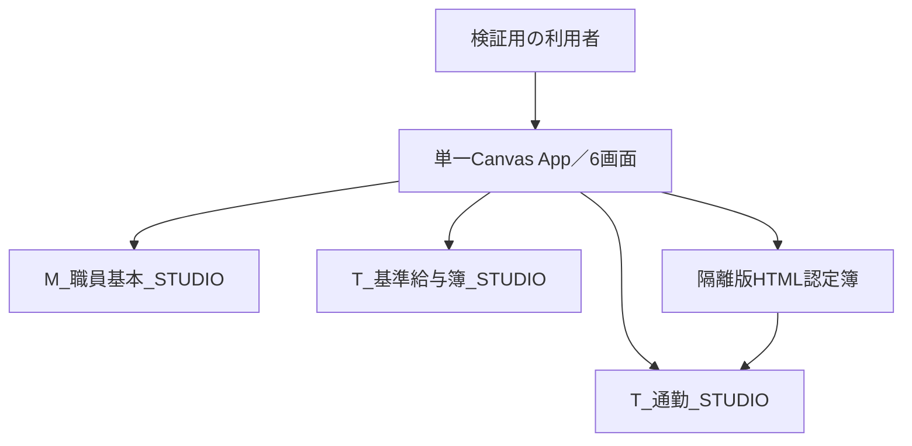

# 基本設計書（現行単一アプリ）

画面・機能間の責務、データ境界、配置を定める。実装上の未達・未照合は[未決一覧](../../requirements/open-decisions.md)を正本とし、設計済みだけで実装済みとは判定しない。旧v1.11/v1.14の設計は[移行前の版](../../../records/docs/design/basic-design-before-consolidation.md)に保存する。画面別の物理設計は[詳細設計](../detailed/detailed-design.md)、データモデルは[Dataverse設計](data-model.md)を参照。

## 軽量化後の構成

> **現行の承認済み設計：** 旧「構成」のCanvasモーダル・固定給与詳細に代わるSCR-002の構成。画面要件9.7の追加事項は優先して参照する。

| ID | 画面領域 | 内容 |
|---|---|---|
| S01 | `scrStaffMasterSearch` | 左に開閉式の検索・職員一覧、右に選択職員サマリーと6タブ。旧`Screen1`の改名先 |
| S01-D | 共通詳細領域 | 基本情報、勤務条件、通勤の選択レコード詳細、社会保険、税固定控除を共通ギャラリーで2列表示。履歴区分は複数件時の短い選択行＋選択レコード詳細 |
| S01-C | 通勤タブ | 認定レコード一覧、選択状態、HTML認定簿起動。帳票本体は別タブHTML |
| S01-P | 基準給与簿 | 件数直下から青の項目名・白の値の一組を163項目縦に配置し、選択した開始月～終了月内の登録済み給与レコードを横列で動的表示。同月の複数レコードは別列。SCR-005支給明細とは別機能 |

固定の青いヘッダーは左に画面名・取得日時、右にホームと最右端のSCR-002を配置する。旧ホーム右の独立した年月選択は廃止し、給与簿内の開始・終了年月は維持する。

タブは「基本情報」「勤務条件」「通勤」「社会保険」「税固定控除」「給与簿」の順とする。6個の完成パネルを非表示で重ねず、共通のタブ、複数履歴時だけの短い選択行、詳細ギャラリーをデータで切り替える。勤務条件・通勤・社会保険・税固定控除の認定ID／期間／状態を重複させる長文カードは置かない。通勤の帳票表示は、認定レコード選択後に別ブラウザータブの正式HTMLを開く。

`CHANGE-20260927-SCR002-UI`の公開v22（`2026-09-27T03:01:06.626618Z`）では、上記ヘッダー・4区分・給与簿の先頭表示とSCR-001／005への移動をPlayerで確認した。選定された単体3件・結合2件の専用利用者E2EはPASS。PAC読戻しのSCR-002画面定義と保存画面定義のSHA-256は一致（[公開後照合記録](../../verification/postpublish/change-20260927-scr002-ui.json)）。全画面・接続・163項目末尾と複数履歴の動作は未照合であり、[実施記録](../../../records/changes/change-20260927-scr002-ui/manual-20260927-scr002/record.md)を参照する。

Canvas内の旧認定簿2ページ、PDFViewer、PDF生成・保存、旧PoC入口、給与163項目固定モーダル、非表示住民税領域は軽量化実装時に正式機能版から除去する。旧ソースと検証記録はGit履歴・検証資料として保持する。

## SCR-002履歴4表の読取り経路（CHANGE-20260928-SCR002-HISTORY）

公開v25（`2026-09-28T05:00:02.0455229Z`）は既存の6タブと共通詳細ギャラリーを使い、勤務条件15列、社会保険26列、税固定控除9列と同タブの住民税6列を選択履歴の値で表示する。各表の親Lookupは隔離`M_職員基本_STUDIO`を指す。取得時に選択した親GUIDと12桁職員番号をともに照合し、職員変更時には古い4表の取得結果を破棄する。住民税履歴は税固定控除の履歴選択肢へ統合し、選択した表に対応する項目だけを描画する。正式表は同じ列定義と親関係を持つが、アプリの読込先は隔離4表である。[物理列・型](data-model.md#scr-002の4履歴テーブル2026-09-28)と[画面式](../../../src/screen-ui/v1.28/README.md)を参照。

Studio数式エラー0件、架空職員011の56項目、NULLと0、別職員への切替をプレビューで確認した。所有者の公開Playerでは勤務条件15項目を確認した。公開後の専用利用者試験と読戻し結果は[公開後記録](../../verification/postpublish/change-20260928-scr002-history.json)に記す。編集対象列、保存先、実効ロール、実データ運用は本変更の読取り確認に含めない。

## 現行アプリの全体構成

> **接続先と設計範囲の整理：** [単一アプリ運用](../../operations/single-app-workflow.md#対象)で確認したApp ID、環境、隔離接続先を基準とする。画面要件のうち実装・接続が未確認の部分は、実装済みとして図に補わない。[ガイド第7章の基本設計の構成例](https://www.digital.go.jp/assets/contents/node/basic_page/field_ref_resources/e2a06143-ed29-4f1d-9c31-0f06fca67afc/0af5ce68/20260715_resources_standard_guidelines_guideline_05.pdf)にいう全体図・データの流れ・機能とデータの対応を、このアプリ向けに整理する。

図の矢印は**接続・設計上のデータ経路**で、各画面の全操作・権限検査・公開版との一致を示す実測結果ではない。SCR-002からHTMLへは選択した通勤レコードのGUIDを渡し、HTML側で隔離データを再取得する設計。帳票はブラウザーの印刷からA4横2ページ・1PDFとし、Canvas内の旧PDFViewerや自動PDF格納フローを現行構成へ戻さない。GitHubの設計文書・ソース・試験fixtureは版管理／投入候補の保管場所であり、GitHubの文書更新がDataverseや公開アプリに自動で同期する経路ではない。

### 画面・機能とデータの流れ

| 画面・機能 | 入力／取得 | 処理・出力と境界 | 設計状態 |
|---|---|---|---|
| SCR-001 ホーム | ログイン者の情報、確認用所属・権限 | 各画面への遷移。確認用の所属切替だけで実際の閲覧権限を拡張しない。 | ログイン属性・管理者区分の取得元とサーバー側権限判定は[画面要件5・6章](../../requirements/screen-requirements.md#5-権限制御)で未定義。 |
| SCR-002 検索・詳細 | `M_職員基本_STUDIO`から職員番号12桁文字列をキーに職員を検索し、選択職員の通勤・給与簿を各`_STUDIO`テーブルから取得する設計。 | 検索0件・別職員選択では以前の詳細・認定GUID・給与値を破棄。取得失敗時は旧職員の値や時刻を新しい取得結果として表示しない。 | [詳細設計10.1・10.6](../detailed/detailed-design.md#10-scr-002軽量化設計2026-09-24)。現行の検索試験には[FAIL／BLOCKED](../../../records/docs/testing/current-app-search-observation.md)がある。 |
| SCR-002 通勤・認定簿 | 選択した認定GUIDと選択職員・通勤親の照合。 | GUIDを隔離HTMLへ渡し、HTMLが権限・GUIDを確認して隔離Dataverseを再読取り。画面内PDF生成ではない。 | [詳細設計10.4](../detailed/detailed-design.md#104-通勤html)。HTML側のアクセス条件・PDF実測は別に確認。 |
| SCR-002 給与簿 | `T_基準給与簿_STUDIO`の選択職員・指定年月の登録済み行。 | 163項目×取得した行GUIDの列を表示。未登録月を列にせず、同月複数行、0／負値／NULLを区別する。 | [詳細設計10.5](../detailed/detailed-design.md#105-基準給与簿163項目動的支給月)。この画面からの給与簿書込みは要件で禁止。 |
| SCR-002 編集 | 基本情報・勤務条件・通勤・社会保険・税固定控除の選択値と所属権限。 | [画面要件9.7](../../requirements/screen-requirements.md#97-画面表示編集の追加要件2026-09-25確定)は変更分保存→再取得、失敗時の入力保持・破棄確認を要求。 | 隔離4表の読取り先は公開v25で接続した。更新対象列、保存先とトランザクション、権限検査は未設計。読取り接続だけで編集可能と判断しない。 |
| SCR-004／SCR-006の対象月設定以外 | 画面一覧と遷移は[画面要件1～3章](../../requirements/screen-requirements.md#1-画面一覧)。 | 勤務時間報告／期末勤勉支給率／メンテナンスの内部入出力は画面一覧からは確定できない。 | 各機能のデータ取得・更新元、書込み可否を後続で定義。 |
| SCR-005 支給明細 | 選択職員番号・支給対象月をSCR-002と受渡し。[画面要件8章](../../requirements/screen-requirements.md#8-scr-005-支給明細画面canvas-ui作成要件)は内蔵仮例での再計算・表示を定義。 | 試算表示のみで保存・確定・支払実行をしない。SCR-002の163項目の基準給与簿と混同しない。 | 現行単一アプリにおける計算用データの取得元・実装状態は未照合。隔離の給与簿テーブルから実額を自動計算すると推定しない。 |

### データモデルと更新範囲（CRUD）

`R`＝参照の設計／既存接続、`U要件`＝更新の要求はあるが保存経路・公開版での成立は未確認、`—`＝当該機能からの操作を求めない、`?`＝取得・更新元を未定義。`—`は他機能も含むテーブル全体の操作禁止を意味しない。表は**画面機能×データ群**の整理であり、全列の物理データ辞書、権限表、実アプリの操作ログではない。

| 機能 | 職員基本 `_STUDIO` | 通勤 `_STUDIO` | 基準給与簿 `_STUDIO` | その他の勤務・保険・税／試算 |
|---|---|---|---|---|
| SCR-002 検索・基本詳細 | R | — | — | ? |
| SCR-002 通勤一覧・HTML表示 | R（親の照合） | R（Canvas・HTMLの再取得） | — | — |
| SCR-002 給与簿 | R（職員選択） | — | R（163項目・行GUID） | — |
| SCR-002 編集・保存 | U要件（対象項目・権限の精査要） | U要件（認定行の指定要） | —（読取専用） | U要件、保存先・接続は未定義 |
| SCR-005 仮例の試算表示 | ?（選択職員の参照元） | ?（通勤額の根拠） | —（163項目の給与簿とは別） | R要件（内蔵仮例。現行実装は未照合） |
| SCR-004／SCR-006の対象月設定以外 | ? | ? | ? | ? |

職員1件に通勤・基準給与簿が各0..N件という論理関係は[統合したDataverseデータ設計](data-model.md#関係と検証の境界)を参照する。親の職員番号は12桁文字列、子レコード識別はGUIDであり、氏名一致や同月1行の仮定で結合しない。元テーブルの論理名・権限・fixture件数を隔離`_STUDIO`テーブルの実測定義として無検証で流用しない。現行3テーブルの列型・参照・権限と投入データは環境側から別途読戻して確定する。更新時の `C`／`D` は本表の画面要件からは確定できず、本整理だけで新規作成・削除を許可しない。

残件は、ログイン属性と所属制限の実装位置、SCR-002の5区分編集の更新先・再取得・ロール、SCR-004／SCR-006の対象月設定以外とSCR-005の詳細データ、隔離HTMLの権限と公開版、現行3テーブルの物理データ辞書である。未設計箇所を埋める際は[要件・設計・試験対応表](../../requirements/traceability-matrix.md)の行と試験選定を更新する。

## 現行画面の機能・状態・データ境界

この節は[画面要件](../../requirements/screen-requirements.md)を画面・機能間の責務に割り当てる基本設計である。**要求された設計**と**公開アプリで実測された実装**を同一視しない。[専用利用者の検索FAIL／結合BLOCKED](../../../records/docs/testing/current-app-search-observation.md)と[所有者Playerの部分照合](../../../records/docs/verification/current-app-player-20260926.md)は条件が異なり、他の機能のPASSを意味しない。

### 画面要件1～5章の追跡単位

| 要件ID | 基本設計の割付 | 未確定の境界 |
|---|---|---|
| `COMMON-SCREEN-001` | SCR-001はホーム、SCR-002は検索詳細、SCR-003は勤務、SCR-004は支給率、SCR-005は支給明細、SCR-006は管理者用メンテナンス。外部Microsoft認証をCanvasの内部画面数に含めない | SCR-004／SCR-006の対象月設定以外の画面内業務機能は未要件定義 |
| `COMMON-NAV-001` | ホームから画面名の入口でSCR-002～006へ進む5経路を設ける | SCR-006のみ管理者判定が必要 |
| `COMMON-NAV-002` | SCR-002～006の各画面から「ホーム」で戻る5経路を設ける | SCR-006は管理者での到達を前提に確認 |
| `COMMON-NAV-003` | SCR-002とSCR-005が職員番号・対象月を伴って双方向に遷移する。対象の存在と所属を遷移先で再確認する | SCR-002側のボタン名・操作方法は要件未定 |
| `COMMON-CONTEXT-001` | ログイン職員の氏名・メールは画面を越えて同一のログイン主体として保持 | 属性の権威ある取得元は未定 |
| `COMMON-CONTEXT-002` | 選択した非常勤職員番号・対象月はSCR-002／005で保持。ログイン者の属性と別の状態とする | 未選択時は無関係な職員を自動選択しない |
| `COMMON-AUTH-001` | 所属部署の一致を検索、一覧、対象読取り、編集、職員を伴う遷移の各境界で確認。管理者でも所属制限の例外を設けない | 属性取得元、Dataverseでの実効権限と更新先は未決 |
| `COMMON-AUTH-002` | SCR-006入口は管理者だけ有効。画面への遷移時にも管理者判定を行う | 管理者属性取得元とサーバー側認可は未決。確認用UIは権限を与えない |

本表は既存の画面要件に追跡IDを付けた機能・状態の割付であり、認証方式や業務画面の未決項目を補完したことにはしない。

| 機能群・要件ID | 画面責務と受渡し | データ・権限・未確定境界 |
|---|---|---|
| ホーム・認証・権限（`SCR001-UI-001`・`002`、画面要件1～5章） | SCR-001の上部からSCR-002～006へ遷移。確認用所属選択はスマホでも操作可能とし、表示切替と権限判定を分離。サインインの外部画面はCanvasの内部画面とみなさない。 | ログイン者の氏名・メールと対象職員の氏名・番号を別状態に保持する。所属・管理者属性の権威ある取得元／権限検証方法は未決であり、確認用の所属値やボタン非表示を認可根拠にしない。 |
| 共通業務領域（`COMMON-LAYOUT-001`） | SCR-001～006の親領域に共通比率4:56:4／2:26:2を適用。画面ごとの余白定数の複製を避ける。 | 900～1920幅・200％拡大・大きな文字では実表示幅を計測し、内容は折返し／必要な横移動で到達させる。外枠を操作する設計ではない。実機可読性は未受入。 |
| 検索・履歴・詳細（`SCR002-LT-*`、`SCR002-UI-001`～`010`） | 検索結果から12桁文字列キーの職員を選び、右側の6タブ・選択履歴と共通2列詳細を更新。初回／F5／職員切替／保存成功時の取得とタブ切替だけの表示変更を分離。 | 選択職員を変える際、旧詳細・認定GUID・給与値・取得時刻を新しい結果として残さない。検索0件・権限拒否・通信失敗の状態を区別。検索実測の不一致は未解消。 |
| 通勤HTML（`SCR002-COM-*`） | 通勤タブで認定行を選び、選択職員・親職員・認定GUIDを照合して隔離HTMLを別タブに開く。HTMLが同GUIDで再読取りし、ブラウザー印刷で1PDFとする。 | 保存・公開済みHTMLの隔離先とアクセス権を別に読戻す。Canvas旧認定簿、PDFViewer、旧PoCを現行版へ再投入しない。帳票の同一性・2ページは実機判定を要する。 |
| 給与簿閲覧（`SCR002-PAY-*`） | 163項目の縦方向と、指定年月に登録された行GUIDごとの動的列。開始・終了それぞれのカレンダーを入力欄の隣に置き、本文の縦スクロールで末尾へ到達する。 | 支給年月日の空欄・解釈不能を例外として見せる。0とNULLを区別し、同月複数行を別列にする。給与簿の書込みはSCR-002から行わない。 |
| 編集・保存（`SCR002-EDIT-*`） | 初期は読取り。編集可能な5区分だけの入力をタブを越えて保持し、未保存変更を失う遷移と読取り切替には続行／取消の確認を挟む。保存成功は対象レコード再取得後に読取りへ戻し、失敗時は入力を保持する。 | 基本情報・通勤は隔離3表との対応を確認する必要がある。勤務・社会保険・税固定控除の永続化先／各編集列は未設計のため、UI表示のみで保存成功にしない。権限は更新対象レコード単位で再検証し、給与簿には書込まない。 |
| 支給明細試算（`SCR005-UI-*`・`CALC-*`・`ACT-*`） | SCR-002との職員番号・対象月の受渡し、内蔵仮例の入力検証→計算→表示。固定ヘッダー・対象操作・サマリーとスクロール本文を分離する。支給／控除は独立開閉。 | アプリ内蔵の試作データだけを対象とし、Dataverseへの登録・更新・確定・支払は行わない。実データの計算根拠・端数規則は未確定。欠落と登録済み0円を区別し、対象変更時の旧結果を無効化する。 |
| SCR-004／SCR-006の対象月設定以外 | ホームとの遷移・管理者ボタンの制御は画面要件1～5章へ対応。 | 画面内の業務入力、データ源、作成・更新・削除の範囲は未要件定義。アプリに画面があることから業務機能や権限を推定しない。 |

### 画面間受渡しと未保存変更の境界

| 操作 | 基本設計の状態遷移 | 成立しない場合 |
|---|---|---|
| SCR-002で職員を選ぶ／SCR-005へ移る | 編集差分があれば破棄確認を先行し、承諾したときだけ次の対象へ切り替える。所属制限を判定し、職員番号・必要な対象月だけを引き継ぐ。 | 取消時は元職員・元タブ・編集差分を保持。権限不一致は対象データを表示せず、旧職員の値を引継ぎ先の値に見せない。 |
| SCR-005で戻る／対象月を変える | 職員番号・対象月を受け手で再検証。対象・入力登録版が変われば旧計算結果を破棄し、再計算まで未計算表示とする。 | 未選択・未登録・権限拒否では無関係な職員を自動選択しない。計算不能を0円へ置換しない。 |
| SCR-002で保存する | 対象職員・選択履歴行・所属と編集可能な列を再確認し、成功後の再取得完了をもって画面を読取りへ戻す。 | 更新先や権限が未整備なら成功表示を禁止。失敗時は入力と選択を維持し、再試行・中止の判断を促す。 |

### SCR-005 試算の入力・出力境界

[画面要件8.3～8.6](../../requirements/screen-requirements.md#83-計算集計と表示の分離)にある勤務日別・月登録・通勤認定・控除・職員基本の内蔵データを対象職員番号＋対象月で結ぶ。勤務日の重複、欠勤単価未設定、通勤・控除欠落、対象外所属を計算前に検出する。計算結果は固定額、欠勤減額、俸給、通勤、給与総額、社会保険料計、控除額計、現金支給額の**一つの表示用結果**として保持し、各UIで値を再計算しない。未丸め値・最終表示値・計算状態と入力登録版を区別する。端数処理の確定値は業務判断待ちとし、例示額を本番の税率・料率に読み替えない。

旧版の[SCR-005画面試験](../../../records/docs/testing/screens-v1.22-results.md)は現行App IDの実装・合格の証拠にしない。スクリーンのコントロール内部名、内蔵試作データの現行版、権限実装はソース読戻し後に[詳細設計](../detailed/detailed-design.md)と突合する。

## 軽量化後の配置

> **現行の承認済み設計：** 以下のうち9月25日追加の画面要件と異なる箇所は[画面要件9.7](../../requirements/screen-requirements.md#97-画面表示編集の追加要件2026-09-25確定)を優先する。

SCR-001は画面遷移ボタン、確認用権限・所属を上部にまとめ、スマホで所属候補を選択可能にする。SCR-002の「非常勤職員マスタ検索」ヘッダーは画面IDとデータ取得日時のみ表示して固定する。ヘッダー直下に操作群をまとめ、操作群から選択職員サマリー・基本情報・各タブ詳細までを一緒に縦スクロールする。従来の固定サマリー、詳細だけのスクロール、ヘッダー内ボタンの配置は新構成に適用しない。

検索条件は縦一列とし検索入力に虫眼鏡を配置する。結果一覧は氏名の下に番号、状態の下に部署略称を置く。状態は文字と色で区別する。右詳細の背景とギャラリー見出しは社会保険履歴編集画面の参照画像を基準とする。「保存」など存続する操作をヘッダー直下へ置き、「変更を破棄」ボタン、戻るボタン、編集対象フッターを置かない。未保存の変更を失う遷移では破棄を確認する。「最新データを読込」「検索結果をTSVで出力」は新構成から除く。通勤タブ右上の「認定簿表示」で正式HTMLを別タブ表示する。

読み取り／編集モードの切替、タブ移動時の未保存入力の保持、保存後の再取得、給与簿の読み取り専用は[画面要件9.7](../../requirements/screen-requirements.md#97-画面表示編集の追加要件2026-09-25確定)と本書「現行画面の機能・状態・データ境界」を参照する。本段落だけで実装完了と扱わない。

親領域に対して、横は左余白4：業務画面56：右余白4、縦は上余白2：業務画面26：下余白2とする。業務画面は`X=Parent.Width*4/64`、`Width=Parent.Width*56/64`、`Y=Parent.Height*2/30`、`Height=Parent.Height*26/30`で算出する。

業務画面内では左検索一覧と右詳細を同時表示する。左は展開360px・折りたたみ48pxを開始値とし、比率余白を適用した1366×768、1920×1080、対象狭幅で実測して調整する。右詳細は初版を2列とし、長文も2列で折り返す。欠け・重なり・著しい可読性低下を実測した項目だけ全幅へ変更する。

基準給与簿は表示開始月・表示終了月（年月）を利用者が選択する。支給年月日が範囲内にある登録済み給与レコードから横列を動的生成し、未登録月の列は作らない。同月の複数レコードはそれぞれ別列にして支給年月日・番号等で識別する。採用前・退職後を理由とする月の一律非表示は初版対象外とする。

## 職員検索サイドバー

> **現行の承認済み設計にも継承：** 手動開閉、検索状態の保持、右詳細の伸縮を扱う。旧版の固定サマリー配置は継承しない。

- 初期は幅360pxで展開し、検索条件と職員一覧を表示する。
- 閉じる操作で幅48px程度の操作帯へ折りたたみ、右詳細を残り幅へ拡張する。列間16pxは展開時だけ確保し、折りたたみ時に不要な空白を残さない。
- 開閉は手動。職員選択後も自動では閉じず、同じ検索結果から続けて選択できるようにする。
- 展開状態は画面変数で管理する。開閉では検索条件、検索結果、選択職員、ページ番号を更新しない。
- 折りたたみ時は検索内部コンテナを非表示にしてTab順から外し、左端に開くボタンだけを残す。開く／閉じる操作は44px以上の押下領域を確保する。
- 右側の職員サマリーは常時表示し、検索領域を閉じても選択対象を誤認しないようにする。
- 開閉アニメーションは必須にしない。Power Appsでの安定した再配置とフォーカス維持を優先する。

## SCR-003勤務時間報告・SCR-006対象月（2026-09-29公開）

変更ID：`CHANGE-20260929-SCR003-ATTENDANCE-IMPORT`。公開版識別時刻：`2026-09-29T09:11:07.0090418Z`。同一の現行アプリ、架空データのテスト環境を対象とする。

画面は `scrAttendanceFormal`、ホームからの遷移は `btnHomeAttendance`。既存PoCとは別に正式3表を使用する。SCR-006では対象月設定部品のみを追加した。

| 責務 | 入出力・更新 |
|---|---|
| SCR-003 | 報告一覧を読み、選択ヘッダーの有効バッチだけをローカル明細へ取得。取込・編集・状態変更を単一フローへ依頼 |
| SCR-006 | yyyy-MMの対象月を有効・無効に設定。対象月表を更新し、SCR-003が再取得 |
| Power Automate | 入力検証、版・状態確認、新規バッチ作成、件数確認、ヘッダー切替を直列に実施 |
| Dataverse | `T_勤務時間報告`（局×月・状態・版・有効バッチ）、`T_勤務時間報告明細`（20列相当とバッチ）、`M_勤務報告対象月`（月・有効状態） |

旧バッチを即時削除せず、新バッチの全件保存確認後に参照先を切り替える。途中失敗で旧有効明細を失わせない設計であり、複数行Dataverseトランザクションの実証済みという意味ではない。報告済／版不一致の要求をフローで拒否するが、Dataverse直接操作を制御する認可の代替ではない。

権限判定・所属制限は利用者指示により後工程。局名を手入力し、ホームの管理者切替は既存の表示確認用UIであって実効権限ではない。999件境界、同時操作、途中障害、業務受入、総合試験は未判定。一時Excelの即時削除はExcelロックによる400で失敗し、所有者OneDriveに残る。これらを本番利用可能の判定へ読み替えない。

### 専用テストユーザーの読取り前提（2026-09-29 20:30 JST）

同公開版の表示検証用に、専用ユーザーだけが持つ既存 `StaffMaster Test Reader` ロールへ勤務時間報告・明細・対象月の3表の組織範囲Readのみを追加（利用者承認20:25、Action 36561770802）。他権限不変、3表および既存基本3表へのCreate/Write/Deleteなしを読戻した。個人用OneDriveの前提不備も修復済み。専用Playerで保存済み架空10件と勤務期間・0・小数・備考を確認した。これはテスト環境の表示試験用アクセスであり、給与班／自局／本人の業務認可の完成ではない。Canvasから所有者接続フローを呼ぶ更新経路の認可も別途必要で、DataverseのRead限定だけでアプリ全体が読取り専用になるとは扱わない。

検証基準更新：`53cb5348a44a9da9deb438edfa05d410958f12d9` はテストのDOM要素選択のみの修正。公開Power Fxは変更せず、上記公開版の再照合を実施する。保存済み10件・勤務期間・数値・備考という期待値は不変。
