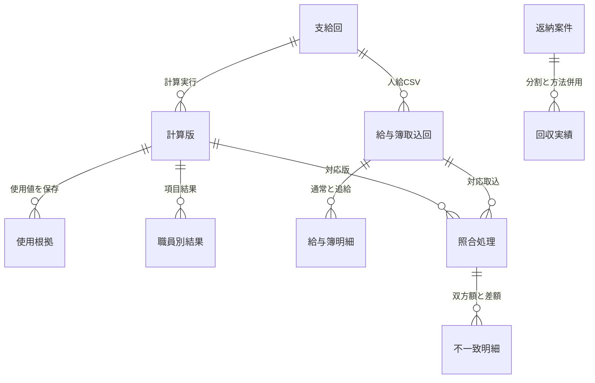

# Dataverseデータ設計（職員基本・通勤・基準給与簿）

> **2026-10-07の改修仕様**：[確定要件](../../requirements/payroll-confirmed-20261007.md)を適用する。下記の公開版・実測記録は当時の状態として保持し、今回の要件確定だけでアプリ／Dataverseを変更済みとは扱わない。競合する今後の業務仕様は新しい確定要件を優先する。

## 対象と正本

現行単一アプリは隔離された `M_職員基本_STUDIO`、`T_通勤_STUDIO`、`T_基準給与簿_STUDIO` を参照する。以下の元テーブルの設計は親子関係と型を考える根拠であり、`_STUDIO` の物理列・権限・行を読戻した証拠ではない。接続・保存・権限の未確認部分は[未決一覧](../../requirements/open-decisions.md)を参照。

| テーブル | 論理関係と主な契約 | 全列の正本 |
|---|---|---|
| `M_職員基本`（元の `crb3c_staffbasic`） | 職員1人1行。12桁数字の職員番号を文字列の代替キーとし、実体の主キーはGUID。在籍状態は日本時間の日付から導出。 | [移行前の職員基本設計](../../../records/docs/design/dataverse-staff-basic-before-consolidation.md#テーブル)。`_STUDIO`側の列・権限は未照合 |
| `T_通勤`（元の `crb3c_commute`） | 親職員1件に認定0..N件。子の親LookupはGUID、子の職員番号は重複可能。認定GUIDと職員の一致を確認する。 | [機械可読の84列](../../../config/dataverse/commute-columns.json)。原本の型決定・テスト値は[移行前の設計](../../../records/docs/design/dataverse-commute-before-consolidation.md) |
| `T_基準給与簿`（元の `crb3c_payrollledger`） | 親職員1件に履歴0..N件。同月複数行を許容し、各行をGUIDで区別。SCR-002では読取り専用。 | [機械可読の163列](../../../config/dataverse/payrollledger-columns.json)。元の範囲・fixtureは[移行前の設計](../../../records/docs/design/dataverse-payrollledger-before-consolidation.md) |

## 関係と検証の境界

| 関係 | 必要な確認 |
|---|---|
| 職員→通勤 | 職員番号の代替キーから親GUIDを解決して子Lookupへ結ぶ。認定IDだけ、氏名だけでは別人を区別できない。0件、複数件、同姓同名、退職・未来のfixtureを確認 |
| 職員→給与簿 | 親GUIDのLookupと12桁番号の整合を確認。同月複数行、追給・返納の負値、登録済み0円とNULLを区別 |
| 元テーブル→隔離`_STUDIO` | テーブル名の類似だけで列型・権限・データが同一とは判断しない。現行接続先のメタデータと画面での読戻しが必要 |
| 各画面の更新 | 基本情報・通勤を含む5区分の編集可能列、勤務・保険・税の保存先、実効ロールを確定してから書込みを検証。給与簿のSCR-002からの更新は要件外 |

元テーブルでは通勤・給与簿の子Lookupは `ApplicationRequired` だが、任意のAPI経路で非NULLが保証されたわけではない。書込み経路ごとに親子関係を検証する。職員基本の税表は甲／乙、勤務時間は分の整数（例7:45＝465分）、保険は未確認の空欄と未加入を区別する。これらの列挙・型は元テーブルの契約であり、現行隔離テーブルの実測値への転記は保留する。

古いDataverse作成作業の実行手順、7件・6件の投入値、60分制限、旧Canvas接続前提は各[移行前の設計](../../../records/docs/design/)に保存した。現在の自動化フローが使う対象と権限は[単一アプリ運用](../../operations/single-app-workflow.md)と実際の接続設定で確認する。

## SCR-002の4履歴テーブル（2026-09-28）

添付4定義書の列名・型・制約を[機械可読の列契約](../../../config/dataverse/scr002-history-columns.json)に転記した。正式4表と隔離4表のメタデータ、親子関係は[構築Action](https://github.com/hirokazu601218/PowerAppsCanvasAppUI/actions/runs/36363649180)で読戻し済み。公開v25の隔離4表の全列表示は専用利用者の選定6ケース（Action 36380881898）で検証した。編集保存・他所属の権限と実データは未判定。

| タブ | 正式表 / 隔離表（論理名） | 添付列数 |
|---|---|---:|
| 勤務条件 | `crb3c_workcondition` / `crb3c_studioworkcondition` | 15 |
| 社会保険 | `crb3c_socialinsurance` / `crb3c_studiosocialinsurance` | 26 |
| 税固定控除 | `crb3c_taxfixeddeduction` / `crb3c_studiotaxfixeddeduction` | 9 |
| 税固定控除内の住民税 | `crb3c_residenttax` / `crb3c_studioresidenttax` | 6 |

各表は所有者付きで、GUIDの主キー、必須の履歴レコード名、および親職員への必須Lookupを持つ。親は正式表では`M_職員基本`、隔離表では`M_職員基本_STUDIO`。親の削除はRestrict。添付56列はいずれも任意で、日付はDateOnly、数値は整数または小数。元定義の正規表現・候補値など列型だけで表せない条件は列の説明に記録した。正式表に人事行は投入せず、隔離表は架空値だけで試験する。子の職員番号と親GUIDの整合は書込み時に別途検証する。

## SCR-003勤務時間報告・SCR-006対象月（2026-09-29公開）

変更ID：`CHANGE-20260929-SCR003-ATTENDANCE-IMPORT`。公開版識別時刻：`2026-09-29T06:38:41.555451Z`。同一の現行アプリ、架空データのテスト環境を対象とする。

列契約は `config/dataverse/scr003-attendance-columns.json`。報告ヘッダー→複数バッチ→複数明細。画面はヘッダーの有効バッチだけを表示し、旧バッチを保持する。対象月は独立表で有効状態を管理する。局×月の一意性は直列フロー内で確認し、実効権限は未実装。

## 2026-10-07の変更後論理モデル（物理設計未確定）

[確定要件](../../requirements/payroll-confirmed-20261007.md)と[添付２文書の変更対応](../../changes/payroll-markdown-change-list-20261007.md)に基づく。以下の名称は論理的な管理単位の仮称であり、既存_STUDIO表の正式な置換物理名・列名・実装済み関係ではない。物理テーブル数、制約の実装方法、削除連鎖等は未入力。親参照はGUID Lookup、職員番号も保持する。

| 管理単位 | データ粒度・主な属性 | 元構造との対応 |
| --- | --- | --- |
| 職員基本 | 一人一行、12桁一意番号、基本情報＋住所、最新所属 | M_Shokuinを整理。銀行・債主・個人番号は初回対象外 |
| 勤務条件履歴 | 職員×有効期間、発令・所属・予算・日額／時間額単価・一日時間・確認状態 | M_Hatsureiと職員側給与条件を統合 |
| 組織・予算・給与単価・区分マスタ | 階層なし組織、所属既定予算、個別予算、単価・可変候補 | M_Soshiki・M_Yosan・M_Hokyu・T_Kubunの用途を整理 |
| 保険履歴 | 各保険の加入確認、資格日、控除期間、等級・標準報酬・登録額 | M_Kojoと職員側保険列を整理 |
| 税条件・固定控除 | 税区分／扶養人数の期間履歴、職員×項目×期間×額 | M_Kojoの用途別再構成、控除項目マスタ |
| 住民税 | 職員×控除年月×金額 | M_Jzeiの月別列から月別行へ |
| 通勤ヘッダー・経路 | 職員認定の期間・状態、経路別定期／IC方式、新旧認定関連 | M_Ninteiの親子ロールを分離 |
| 勤怠ヘッダー・職員明細・取込処理 | 所属×勤務月、職員別日数時間、提出状態、取込検証・反映・失敗状態 | M_Kintaiの親子ロールを分離。複数所属の実績を集計 |
| 支給回・職員別結果・計算版・根拠 | 支給回、期間／支給日、職員、版、結果と使用値、確定／支払状態 | M_Shikyuを再構成。参照IDだけでなく使用値を保存 |
| 期末勤勉率・調整 | 職員×対象期間の別率、結果と別の項目調整額・理由・処理者 | 単一率・その他額だけに依存しない |
| 給与簿取込回・明細 | 人給CSVの通常／追給の行と各支給控除列、職員・支給回 | M_Kyuyoboは取込後読み取り専用。sgの意味は未入力 |
| 照合処理・不一致明細 | 計算版×取込回、日時・人・件数・結果、職員項目と双方額・差額 | 旧GUID帳票照合から処理履歴へ。中間版削除後も明細保持 |
| 追給返納案件・差額内訳・回収実績 | 過去支払との関連、月別項目差額、人給集約、複数回収・方法・残額 | 支払済を不訂正。返納分割・相殺と告知書併用 |
| 利用者・複数ロール・対象所属 | 給与班・局担当・業務管理、兼務、自局範囲 | M_Userの単一区分・組織1～3列を再設計 |

初回モデルからM_Kazoku・M_SKDB・M_Memoを外す。既存データの物理削除を実行する意味ではない。認定権者・官職を複写するかLookupにするか、一般列の型、プライマリ列、特殊月・略語の対応は未入力。

### 計算・照合・回収の関連

図は論理構成の候補。必須Lookupの正式実装、多重度の詳細、支給回と人給行の確定キーは設計時に検証する。中間版削除時に照合処理の識別情報や双方額を失わないよう、履歴の保持方式と参照制約を確定する。支払い済み給与を訂正する更新関係は設けない。

## 2026-10-08 人給連携確定仕様

人給出力行に11キーと職員判断更新区分、計算版・対象期間との対応を持つ論理要件を追加する。正式物理列名・型・実装は未入力。給与簿CSV照合キーは別で未入力。差額発生対象期間を保持し、複数過去月集約との両立は未入力。既存給与簿のsgを11キーへ推定対応させない。

[出力仕様](../detailed/payroll-jinkyu-interface.md)、[決定台帳](../../requirements/payroll-interface-decisions-20261008.md)。
