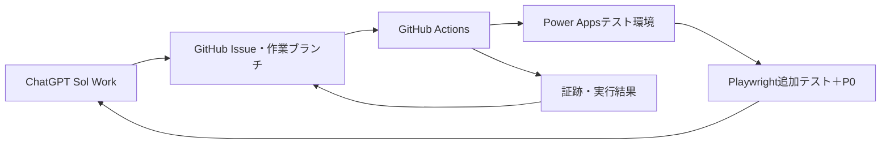

# Power Apps無人修正・テスト・公開基盤 段階別構築計画 v1.03

> 対象アプリ：共通（自動テスト／ハンドメイド）

更新日：2026-09-15  
関連要件：[Power Apps無人修正・テスト・公開基盤 要件定義書](../requirements/unattended-development-requirements.md)

## 1. 構築方針

初回から全機能を一括実装せず、復元可能な単位で段階的に構築する。各段階は、前段階の完了条件を満たした後に開始する。

最初の対象は `ハンドメイド職員マスタ検索` のみとする。既存の無人P0テストを維持しながら、次の順で機能を追加する。

1. 合格済み公開アプリの保全とGitHubへの正規取込み
2. 専用サービスプリンシパルによるSolution反映
3. 指示単位のブランチ、PR、追加テスト
4. 失敗分析、自動修復、反復制御
5. 成功版のmain統合、採番、タグ、公開、記録
6. 失敗時の合格版復元

## 2. 役割分担

| 担当 | 役割 |
|---|---|
| ユーザー | 修正方針の承認、初回管理者操作の許可、業務仕様判断、本番公開承認 |
| ChatGPT Sol Work | 要求整理、修正方針、Issue・ブランチ・PR、ソース修正、テスト追加、失敗分析、自動修復、最終報告 |
| GitHub Actions | Solutionの検査・パック・反映・公開、Playwrightテスト、証跡取得、機械的な合否判定 |
| Power Platform | Git統合対応Solution、テストアプリの実行・公開、合格版の復元 |
| GitHub | 正本、承認後の作業履歴、Issue、PR、タグ、Actions、14日間の証跡 |

GitHub Actions自体に生成AI判断を埋め込まない。原因分析と修正案生成は、このWorkがActionsのログと証跡を取得して行う。Actionsは再現可能な処理と判定に限定する。

## 3. 目標構成

## 4. 提案するリポジトリ構成

Power Platform Git統合の初回出力を確認後、実際のフォルダ名へ合わせる。以下は論理構成であり、初回同期前に空のSolution構造を手作業で作らない。

| パス | 用途 |
|---|---|
| `solutions/` | Power Platform Git統合が生成するSolution正本 |
| `config/apps/staff-master.json` | 対象Solution、アプリ、環境変数名、テストセット等の非秘密設定 |
| `.github/workflows/staff-master-deploy-test.yml` | 検査、パック、テスト環境反映、公開、E2E |
| `.github/workflows/staff-master-restore.yml` | 指定した合格タグからの復元 |
| `scripts/powerplatform/` | PAC CLI呼出し、事前検査、結果正規化 |
| `scripts/automation/` | 原因指紋、状態、版番号、Issue記録の補助処理 |
| `e2e/staff-master-p0.test.ts` | 既存P0回帰テスト |
| `e2e/changes/` | 指示単位で追加する受入テスト |
| `docs/requirements/` | 要件正本 |
| `docs/operations/` | 構築・運用・復元手順 |
| `docs/handoff/STATUS.md` | 現在地と次作業 |

## 5. 段階別計画

### Phase 0：要件・対象の確定

#### 作業

- 本要件定義書と本計画を作成する。
- STATUSの対象作業を本基盤へ切り替える。
- 既存リポジトリにSolution全体がないことを記録する。
- 外部編集方式をPower Platform Git統合対応Solutionへ統一する。

#### 完了条件

- 要件ID AUT-001～AUT-024、NFR-001～NFR-012がGitHubにある。
- 実装対象、対象外、承認境界、停止条件、復元方針が明記されている。
- 文書間のリンク、用語、版が一致している。

### Phase 1：基準版の保全と差分調査

#### 作業

1. 現在の公開アプリのApp ID、環境ID、公開日時、P0成功runを記録する。
2. 現在のP0を再実行し、初期時点で合格することを確認する。
3. 現在の公開アプリまたはSolutionを復元用にエクスポートし、チェックサムを記録する。
4. 既存GitHub v1.11の画面YAML、Power Fx、テスト、release.jsonと公開アプリを比較する。
5. 差分を次の区分に分類する。
   - 公開アプリへ採用
   - 既存GitHub版を採用
   - 旧資料として保持
   - 判断が必要

#### 安全策

- このPhaseでは公開アプリを変更しない。
- エクスポート物へ資格情報が含まれないことを確認する。
- バイナリの一時成果物は正本としてmainへ置かない。

#### 完了条件

- P0合格済み公開版の復元点がある。
- 公開アプリとGitHub v1.11の差分一覧がある。
- 初期基準に採用する内容が決まっている。

### Phase 2：Solution化と編集可能ソースの初期取込み

#### 作業

1. 開発者環境で専用のアンマネージドSolutionを作成する。
2. P0合格済み公開アプリと必要な依存部品だけをSolutionへ追加する。
3. Solutionをエクスポートし、展開ソースをGitHub作業ブランチへ格納する。
4. Microsoft公式 `PowerApps-Tooling` のPersistenceライブラリを固定コミットで使用し、Canvasアプリをactive `Src/*.pa.yaml` と `.msapr` 参照へ分離する。
5. activeソースと `.msapr` から `LoadFromYaml=true` の `.msapp` を再構成し、Solutionへ組み込めることを確認する。
6. GitHub OIDCとDataverse URL直接指定で隔離環境へ反映・公開する。
7. 固定App IDで再取得し、activeソース比較とP0回帰で意味差分がないことを確認する。

非推奨の `pac canvas pack/unpack` は使用しない。Power PlatformネイティブGitHub統合は、GitHub Organization、Managed Environment、Azure Key Vault、Premium相当ライセンス等の前提が整うまで採用しない。

#### 完了条件

- `powerapps/solution-src/` に完全なSolution展開ソースがある。
- `powerapps/canvas-v3/` にactive `*.pa.yaml` と `baseline.msapr` がある。
- GitHub正本から `.msapp` とSolutionを再構成できる。
- 隔離環境への公開後も固定App IDを直接指定して再取得できる。
- 投入元と再取得後のactiveソースが一致し、P0が合格する。
- 基準・本番アプリは変更されない。

#### 実績（2026-09-15）

[ステップ6実行結果](unattended-development-step6-source-reconstruction.md)のとおり、run `34928950801` で全条件に合格した。成功後のみcommit `ab1b7456ed8bc7d39cd302c1e23276b789212179` へ編集可能ソースを確定した。

### Phase 3：専用サービスプリンシパルと秘密値

#### 作業

1. Microsoft Entra IDに配布専用アプリ登録を作成する。
2. 対象Power Platform環境へサービスプリンシパルを追加する。
3. Solution反映と公開に必要な最小権限を付与する。
4. GitHub Actionsへ秘密値と非秘密設定を登録する。
5. PAC CLIで対象環境を読み取れることを確認する。
6. 認証ログへ秘密値が出ないことを確認する。

#### 設定候補

| 種別 | 名称例 | 内容 |
|---|---|---|
| Secret | `POWERPLATFORM_CLIENT_SECRET` | サービスプリンシパル秘密値 |
| Variable/Secret | `POWERPLATFORM_CLIENT_ID` | アプリケーションID |
| Variable/Secret | `POWERPLATFORM_TENANT_ID` | テナントID |
| Variable | `POWERPLATFORM_ENVIRONMENT_URL` | 対象環境URL |
| Variable | `POWERPLATFORM_SOLUTION_NAME` | Solution一意名 |
| Variable | `POWERAPPS_STAFF_APP_URL` | E2E対象URL |

実際の名前は実装時に既存Secretsとの重複を確認して確定する。

#### 完了条件

- GitHub Actions上でサービスプリンシパル認証が成功する。
- 対象Solutionの一覧または状態を読み取れる。
- テスト利用者の資格情報と配布資格情報が分離されている。
- 認証失敗時にテナント設定を変更せず停止する。

### Phase 4：一方向の自動反映パイプライン

#### 作業

1. 作業ブランチをチェックアウトする。
2. Solution構造と必須ファイルを静的検査する。
3. PAC CLIのバージョンを固定または記録する。
4. `pac solution pack` でSolution成果物を作成する。
5. 対象環境、Solution一意名、App IDを照合する。
6. `pac solution import --publish-changes` 相当でテスト環境へ反映・公開する。
7. 各工程の結果をActions SummaryとIssueへ記録する。
8. 同一アプリに対する同時実行を禁止する。

#### 初回検証変更

画面上で明確に確認でき、業務ロジックへ影響しない小さな表示変更を使用する。検証後に元へ戻すか、正式なv1.12候補として扱うかを修正方針で明記する。

#### 完了条件

- GitHub作業ブランチの変更がテストアプリへ反映される。
- 公開後のApp IDが対象と一致する。
- 手動Studio貼付なしで反映・公開できる。
- 失敗工程をパック、認証、インポート、公開に分けて判定できる。

### Phase 5：指示別テストとP0回帰

#### 作業

1. Workで修正指示を受け、修正方針と受入条件を作成する。
2. ユーザー承認後、Issue、作業ブランチ、PRを作成する。
3. 受入条件から変更専用Playwrightテストを追加する。
4. Solution反映後に、変更専用テストと既存P0を実行する。
5. スクリーンショット、動画、トレース、レポートを14日保持する。
6. Issueへテストケース、期待値、実結果、Actions、証跡を記録する。

#### 完了条件

- 追加テストだけ成功してP0が失敗した場合も不合格になる。
- P0だけ成功して追加テストが失敗した場合も不合格になる。
- 対象版、App ID、コミット、テスト結果を相互に追跡できる。

#### Phase 4・5 初回実績（2026-09-15）

[ステップ7実行結果](unattended-development-step7-automatic-source-deployment.md)のとおり、一時表示をGitHubソースから隔離アプリへ反映したrun `34934912204` で変更専用テストとP0が合格した。その後、元表示へ戻したcommit `260819a4fa30c4d8c8dcd02acc626c26d7823697` を再公開し、run `34935420385` でP0が再合格した。

これにより一方向の自動反映と指示別テスト＋P0の初回受入を完了した。テスト専用変更のためv1.12採番・タグ・main統合は行っていない。active `.pa.yaml` の汎用コンパイルと自動修復制御はPhase 6以降で扱う。

### Phase 6：原因分析と自動修復ループ

#### 作業

1. WorkがActions結果、Playwrightレポート、スクリーンショット、動画、トレースを取得する。
2. 基盤障害とアプリ不具合を分類する。
3. アプリ不具合について、テストケースID、失敗工程、正規化エラーから原因指紋を作る。
4. 承認範囲内ならSolutionソースまたは追加テストの誤りを修正する。
5. 修復内容を同じ作業ブランチとPRへ追加する。
6. Solution反映から再実行する。
7. 同一原因が2回連続しても、承認範囲内に未試行で実質的に異なる対応策があれば既試行との差を記録して続行する。同じ対応策は単純反復せず、新対応策が尽きた場合に停止する。

#### 自動修復してよい例

- Power Fxの構文・参照・状態更新の不具合
- 画面部品の表示、配置、操作、アクセシビリティ上の不具合
- 承認済み要求に必要なSolution内の部品修正
- 追加テスト側の明白なセレクター・待機・期待値の誤り

#### 自動修復しない例

- 環境、権限、接続、認証ポリシーの変更
- 要求または期待値の変更
- 実データや本番接続の追加
- 承認されていない別画面・別アプリへの変更
- 合格させるためのテスト削除、期待値緩和、無条件skip

#### 完了条件

- 意図的なアプリ不具合から1回以上自動修復して合格できる。
- 同一原因が続いても新対応策があれば続行でき、既試行しか残っていなければ停止できる。
- 基盤障害をアプリ修復回数へ誤算入しない。
- 各試行の原因、変更、結果がIssueとPRに残る。

### Phase 7：成功処理と版管理

#### 作業

1. 追加テストとP0の全成功を確認する。
2. PRをmainへ自動統合する。
3. 直前タグから0.01加算した版を採番する。
4. 現行v1.11の次回成功版をv1.12とする。
5. mainの統合コミットへ `v1.12` 形式のGitタグを付ける。
6. 公開済みテストアプリ、Solution版、Gitタグ、コミットを記録する。
7. Issueへ最終概要を追記して成功状態で閉じる。
8. このWorkで結果を報告する。

#### 完了条件

- 不合格時にはmain統合もタグ作成も行われない。
- GitタグからSolutionを再構築できる。
- Issue、PR、コミット、タグ、Actionsが相互参照できる。

### Phase 8：停止・復元処理

#### 作業

1. 実行開始時に直前合格タグを固定する。
2. 未試行の新対応策がなくなった場合、または安全停止条件で修復ループを止める。
3. 直前合格タグからSolutionを再構築する。
4. テスト環境へ反映・公開し、P0で復元を確認する。
5. 失敗Issueへ全試行、停止理由、復元結果、残件を記録する。
6. PRを閉じ、作業ブランチを保持する。

#### 完了条件

- 失敗候補版がテストアプリに残らない。
- 復元後にP0が成功する。
- 復元失敗時は `RESTORE_FAILED` として追加変更せず停止する。

### Phase 9：基盤受入試験と運用開始

#### 試験シナリオ

| ID | シナリオ | 期待結果 |
|---|---|---|
| BAS-01 | 正常な小変更 | 自動反映、追加テスト＋P0成功、main統合、v1.12タグ、Issue完了 |
| BAS-02 | 1回修復で解消する不具合 | 原因分析、修正、再反映、全テスト成功 |
| BAS-03 | 同一原因が2回継続 | 未試行の新対応策があれば続行。同じ対応策は反復せず、新対応策が尽きた時点で自動停止、合格版復元、PR終了、ブランチ保持 |
| BAS-04 | サービスプリンシパル認証失敗 | 環境設定を変更せずBLOCKEDで停止 |
| BAS-05 | 承認範囲外の変更が必要 | 自動修復せずユーザー確認で停止 |
| BAS-06 | P0のみ失敗 | 不合格とし、成功処理を行わない |
| BAS-07 | 追加テストのみ失敗 | 不合格とし、成功処理を行わない |
| BAS-08 | 復元失敗 | RESTORE_FAILEDで停止し、手動対応情報を提示 |

#### 完了条件

- BAS-01～BAS-08の結果と証跡がある。
- 運用手順、障害対応、Secrets更新、合格版復元手順が文書化されている。
- ユーザーがテスト環境での自動公開運用開始を承認する。

## 6. 実装順序と依存関係

| 順序 | Phase | 主な依存 |
|---:|---|---|
| 1 | Phase 0 | なし |
| 2 | Phase 1 | 既存P0が実行可能 |
| 3 | Phase 2 | 公開アプリ所有権、Dataverse Solution、GitHub接続 |
| 4 | Phase 3 | Entra IDとPower Platformの管理権限 |
| 5 | Phase 4 | Solution正本、サービスプリンシパル |
| 6 | Phase 5 | 自動反映パイプライン、既存P0 |
| 7 | Phase 6 | 失敗証跡とWorkからのGitHub操作 |
| 8 | Phase 7 | 全テスト成功判定 |
| 9 | Phase 8 | 直前合格タグ、復元ワークフロー |
| 10 | Phase 9 | Phase 1～8の完成 |

## 7. ロールバック基準

| 発生箇所 | 対応 |
|---|---|
| GitHubソース修正前 | 変更なしで終了 |
| Solutionパック失敗 | Power Appsへ反映せず修正または停止 |
| Solutionインポート失敗 | 公開せず、環境状態を確認して停止または合格版復元 |
| 公開後E2E失敗 | 承認範囲内で修復。停止条件到達時は合格版復元 |
| main統合前 | PRを閉じ、ブランチ保持 |
| main統合後の記録失敗 | アプリを戻さず記録処理を再実行。版と公開内容の一致を優先 |
| 合格版復元失敗 | RESTORE_FAILEDとして自動変更を停止 |

## 8. 実行記録の最低項目

- Issue番号、指示概要、承認日時
- 対象アプリ、環境、Solution
- 基準タグ、作業ブランチ、PR
- 修正方針、受入条件、対象外
- 変更ファイルと変更概要
- 試行番号、原因指紋、分析結果、修復内容
- Solutionパック、インポート、公開の結果
- 追加テスト、P0回帰の結果
- Actions run、証跡リンク、保持期限
- 成功版、統合コミット、Gitタグ
- 停止理由、復元版、復元結果
- 未解決事項とユーザー対応の要否

## 9. 構築時にユーザー確認が必要な場面

次の場合だけ確認する。

1. 修正方針の承認
2. 初回のSolution作成、アプリ追加、GitHub接続
3. サービスプリンシパル作成または権限付与
4. 承認範囲外の部品、環境、権限、接続変更
5. 業務要件または受入条件の変更
6. 本番公開
7. 復元失敗など、自動回復不能な状態

承認済み範囲内の原因分析、自動修復、再テスト、テスト用公開では途中確認しない。

## 10. ステップ8～9の実行

2026-09-15、ユーザーがステップ8～9の連続実行を承認した。実装・受入・成功版確定を [Issue #7](https://github.com/hirokazu601218/PowerAppsCanvasAppUI/issues/7) へ記録する。

- 既存プロパティ変更を承認マニフェストで検査し、元msappからactive YAMLと実行ルールを再構成する。
- 原因指紋と対応策台帳により、既知不具合の修復と新対応策枯渇時の停止・復元を検証する。
- 合格後、v1.12候補の追加テスト＋P0、main統合、成功タグ確定へ進む。
- 運用手順と技術上の対応範囲は [運用手順](staff-master-unattended-runbook.md) に定義した。
- 基準・本番アプリ、課金、接続、権限は今回変更しない。

## 11. 公式参照

- [Power Apps：Canvas app source code files](https://learn.microsoft.com/en-us/power-apps/maker/canvas-apps/power-apps-yaml)
- [Power Platform：Git integration overview](https://learn.microsoft.com/en-us/power-platform/alm/git-integration/overview)
- [Power Platform CLI：pac solution](https://learn.microsoft.com/en-us/power-platform/developer/cli/reference/solution)
- [Power Platform CLI：pac auth](https://learn.microsoft.com/en-us/power-platform/developer/cli/reference/auth)

## 変更履歴

| 版 | 日付 | 内容 |
|---|---|---|
| 1.03 | 2026-09-15 | ステップ8～9の連続実行、現行ブリッジ・運用手順、最新の停止規則へ記述を統一 |
| 1.02 | 2026-09-15 | ステップ7の一時表示変更、変更専用テスト＋P0、復元・再公開・P0再合格を反映し、次回をステップ8へ更新 |
| 1.01 | 2026-09-15 | ネイティブGit統合前提を見直し、Microsoft公式Persistenceライブラリによるactive Canvasソース再構成経路とステップ6合格実績、新対応策がある場合の継続規則を反映 |
| 1.00 | 2026-09-15 | 要件定義書に基づく初版。Phase 0～9、完了条件、復元、受入試験を整理 |
