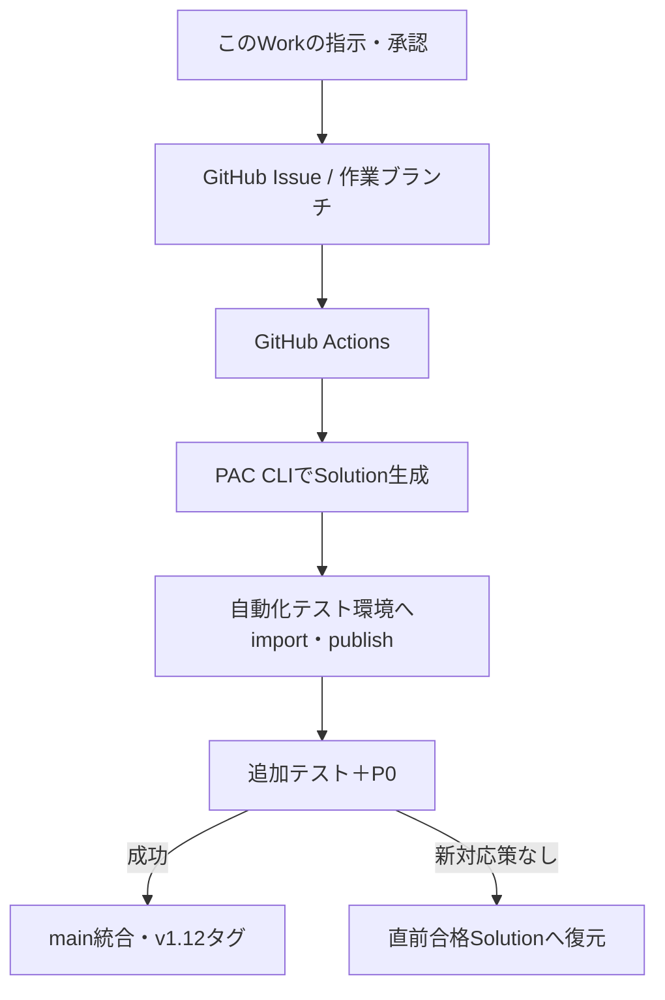

# Phase 1.5 実行計画 — CLI暫定経路とGitHub OIDC

更新日: 2026-09-15  
状態: **URL直接指定の無変更展開・CanView共有・隔離環境P0成功**  
対象Issue: [#5](https://github.com/hirokazu601218/PowerAppsCanvasAppUI/issues/5)  
対象PR: [#6](https://github.com/hirokazu601218/PowerAppsCanvasAppUI/pull/6)  
実行記録: [Phase 1.5 実行記録](unattended-development-phase1-5-execution-record.md)

## 1. 推奨判断

現時点ではGitHub Organization、Azure Key Vault、Managed Environmentを新規作成せず、既存の個人GitHubリポジトリと開発者環境を利用する。

Power Apps Premiumの購入とプレビュー機能に依存せず、次の構成で完全無人化の成立性を先に検証する。

- GitHubを変更指示、ソース、試行履歴、テスト結果の正本とする。
- Power Platform CLIでSolutionをexport/importする。
- Canvasアプリのソース変換だけは、非推奨の `pac canvas pack/unpack` をサンドボックス限定で使用する。
- GitHub ActionsからPower Platformへは、専用サービスプリンシパルとGitHub OIDC Federationで接続する。
- Client Secretは作成・保存しない。
- 公開済みP0合格アプリを直接上書きせず、別の自動化テスト環境へ配置する。
- 無変更の往復試験とP0が成功した場合だけ、この経路を採用する。
- 同じ対応策を単純反復しない。同一原因が2回続いても承認範囲内に未試行の実質的に異なる対応策があれば続行し、新対応策がない場合は停止する。

## 2. 実環境で確認した状態

| 項目 | 確認結果 |
|---|---|
| Microsoft Entraテナント | `山下テスト会社` |
| Tenant ID | `a00c92fa-e1db-4aa6-ab28-356c3203353d` |
| Azure Subscription | `Azure subscription 1` |
| Subscription ID | `2e8a84b7-d0e3-4576-9a74-484f3b7dcea7` |
| Azure上の権限 | 所有者 |
| Power Platform環境 | `山下 浩和 の環境` |
| Environment ID | `2fa12587-ea8f-ee93-ac2f-054f6b7fe2bb` |
| 環境種別 | 開発者 |
| Dataverse | あり |
| Managed Environment | いいえ |
| カスタムSolution | `StaffMasterAutomation`（表示名「職員マスタ自動化」、版 `1.11.0.0`）を作成済み |
| Power Apps Premium | なし |
| Power Apps Developer | あり |
| GitHub Organization | なし |
| GitHubリポジトリ | 個人アカウント配下、public、管理者権限あり |
| 専用アプリ登録 | `PowerAppsCanvasAppUI-Automation`（Application ID `1c94f011-c447-4af1-968f-ec564f489395`）を作成済み。Client Secret 0件 |

## 3. ネイティブGit統合を見送る理由

Power PlatformのGitHub統合はプレビューであり、次が必要になる。

- 開発・対象環境のManaged Environment化
- GitHub Organization管理権限
- Azure Key Vault
- Power Apps Premium等の適格ライセンス
- GitHub AppとOAuth接続

現在の管理センターにも「マネージド環境のすべてのユーザーにはPremium相当ライセンスが必要」と表示されている。現在のDeveloper Planは無料の開発・テスト用であり、Premiumは未購入である。

公式価格ページではPower Apps Premiumは米国表示で年払い1ユーザー月額20米ドル。実際の日本価格・税・契約条件は購入画面で確定する。

ネイティブGit統合が一般提供されるか、Premiumを継続契約する段階で移行を再評価する。

## 4. 構築する構成

GitHub ActionsからPower Platformへの認証は、GitHub OIDCトークンとMicrosoft EntraのFederated Credentialを使う。`pac auth create --githubFederated` が公式CLIで提供されているため、長期Client Secretを作らない。

## 5. 一回限りの設定

### 5.1 Power Platform

1. 公開済みP0合格アプリを `.msapp` として無変更ダウンロードし、ハッシュを記録する。
2. カスタムのアンマネージドSolution `StaffMasterAutomation` を作成する。
3. 現在の職員マスタ検索アプリをSolutionへ追加する。
4. 2個目の開発者環境 `StaffMaster-Automation-Test` を作成する。
5. Solutionを新環境へimportし、自動化専用テストアプリとする。

### 5.2 Microsoft Entra / Dataverse

1. 専用アプリ `PowerAppsCanvasAppUI-Automation` を登録する。
2. GitHub Environment `powerapps-test` を信頼対象にしたFederated Credentialを作る。
3. Client Secretは作らない。
4. 2つのサンドボックス環境へApplication Userとして追加する。
5. 初期PoCでは隔離テスト環境にSystem Administrator、基準環境にSystem Customizerを付与する。本番環境には付与しない。
6. 成立後に必要権限を調査し、専用の最小権限ロールへ縮小する。

### 5.3 GitHub

1. GitHub Environment `powerapps-test` を作成する。
2. Tenant ID、Application ID、Environment URL等の秘密でない識別子をEnvironment variablesへ登録する。
3. ワークフローへ `id-token: write` を付与する。
4. OIDCで `pac auth create --githubFederated` を実行する。
5. branch / PR / workflow / issueの命名と証跡保持を既存要件へ合わせる。
6. 個別承認済みの隔離テストアプリに限り、専用テスト利用者へ `CanView` を冪等付与し、読戻し検証する。`CanEdit` などへの権限拡大は拒否する。

## 6. 採用判定用round-trip

最初の試験ではPower Fxや画面を一切変更しない。

1. 基準Dataverse URLを直接指定して基準Solutionをexportする。
2. 取得済みSolutionと `.msapp` のunpack結果をGitHub正本として保持する。
3. 配布経路の無変更試験では、外部編集を加えずexportした同じSolutionパッケージを使用する。
4. 隔離テストDataverse URLを直接指定してimportし、publishする。
5. Canvasの再パック検証は配布経路から分離し、非推奨CLIの不具合を別ゲートとして扱う。
6. 既存P0を隔離テストアプリへ実行する。
7. P0合格後に、編集可能ソースからの再構成方式を採用判定する。
8. 失敗時は原因と試行済み対応策を記録する。同じ対応策は繰り返さず、承認範囲内に未試行の新対応策があれば続行する。

## 7. 変更境界

### 今回の承認後に変更するもの

- カスタムSolution
- 2個目の開発者環境
- 専用Entraアプリ／サービスプリンシパル
- GitHub OIDC Federated Credential
- サンドボックス内Application Userとロール
- GitHub Environment、変数、ワークフロー
- 自動化テスト用アプリ

### 変更しないもの

- 本番環境・本番アプリ
- 現在のP0合格公開アプリの画面・Power Fx
- 既存ユーザーの権限
- Security Defaultsや条件付きアクセス
- GitHub Organization、リポジトリ所有者
- Azure Key Vault
- Power Apps Premium契約
- 課金プラン

## 8. 停止・再確認条件

次の場合は自動処理を止め、再承認を求める。

- 課金契約や無料試用の開始が必要
- 既存P0合格アプリの内容変更が必要
- Security Defaults、MFA、条件付きアクセスの変更が必要
- 本番環境への権限付与・import・publishが必要
- GitHub Organizationへの移行が必要
- Client Secretの発行が必要
- round-tripで意味差分が出る
- 同じ原因・同じ対応策が反復し、承認範囲内に未試行の新対応策がない

## 9. 実行順と完了条件

| 順序 | 作業 | 完了条件 |
|---|---|---|
| 1 | 基準 `.msapp` の無変更取得 | ハッシュと取得記録 |
| 2 | Solution化 | export成功 |
| 3 | 自動化テスト環境作成 | Dataverse利用可能 |
| 4 | OIDCサービスプリンシパル構築 | GitHub Actionsから `pac auth who` 成功 |
| 5 | URL直接指定の無変更配布 | 基準環境export、隔離環境import・publish、対象アプリ存在確認が成功 |
| 6 | P0実行 | 全P0成功 |
| 7 | GitHub記録 | Issue・PR・証跡・ロールバック版を関連付け |

順序1～7の成功をもってPhase 1.5の無変更配布基線を完了とする。次のゲートは、編集可能Canvasソースから意味差分なくアプリを再構成できる方式の選定・実証とする。

## 10. 実行結果（2026-09-15）

OIDC、Solution作成、隔離テスト環境、専用サービスプリンシパル、GitHub OIDC、両環境へのアプリユーザー追加は完了した。基準環境のロールはSystem Customizer、隔離テスト環境はSystem Administratorであり、本番環境には権限を付与していない。

環境IDを指定した自動exportは、PAC CLIによるPower Platform管理APIの環境探索で2回失敗した。ユーザー承認後、基準Dataverse URL `https://org24a2c22d.crm7.dynamics.com/` を直接指定する新対応策へ切り替え、run [34922824319](https://github.com/hirokazu601218/PowerAppsCanvasAppUI/actions/runs/34922824319) で次をすべて確認した。

- 基準環境へのGitHub OIDC認証
- `StaffMasterAutomation` 版 `1.11.0.0` の自動export
- 隔離テストDataverse URLへのGitHub OIDC認証
- 同一の無変更Solutionパッケージのimport・publish
- 隔離環境内のSolutionとCanvasアプリの存在

隔離テストアプリはApp ID `362ac991-eead-4f07-8373-afdb3ebfdba1` で作成された。初回P0 run [34923187435](https://github.com/hirokazu601218/PowerAppsCanvasAppUI/actions/runs/34923187435) は、専用テスト利用者にアプリが未共有のため「Request access」で停止した。

個別承認に基づき、テナント管理APIで権限を拡大せず、アプリ所有者向けPower Apps APIを使用して隔離テストアプリだけを `powerapps-test@govaca.onmicrosoft.com` へ `CanView` 共有した。ワークフローは対象環境・App ID・利用者・ロールを固定し、`CanEdit` を拒否して、付与後の読戻し検証を行う。最終run [34925700515](https://github.com/hirokazu601218/PowerAppsCanvasAppUI/actions/runs/34925700515) で共有、検証、P0のすべてが成功した。

証跡artifactは `phase1-5-target-evidence-5`（ID `10379427558`、SHA-256 `1bc8db8f60ddb6435a7726c107ab538b202b4a88587cf4d17c535f9f9e808be8`）で、保持期限は2026-09-29 03:39:32 UTCである。基準アプリの内容・公開状態・共有設定、本番環境、テナント管理ロール、Client Secretはいずれも変更していない。

これによりURL直接指定の無変更配布基線は成立した。次は、失敗済みの `pac canvas pack` 単純再試行を除外し、編集可能Canvasソースからの再構成方式を比較・実証する。
