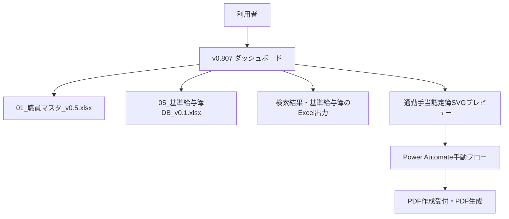
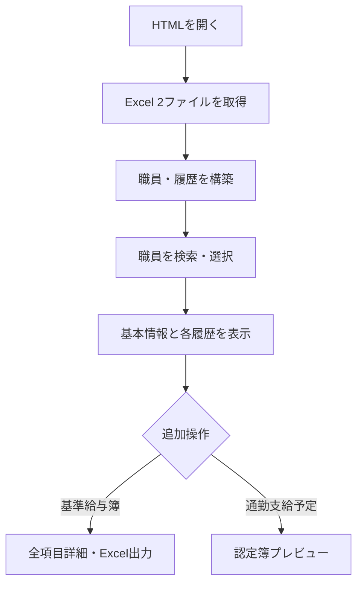

# 職員マスタ検索ダッシュボード v0.807 基本設計書

## 1. 文書の目的

本書は、SharePoint 上で動作する単一HTMLファイル「職員マスタ_検索ダッシュボード_v0.807」の目的、利用者、外部データ、画面、主要機能、制約を定義する基本設計書である。

人によるレビューとAIによる機械的な参照の両方を想定し、固有名詞、識別子、入出力、責務境界を明示する。実装関数、項目マッピング、処理条件は別紙「詳細設計書」に記載する。

## 2. 対象・前提

| 項目 | 内容 |
|---|---|
| 対象成果物 | `職員マスタ_検索ダッシュボード_v0.807(1).html` |
| 画面名 | 非常勤職員マスタ検索 |
| 配置・実行環境 | SharePoint のHTMLビューア内 |
| 構成 | HTML、CSS、JavaScript、通勤手当認定簿SVGを1ファイルに内包 |
| 外部ライブラリ | なし |
| 外部データ | SharePoint上のExcel 2ファイル |
| PDF作成 | Power Automateの手動フローを利用 |
| 対象外 | Power Automate内部のPDF変換ロジック、Excelファイル自体の列定義変更、SharePoint権限設計 |

### 2.1 正本判定

本書は次のソースを解析して作成した。

| 属性 | 値 |
|---|---|
| ファイル名 | `職員マスタ_検索ダッシュボード_v0.807(1).html` |
| HTMLタイトル | `職員マスタ_検索ダッシュボード_v0.807` |
| サイズ | 309,769 bytes |
| 行数 | 2,202行 |
| SHA-256 | `47e023970174c2e421488502c1f9445719db52dcbf20a4cc8f18ad0ba615e386` |

## 3. システム概要

本ダッシュボードは、職員マスタと基準給与簿を起動時に読み込み、職員検索、職員別の基本情報・履歴参照、Excel出力、通勤手当認定簿表示、PDF作成フローへの誘導を提供する。

## 4. 利用者と利用目的

| 利用者 | 主な利用目的 |
|---|---|
| 人事・給与担当者 | 職員を検索し、基本情報と各種履歴を確認する |
| 通勤手当担当者 | 通勤支給予定から通勤手当認定簿を表示し、PDF作成を依頼する |
| 管理・監査担当者 | 基準給与簿履歴の全項目を参照し、必要に応じてExcel出力する |
| 保守担当者・AI | データ参照元、画面、関数、制約、変更影響範囲を把握する |

## 5. 外部データ設計

### 5.1 SharePointデータソース

共通フォルダ：

`[環境固有パス省略] Documents/61_DX・職員DB等　令和8年度/11_改良版（実験中）/`

| ID | ファイル | 主用途 | 識別情報 |
|---|---|---|---|
| DS-01 | `01_職員マスタ_v0.5.xlsx` | 職員基本情報および5種類の履歴 | item ID `[環境固有ID省略]`、Unique ID `[環境固有ID省略]` |
| DS-02 | `05_基準給与簿DB_v0.1.xlsx` | 基準給与簿履歴 | table `q基準給与簿`、item ID `[環境固有ID省略]`、Unique ID `[環境固有ID省略]` |

### 5.2 論理データ区分

| 区分ID | 表示名 | 代表シート・テーブル名 | 結合キー |
|---|---|---|---|
| DATA-STAFF | 職員基本 | `StaffMaster`、`M_職員基本`、または名称に「職員基本」を含むシート | 職員番号 |
| DATA-WORK | 給与・勤務条件履歴 | `StaffConditionHistory` / `T_給与勤務条件履歴` | 職員番号 |
| DATA-COMMUTE | 通勤支給予定 | `CommutePaymentSchedule` / `T_通勤支給予定` | 職員番号 |
| DATA-SOCIAL | 社会保険履歴 | `SocialInsuranceHistory` / `T_社会保険履歴` | 職員番号 |
| DATA-RESIDENT | 住民税履歴 | `ResidentTaxHistory` / `T_住民税履歴` | 職員番号 |
| DATA-TAX | 税・固定控除設定履歴 | `TaxFixedDeductionHistory` / `T_税・固定控除設定履歴` | 職員番号 |
| DATA-PAYROLL | 基準給与簿履歴 | `q基準給与簿` | 職員番号 |

> `CommutePaymentSchedule` は先頭列が「通勤認定ID」であっても、「職員番号」列を名称で特定して有効行を判定する。列順には依存しない。

## 6. 画面構成

### 6.1 全体レイアウト

| 領域ID | 領域 | 内容 |
|---|---|---|
| UI-HEADER | ヘッダー | 画面タイトル、参照元ファイル名、取得時刻、検索結果Excel取得 |
| UI-SEARCH | 職員検索 | フリーワード、所属、在籍状態、検索、クリア |
| UI-LIST | 職員一覧 | 職員番号、氏名、所属、在籍状態、ページ移動 |
| UI-DETAIL | 職員詳細 | 選択職員の基本情報と各履歴 |
| UI-CERT | 通勤手当認定簿モーダル | v0.16の2ページ帳票プレビュー、PDFフロー案内 |
| UI-PAYROLL | 基準給与簿詳細モーダル | 選択職員の基準給与簿全項目、Excel出力 |

画面幅1,000px超では左400px・右可変の2列、1,000px以下では1列表示とする。職員一覧は1ページ20件とする。

### 6.2 職員詳細の表示順

1. 職員基本情報
2. 給与・勤務条件履歴
3. 通勤支給予定
4. 社会保険履歴
5. 住民税履歴
6. 税・固定控除設定履歴
7. 基準給与簿履歴

### 6.3 職員基本情報

| 順番 | 項目 |
|---:|---|
| 1 | 職員番号 |
| 2 | 氏名 |
| 3 | 組織・所属（正式名称） |
| 4 | 組織名略称 |
| 5 | 生年月日 |
| 6 | 性別 |
| 7 | 採用日 |
| 8 | 退職日 |
| 9 | 在籍状態 |

## 7. 機能要件

| 機能ID | 機能 | 要件 |
|---|---|---|
| F-01 | 初期読込 | SharePointホストから2つのExcel取得結果を受け取り、職員・履歴・基準給与簿を構築する |
| F-02 | 職員検索 | 全項目フリーワード、所属完全一致、在籍状態完全一致をAND条件で絞り込む |
| F-03 | 職員選択 | 一覧行の選択により右ペインへ対象職員の詳細を表示する |
| F-04 | 履歴表示 | 5種類の履歴を職員番号で抽出し、件数と表を表示する |
| F-05 | 日付・金額表現 | 日付区分で行を色分けし、金額候補列を右寄せ・桁区切り表示する |
| F-06 | 検索結果Excel出力 | 現在の検索対象データからブラウザ内でXLSXを生成しダウンロードする |
| F-07 | 基準給与簿概要 | 主要15項目を職員詳細内に表示する |
| F-08 | 基準給与簿詳細 | 「詳細表示」で元データの全項目をモーダル表示する |
| F-09 | 基準給与簿Excel出力 | 詳細モーダル対象の全項目をXLSXで出力する |
| F-10 | 通勤認定簿表示 | 職員基本と通勤支給予定を統合し、埋込SVGへ値を反映する |
| F-11 | 通勤認定IDコピー | PDFフロー案内モーダル内で現在の通勤認定IDをクリップボードへコピーし、3秒間トースト表示する |
| F-12 | PDF作成フロー誘導 | Power Automateのフロー詳細画面リンクを提示し、利用者が新しいタブで開いて手動実行できるようにする |
| F-13 | 再取得要求 | ホストへ `ka-html-viewer-refresh` メッセージを送信できること。現行UIでは更新ボタンと状態欄は非表示 |

## 8. 主要業務フロー

### 8.1 職員情報の参照

### 8.2 通勤手当認定簿PDF作成

1. 対象職員を選択する。
2. 「通勤支給予定」の「認定簿出力」を押す。
3. 認定簿プレビューで「PDF出力フローの実行」を押す。
4. 小モーダルで「通勤認定IDをコピー」を押す。
5. Power Automateリンクを右クリックし、「リンクを新しいタブで開く」を選択する。
6. Power Automate画面上部の「実行」を押す。
7. 入力欄へ通勤認定IDを貼り付け、画面下部の「実行」を押す。
8. 既存の受付・PDF作成フローにより、通常2～3分後にPDFが作成される。

## 9. 通勤手当認定簿の論理仕様

| 項目 | 仕様 |
|---|---|
| 帳票版 | 通勤手当認定簿 v0.16 |
| 表示方式 | 埋込HTML/SVGをShadow DOMへ展開 |
| 対象ページ | 2ページ表示。データマッピング定義は1ページ目の69フィールド |
| 統合元 | 選択職員の基本情報 + `T_通勤支給予定` の行 |
| 順路 | 最大4順路として帳票フィールドへ展開 |
| 認定ID | `通勤認定ID`。未設定時はPDFフロー実行ボタンを無効化 |
| 文字調整 | 欄幅に応じた縮小・折返し、備考の複数行化 |
| 表示補正 | 定期券欄中央寄せ、認定期間左寄せ、見出し文言・2ページ目罫線等をJavaScriptで補正 |

## 10. 非機能要件

| 区分 | 要件・現状 |
|---|---|
| 可用性 | 元Excel取得に失敗した場合は「Excelファイルを読み込めませんでした。」を表示する |
| 性能 | 初期起動時に2つのExcel全体を取得・解析するため、ファイル容量とSharePoint応答時間の影響を受ける |
| 操作性 | 検索入力は250msのデバウンス、一覧は20件単位、モーダルはEscまたは背景クリックで閉じられる |
| 互換性 | `TextEncoder`、`Blob`、`URL.createObjectURL`、Shadow DOM、Clipboard APIを利用できるモダンブラウザを前提とする |
| セキュリティ | SharePoint認証・権限を前提とし、HTML自身は認証情報を保持しない。出力値はHTML/XMLエスケープする |
| 保守性 | 外部ライブラリなしの単一ファイルである一方、埋込SVGと帳票補正コードによりファイルが大きい |
| アクセシビリティ | dialog/aria-modal、aria-label、focus、Esc閉じる処理を一部実装。完全なフォーカストラップは未実装 |
| 監査性 | 表示時刻と参照元ファイル名をヘッダーに表示。操作ログの永続化はHTMLの責務外 |

## 11. 制約・既知事項

1. SharePointビューアのsandbox制約により、スクリプトから新しいタブを直接開けない場合がある。このためPower Automateリンクは右クリックで新しいタブを開く運用とする。
2. PDF作成はHTMLから直接APIを呼び出さず、利用者がPower Automateを手動実行する。
3. 初期読込はExcel全件を対象とするため、約20秒を要する環境がある。v0.807では機能維持を優先し、高速化のためのデータ分離は採用していない。
4. 基準給与簿詳細は `05_基準給与簿DB_v0.1.xlsx` の全項目表示を要件とする。概要表は主要15項目のみである。
5. 埋込通勤認定簿テンプレート内に旧PDF送信用JavaScriptが含まれるが、ダッシュボードはShadow DOMへ挿入する前に全script要素を削除する。旧コードは実行されない。
6. シート・列名の揺れは一部正規化するが、意味が異なる列名への自動推測には限界がある。

## 12. エラー・空状態

| 条件 | 表示・動作 |
|---|---|
| 主データ取得失敗 | `Excelファイルを読み込めませんでした。` |
| 職員未選択 | `職員一覧から1名を選択してください。` |
| 履歴0件 | `登録されているレコードはありません（0件）` |
| 認定IDなし | PDFフロー実行ボタンを無効化。強制操作時は `通勤認定IDが設定されていません` |
| 認定簿生成失敗 | `認定簿を表示できませんでした：<エラー内容>` |
| Excel生成失敗 | `Excel出力に失敗しました。` |

## 13. 受入条件

| 受入ID | 条件 |
|---|---|
| AC-01 | 2つのExcelを読み込み、職員一覧が表示される |
| AC-02 | フリーワード、所属、在籍状態で検索できる |
| AC-03 | 職員選択後、基本情報と6区分の履歴が正しい職員番号で表示される |
| AC-04 | `CommutePaymentSchedule` の先頭列が通勤認定IDでも通勤支給予定が表示される |
| AC-05 | 基準給与簿の詳細表示に、職員番号・氏名を除く元データ全項目が表示される |
| AC-06 | 検索結果および基準給与簿詳細をXLSX出力できる |
| AC-07 | 通勤認定簿に選択職員と最大4順路の値が反映され、長文が欄外へはみ出さない |
| AC-08 | 通勤認定IDをコピーでき、3秒後にトーストが消える |
| AC-09 | Power Automateリンクを新しいタブで開き、コピーしたIDで既存フローを実行できる |

## 14. 変更時の影響範囲

| 変更対象 | 主な影響 |
|---|---|
| Excelのファイル名・場所・ID | LiveData manifestと`CONFIG.items`の両方 |
| シート・テーブル名 | 正規化マッピング、履歴抽出、画面見出し |
| 職員番号 | 全データ結合、選択、履歴抽出、認定簿、出力 |
| 通勤支給予定の列 | `buildCommuteLedgerRecord`、69項目マッピング、認定簿表示 |
| 基準給与簿の列 | 概要15項目、詳細全項目、XLSX出力 |
| Power AutomateフローURL | `COMMUTE_FLOW_URL`相当のリンク生成箇所 |
| 帳票SVG | フィールドID、レイアウト補正、折返し・位置調整 |

## 15. 関連文書

- `職員マスタ_検索ダッシュボード_v0.807_詳細設計書.md`
- `職員マスタ_検索ダッシュボード_v0.807(1).html`
