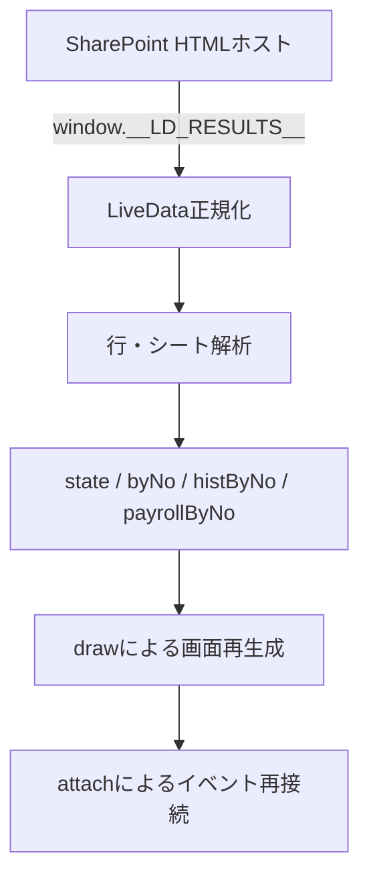

# 職員マスタ検索ダッシュボード v0.807 詳細設計書

> 対象アプリ：共通（自動テスト／ハンドメイド）

## 1. 文書の目的と読み方

本書はv0.807の実装構造、データ解析、状態、画面生成、イベント、Excel出力、通勤手当認定簿マッピングを、ソース修正に利用できる粒度で定義する。

- 人向け：表、処理順、制約、テスト観点から仕様を確認する。
- AI向け：`ID`、関数名、定数名、データキー、条件式を検索キーとして利用する。
- 「実装根拠」はHTML内の関数名または定数名を示す。
- 本書における「行」はJavaScriptオブジェクト化された1レコードを指す。

## 2. 実装構成

### 2.1 単一ファイル構成

| 構成要素 | 内容 |
|---|---|
| HTML | LiveData manifest、読込プレースホルダー、画面コンテナ |
| CSS | 画面、表、履歴色、モーダル、レスポンシブ表示 |
| JavaScript | データ解析、検索、描画、XLSX生成、通勤認定簿制御 |
| 埋込テンプレート | `COMMUTE_LEDGER_V016_HTML`に通勤手当認定簿v0.16のHTML/SVGを文字列として保持 |
| 埋込マッピング | `excel-svg-mapping` JSON。帳票1ページ目69フィールド |

### 2.2 実行責務



描画は差分更新ではなく、`draw()`で画面主要部を再構築し、`attach()`でイベントを付け直す方式である。

## 3. 外部入力インターフェース

### 3.1 LiveData入力

ホストが `window.__LD_RESULTS__` に取得結果を注入する。各結果は少なくとも次の概念を持つ。

```json
{
  "format": "xlsx-sheets | rows | csv | text",
  "content": "文字列またはJSON文字列",
  "error": "任意のエラー情報"
}
```

| format | content | 処理 |
|---|---|---|
| `xlsx-sheets` | `<sheet name="...">CSV...</sheet>`の連結文字列 | 全シート抽出後、各CSVを解析 |
| `rows` | `{headers:[], rows:[]}` JSON文字列 | 配列行またはオブジェクト行をヘッダー付き行へ正規化 |
| `csv` | CSV文字列 | 区切り解析 |
| `text` | CSV/TSV相当文字列 | 先頭行からタブまたはカンマを判定 |

実装根拠：`extractSheets`、`loadTabular`、`parseCSV`、`sheetsFrom`、`genericRows`。

### 3.2 データソース定義

LiveData manifestと`CONFIG.items`に同一の2件を持つ。変更時は両方を一致させる。

| 配列位置 | fileName | tableName | 用途 |
|---:|---|---|---|
| 0 | `01_職員マスタ_v0.5.xlsx` | 指定なし | 職員・履歴・通勤支給予定 |
| 1 | `05_基準給与簿DB_v0.1.xlsx` | `q基準給与簿` | 基準給与簿 |

## 4. データ解析設計

### 4.1 CSV解析

| 関数 | 用途 | 特徴 |
|---|---|---|
| `splitLine` | 簡易1行分割 | 引用符と二重引用符を処理 |
| `_parseDelimited` | LiveData共通簡易解析 | 空行除去、先頭行でタブ/カンマ判定 |
| `parseCSV` | ダッシュボード主解析 | BOM、引用符内改行、引用符内カンマ、二重引用符を処理 |

主画面のExcel解析には`parseCSV`を用いるため、複数行テキストを含むCSVを扱える。

### 4.2 ヘッダー正規化

`_normHeader`は次の順で列名を正規化する。

1. 文字列化して小文字化。
2. SharePoint形式 `_xHHHH_` をUnicode文字へ復号。
3. `_0xHH_` をUnicode文字へ復号。
4. 空白とアンダースコアを削除。

`findCol`は完全一致を優先し、なければ正規化後の部分一致を返す。戻り値は列番号ではなく、実際のヘッダー文字列である。

### 4.3 有効行判定

`objRows`はヘッダー名「職員番号」を解決し、その値が空でない行を有効行とする。先頭列の値には依存しない。このため`CommutePaymentSchedule`の先頭列が「通勤認定ID」でも読み込める。

### 4.4 シート名の正規化

`canonicalDataSectionName`は英語名を表示・内部抽出用の日本語名へ変換する。

| 入力 | 正規化結果 |
|---|---|
| `CommutePaymentSchedule` | `T_通勤支給予定` |
| `StaffConditionHistory` | `T_給与勤務条件履歴` |
| `SocialInsuranceHistory` | `T_社会保険履歴` |
| `ResidentTaxHistory` | `T_住民税履歴` |
| `TaxFixedDeductionHistory` | `T_税・固定控除設定履歴` |

### 4.5 主データ選択

職員基本シートは、名称が次のいずれかに合致するものを優先する。

- `StaffMaster`
- `M_職員基本`
- SharePointエスケープを含む同等名
- 「職員基本」を含む名称

基準給与簿は、`q基準給与簿`に一致するシートを優先し、該当がない場合は全シートをフォールバック候補とする。

## 5. 内部データモデル

### 5.1 インデックス

| 変数 | 型 | キー | 値 |
|---|---|---|---|
| `master` | `Array<Object>` | なし | 職員基本行 |
| `byNo` | `Object` | 職員番号 | 職員基本行 |
| `histByNo` | `Object` | 職員番号 | 履歴行配列 |
| `payrollByNo` | `Object` | 職員番号 | 基準給与簿行配列 |

履歴行には内部メタデータ `_sheet`、`_org`、`_status`を付加する。画面・出力時、`_`で始まるキーは原則非表示とする。

### 5.2 状態オブジェクト

```js
state = {
  mPage: 1,
  hPage: 1,
  filtered: master,
  selected: '',
  filter: { q: '', org: '', status: '' },
  _drawing: false,
  _exportUrl: undefined,
  _payrollExportUrl: undefined
}
```

| キー | 意味 |
|---|---|
| `mPage` | 職員一覧ページ番号 |
| `hPage` | 履歴表示ページ番号 |
| `filtered` | 現在の検索条件に合う職員行 |
| `selected` | 選択職員番号 |
| `filter` | 現在適用中の検索条件 |
| `_drawing` | 再入描画抑止 |
| `_exportUrl` | 検索結果XLSXのObject URL |
| `_payrollExportUrl` | 基準給与簿詳細XLSXのObject URL |

## 6. 検索・ページング設計

### 6.1 検索条件

| 条件 | 対象 | 比較 |
|---|---|---|
| `q` | 職員行の全値を連結した`_blob` | 小文字化後の部分一致 |
| `org` | 組織名略称、なければ正式名称 | 完全一致 |
| `status` | 在籍状態 | 完全一致 |

複数条件はAND結合する。検索入力イベントは250msデバウンスする。検索実行時に`mPage`と`hPage`を1へ戻す。

### 6.2 ページング

- 定数：`PAGE = 20`
- `m-prev` / `m-next`：職員一覧
- `h-prev` / `h-next`：履歴
- ページ変更後は`draw()`で再描画する。

## 7. 表示設計

### 7.1 色・整形判定

| 関数 | 目的 |
|---|---|
| `parseDateValue` | `yyyy/mm/dd`、`yyyy-mm-dd`、Excelシリアル日付をDateへ変換 |
| `isDateColumn` | 列名末尾「日」等から日付候補を判定 |
| `isMoneyColumn` | 金額候補列を判定 |
| `formatCell` | 金額の桁区切り等を適用 |
| `periodClass` / `dateClass` | 将来・現在・過去のCSSクラスを返す |
| `statusClass` | 在籍状態等の表示クラスを返す |

期間色は、将来`#E5EFFB`、現在`#DDF2D5`、過去`#F2F2F2`を使用する。

### 7.2 履歴列生成

`historyCols`は共通項目を優先し、最初の200行に存在する追加列を後続へ加え、最大12列とする。

`pairsForSection`は区分別の表示優先順を返す。通勤支給予定では次を基本とする。

- 適用開始日、適用終了日、支給方式
- 通勤4月～通勤3月
- 通勤毎月、通勤IC運賃
- 月次・金額系の追加項目は、対象行に1以上の数値が存在する場合のみ表示

### 7.3 空状態

対象行が0件の場合、見出しと件数`0件`に続けて「登録されているレコードはありません（0件）」を表示する。

## 8. 基準給与簿設計

### 8.1 概要表

`payrollPairs`は次の15項目を順番固定で表示する。元データに列がない項目は追加しない。

1. 給与期間対象年
2. 支給年月日
3. 俸給支給額・当給与期間分
4. 俸給支給額・返納・追給分
5. 通勤手当・当給与期間分
6. 通勤手当・返納・追給分
7. 在宅勤務等手当・当給与期間分
8. 在宅勤務等手当・返納・追給分
9. 超過勤務手当等・当給与期間分
10. 超過勤務手当等・返納・追給分
11. 給与支給総額
12. 控除額計・当給与期間分
13. 控除額計・返納・追給分
14. 現金支給額
15. 備考

### 8.2 詳細モーダル

`payrollDetailPairs`は、対象職員の基準給与簿行から全キーを収集し、次のみ除外する。

- `_`で始まる内部キー
- `職員番号`
- `氏名`

したがって、モーダルの見出しで職員番号・氏名を表示し、表本体では`05_基準給与簿DB_v0.1.xlsx`のその他全項目を表示する。備考以外は等幅相当、備考は折返しとする。

### 8.3 詳細XLSX

- シート名：`基準給与簿詳細`
- 列：`payrollDetailPairs`と同一
- ファイル名：`基準給与簿詳細_<氏名または職員番号>_<YYYYMMDDHHMMSS>.xlsx`
- 禁止文字 `/ : * ? " < > |` は `_` に置換する。

## 9. 検索結果XLSX設計

`makeXlsxBlob`は外部ライブラリを使用せず、SpreadsheetML XMLとZIP構造をブラウザ内で生成する。

| シート順 | シート名 | 対象 |
|---:|---|---|
| 1 | 職員一覧 | 現在の`state.filtered`。職員番号、氏名、所属、在籍状態 |
| 2 | 給与勤務条件 | 選択職員の給与・勤務条件履歴 |
| 3 | 通勤支給予定 | 選択職員の通勤支給予定 |
| 4 | 社会保険履歴 | 選択職員の社会保険履歴 |
| 5 | 住民税履歴 | 選択職員の住民税履歴 |
| 6 | 税固定控除 | 選択職員の税・固定控除設定履歴 |
| 7 | 基準給与簿履歴 | 選択職員の概要15項目 |

未選択時、職員一覧以外は空シートとなる。ファイル名は`職員マスタ_検索結果_<YYYYMMDDHHMMSS>.xlsx`。

実装根拠：`sheetXmlX`、`rowsForPairs`、`utf8`、`crc32`、`zip`、`makeXlsxBlob`、`exportFile`。

## 10. 通勤手当認定簿データ統合

### 10.1 入力と統合優先順位

`buildCommuteLedgerRecord(person, rows)`は、職員基本行を先頭、通勤支給予定行を後続とする`sources`を順に走査し、最初に見つかった非空値を採用する。`_`で始まる内部キーは除外する。

固定上書きは次のとおり。

| 出力キー | 優先元 |
|---|---|
| 氏名 | `person.氏名` |
| 職員番号 | `person.職員番号` |
| 組織・所属 | `person.組織・所属（正式名称）` → `person.組織名略称` → 既存値 |
| 事実発生年月日 | 同名 → 先頭通勤行の同名 → 適用開始日 |
| 提出年月日 | 同名 → 届出年月日 → 適用開始日 |
| 受理年月日 | 同名 → 適用開始日 |

### 10.2 順路生成

最大4行を順路1～4に割り当てる。各順路`i`について、既存の`i_`列を優先し、汎用列をフォールバックする。

| 帳票レコードキー | 主なフォールバック候補 |
|---|---|
| `i_交通機関` | `交通機関i`、`交通機関`、`普通交通機関等の名称` |
| `i_利用区間発` | `利用区間発i`、`利用区間発`、`利用区間（発）`、`区間（発）` |
| `i_利用区間着` | `利用区間着i`、`利用区間着`、`利用区間（着）`、`区間（着）` |
| `i_定期等別` | `定期等別i`、`定期等別`、`券種`、`支給方式` |
| `i_回数券他_算定基礎` | 同名番号付き、同名共通、`算定基礎` |
| `i_定期券(km)_算定基礎` | 同名番号付き、同名共通、`片道距離`、`距離` |
| `i_回数券他_相当額` | 同名番号付き、同名共通、`通勤IC運賃`、`IC片道運賃` |
| `i_定期券_相当額` | 同名番号付き、同名共通、`定期券額i`、`定期券額`、`定期額` |
| `i_定期箇月` | 同名番号付き、同名共通、または券種文字列中の1/3/6/12箇月 |
| `i_１箇月当たりの運賃等相当額` | 同名番号付き、同名共通、`通勤毎月`、または定期券額÷定期箇月 |
| `i_認定期間始` | 同名番号付き、同名共通、`適用開始日` |
| `i_支給月` | 同名番号付き、同名共通、または通勤4月～3月の正数月 |
| `i_備考` | 同名番号付き、同名共通 |

4順路の月額が数値化でき、合計額が未設定の場合は`1箇月当たりの運賃等相当額の合計額`を計算する。

## 11. SVGマッピング設計

### 11.1 マッピング定義

| 属性 | 値 |
|---|---|
| version | `v0.16` |
| workbook.sheet | `新テーブル項目` |
| workbook.table | `テーブル1` |
| headerRow | 3 |
| dataStartRow | 4 |
| keyHeader | `職員番号` |
| scope | `認定簿1ページ目のみ` |
| fields | 69 |

### 11.2 共通フィールド（12件）

| field | sourceHeader | format |
|---|---|---|
| `employee_name` | 氏名 | text |
| `employee_number` | 職員番号 | text |
| `organization` | 組織・所属 | text |
| `event_date_year` | 事実発生年月日 | reiwaYear |
| `event_date_month` | 事実発生年月日 | month |
| `event_date_day` | 事実発生年月日 | day |
| `submitted_date_year` | 提出年月日 | reiwaYear |
| `submitted_date_month` | 提出年月日 | month |
| `submitted_date_day` | 提出年月日 | day |
| `accepted_date_year` | 受理年月日 | reiwaYear |
| `accepted_date_month` | 受理年月日 | month |
| `accepted_date_day` | 受理年月日 | day |

### 11.3 順路フィールド（各14件 × 4順路 = 56件）

下表の`{n}`は1～4。fieldは`route_{n}_...`、sourceHeaderは`{n}_...`へ展開する。

| fieldパターン | sourceHeaderパターン | format |
|---|---|---|
| `route_{n}_transport` | `{n}_交通機関` | text |
| `route_{n}_section_from` | `{n}_利用区間発` | text |
| `route_{n}_section_to` | `{n}_利用区間着` | text |
| `route_{n}_ticket_type` | `{n}_定期等別` | text |
| `route_{n}_other_basis` | `{n}_回数券他_算定基礎` | text |
| `route_{n}_season_basis` | `{n}_定期券(km)_算定基礎` | decimal |
| `route_{n}_other_amount` | `{n}_回数券他_相当額` | integer |
| `route_{n}_season_amount` | `{n}_定期券_相当額` | integer |
| `route_{n}_season_months` | `{n}_定期箇月` | integer |
| `route_{n}_monthly_amount` | `{n}_１箇月当たりの運賃等相当額` | integer |
| `route_{n}_period_start_year` | `{n}_認定期間始` | reiwaYear |
| `route_{n}_period_start_month` | `{n}_認定期間始` | month |
| `route_{n}_payment_months` | `{n}_支給月` | paymentMonths |
| `route_{n}_remarks` | `{n}_備考` | text |

### 11.4 合計フィールド（1件）

| field | sourceHeader | format |
|---|---|---|
| `monthly_amount_total` | １箇月当たりの運賃等相当額の合計額 | integer |

### 11.5 書式関数

| format | 処理 |
|---|---|
| `text` | 文字列化 |
| `reiwaYear` | 西暦年から2018を減算 |
| `month` | 月を1～12で表示 |
| `day` | 日を表示 |
| `integer` | 数値を四捨五入し日本語ロケールの桁区切り |
| `decimal` | 有限数なら通常の数値文字列 |
| `paymentMonths` | カンマ・読点区切りの数字へ「月」を付加。「毎月」はそのまま |

## 12. 通勤認定簿レイアウト補正

| 補正ID | 対象 | 実装 |
|---|---|---|
| L-01 | 交通機関名 | 最大3行折返し |
| L-02 | 利用区間発・着 | 最大2行折返し |
| L-03 | 定期等別 | 最大2行、中央寄せ |
| L-04 | 定期券(km)・定期券相当額・定期箇月 | 中央寄せ |
| L-05 | 認定期間 | `令和N年M月から`へ統合し左寄せ。月用ノードは空にする |
| L-06 | 備考 | 最大幅150、最大3行、強制折返し、最小フォント5.2 |
| L-07 | 見出し | 「回数券その他(式)」「定期券(km)」「回数券その他(円)」「定期券(円)」「1箇月当たりの運賃等相当額(円)」「支給対象月」へ補正 |
| L-08 | 新幹線鉄道等利用者 | 見出し左の四角を白抜きに補正 |
| L-09 | 駐車場等利用者 | 平均通勤所要回数見出しを4行化し、欠損・不整合罫線を補正 |

実装根拠：`commuteLedgerSplitLines`、`commuteLedgerLayoutCell`、`commuteLedgerFormatRecognitionPeriods`、`commuteLedgerEnhancePageOne`、`commuteLedgerUpdatePageOneLabels`、`commuteLedgerFixPageTwo`。

## 13. 通勤認定簿モーダル・PDFフロー

### 13.1 モーダル生成

`openCommuteCertificate`は次を行う。

1. 既存認定簿モーダルを閉じる。
2. 選択職員と`T_通勤支給予定`行を取得する。
3. `buildCommuteLedgerRecord`で帳票レコードを作る。
4. 認定簿モーダルとShadow DOMホストを生成する。
5. `createCommuteLedgerController`でSVG、値、操作UIを初期化する。

### 13.2 Shadow DOM初期化

1. `COMMUTE_LEDGER_V016_HTML`を`DOMParser`で解析。
2. `excel-svg-mapping`をJSON解析。
3. 埋込HTML内の全`script`要素を削除。
4. 見出し文言を補正。
5. 帳票レコードをSVGへ反映。
6. open Shadow DOMを作り、テンプレートCSSと本文を挿入。
7. PDFフロー案内UI、トースト、イベントを追加。
8. フォント準備完了後を含め、文字幅調整を実行。

### 13.3 PDFフロー定数

```text
[環境固有フローURL省略]
```

実装名：`COMMUTE_PDF_FLOW_URL`。

### 13.4 小モーダル

| 手順 | 表示・処理 |
|---:|---|
| 1 | 通勤認定IDを表示し、「通勤認定IDをコピー」ボタンを提供 |
| 2 | Power AutomateのPDF出力フローリンクを提供。右クリックで新しいタブを開くよう案内 |
| 3 | Power Automate上部の実行、ID貼付、下部の実行、2～3分後のPDF作成を案内 |

通勤認定IDが空の場合、`PDF出力フローの実行`とコピー操作を無効化する。

### 13.5 コピー処理

1. `navigator.clipboard.writeText`を試す。
2. 失敗または未対応なら、一時`textarea`と`document.execCommand('copy')`へフォールバック。
3. 成功時「通勤認定IDをコピーしました」を表示。
4. 失敗時「通勤認定IDをコピーできませんでした」を表示。
5. トーストは3,000ms後に非表示。

### 13.6 旧埋込コードの扱い

埋込帳票文字列の中には、`commute-ledger-pdf-request-v076`を親へ送信する旧スクリプトが残る。しかし`createCommuteLedgerController`が挿入前に`sourceDoc.querySelectorAll('script').forEach(remove)`を実行するため、v0.807のランタイムでは非稼働である。保守時に現行PDF仕様と誤認しないこと。

## 14. DOMイベント設計

| 対象 | イベント | ハンドラ | 結果 |
|---|---|---|---|
| `tr[data-no]` | click | 無名関数 | `state.selected`更新、再描画 |
| `[data-action=search]` | click | `doSearch` | 条件適用 |
| 検索入力 | input | `debounced` | 250ms後に条件適用 |
| `[data-action=clear]` | click | `clear` | 条件・選択・ページ初期化 |
| `[data-page]` | click | 無名関数 | 対象ページ増減 |
| `[data-action=export]` | click | `exportFile` | 検索結果XLSX作成 |
| `[data-action=open-payroll-modal]` | click | `openPayrollModal` | 基準給与簿詳細表示 |
| `[data-action=export-payroll-modal]` | click | `exportPayrollModal` | 詳細XLSX作成 |
| `[data-action=open-commute-cert]` | click | `openCommuteCertificate` | 認定簿表示 |
| PDFフロー実行 | click | `openFlowModal` | 小モーダル表示 |
| 通勤認定IDコピー | click | `copyCertificationId` | クリップボードへコピー |
| document | keydown Escape | 共通閉じる処理 | 基準給与簿・認定簿モーダルを閉じる |
| モーダル背景 | click | 各close関数 | 対象モーダルを閉じる |

## 15. 関数カタログ

### 15.1 データ取得・解析

| 関数 | 責務 |
|---|---|
| `splitLine` / `_parseDelimited` | LiveData簡易区切り解析 |
| `extractSheets` | `<sheet>`ブロック抽出 |
| `loadTabular` | 取得形式をヘッダー・行へ正規化 |
| `_normHeader` / `findCol` | 列名揺れ吸収 |
| `parseCSV` / `sheetsFrom` / `objRows` / `genericRows` | 主画面向けExcelデータ解析 |
| `canonicalDataSectionName` | シート・テーブル名統一 |

### 15.2 状態・検索・描画

| 関数 | 責務 |
|---|---|
| `filt` / `apply` | 条件取得・絞込 |
| `histories` / `payrollHistories` | 職員番号別履歴取得 |
| `selectedMaster` | 選択職員取得 |
| `draw` | 画面再構築 |
| `attach` | 描画後イベント接続 |
| `doSearch` / `debounce` / `clear` | 検索制御 |
| `pager` | ページUI生成 |

### 15.3 表示

| 関数 | 責務 |
|---|---|
| `esc` / `xml` | HTML/XMLエスケープ |
| `masterTable` / `staffListTable` | 職員一覧生成 |
| `basicInfo` / `kv` | 職員基本情報生成 |
| `pairsForSection` / `renderRowsTable` | 履歴列・表生成 |
| `renderHistorySection` | 履歴セクション生成 |
| `payrollPairs` / `payrollDetailPairs` | 基準給与簿列定義 |
| `renderPayrollSection` | 基準給与簿概要生成 |
| `openPayrollModal` / `closePayrollModal` | 詳細モーダル制御 |

### 15.4 通勤認定簿

| 関数 | 責務 |
|---|---|
| `buildCommuteLedgerRecord` | 職員・通勤行から帳票レコード生成 |
| `commuteLedgerApplyRecord` | マッピングに従ってSVGへ値設定 |
| `commuteLedgerFitText` / `commuteLedgerLayoutCell` | 文字縮小・折返し・配置 |
| `commuteLedgerFormatRecognitionPeriods` | 認定期間整形・左寄せ |
| `commuteLedgerEnhancePageOne` | 1ページ目セル補正 |
| `commuteLedgerUpdatePageOneLabels` | 1ページ目見出し補正 |
| `commuteLedgerFixPageTwo` | 2ページ目四角・罫線・見出し補正 |
| `createCommuteLedgerController` | Shadow DOM、操作UI、コピー、フローリンク統合 |
| `openCommuteCertificate` / `closeCommuteCertificate` | 認定簿モーダル制御 |

### 15.5 XLSX生成

| 関数 | 責務 |
|---|---|
| `colName` | 列番号をA1形式列名へ変換 |
| `sheetXmlX` | ワークシートXML生成 |
| `rowsForPairs` | 表示列定義に従い出力行生成 |
| `crc32` / `u16` / `u32` / `zip` | 無圧縮ZIPパッケージ生成 |
| `makeXlsxBlob` | 検索結果ブック生成 |
| `makePayrollXlsxBlob` | 基準給与簿詳細ブック生成 |
| `exportFile` / `exportPayrollModal` | Object URL生成とダウンロード開始 |

## 16. セキュリティ・ブラウザ制約

| 観点 | 実装・留意点 |
|---|---|
| 認証 | SharePointとPower Automate側のMicrosoft 365認証を利用 |
| HTML注入対策 | 通常画面値は`esc`、Excel XMLは`xml`でエスケープ |
| iframe sandbox | `window.open`やトップ遷移が拒否される場合がある |
| 外部リンク | `target="_blank"`、`rel="noopener noreferrer"` |
| クリップボード | セキュアコンテキスト・許可状態に依存し、旧APIへフォールバック |
| Object URL | 新規生成前に旧URLを`URL.revokeObjectURL`で解放 |
| Shadow DOM | 帳票CSSをダッシュボードから分離。modeは`open` |

## 17. エラー処理

| 失敗点 | 処理 |
|---|---|
| 主データなし・取得エラー | 画面に読込失敗表示 |
| マッピングJSONなし | 認定簿ホストにエラー表示 |
| PDFボタン要素なし | 認定簿初期化エラー |
| 通勤認定IDなし | ボタン無効化、操作時エラートースト |
| Clipboard API失敗 | `execCommand('copy')`へフォールバック |
| XLSX生成例外 | 画面内ステータスへ失敗表示 |

例外は主にユーザー向け表示へ変換し、サーバーへログ送信しない。

## 18. テスト設計

### 18.1 データ読込

| テストID | 条件 | 期待結果 |
|---|---|---|
| T-DATA-01 | 正常な2ファイル | 職員一覧と基準給与簿が表示される |
| T-DATA-02 | `CommutePaymentSchedule`の先頭列が通勤認定ID | 職員番号列で有効行判定し、0件にならない |
| T-DATA-03 | 英語シート名 | 日本語論理区分へ正規化される |
| T-DATA-04 | 引用符内改行・カンマを含むセル | 1セルとして保持される |
| T-DATA-05 | 主ファイル取得エラー | 読込失敗表示になる |

### 18.2 検索・表示

| テストID | 操作 | 期待結果 |
|---|---|---|
| T-UI-01 | フリーワード入力 | 250ms後に全項目部分一致で絞り込まれる |
| T-UI-02 | 所属・在籍状態指定 | 完全一致かつAND条件で絞り込まれる |
| T-UI-03 | クリア | 条件、選択、ページが初期化される |
| T-UI-04 | 職員選択 | 右ペインに当該職員のみ表示される |
| T-UI-05 | 履歴なし | 0件メッセージが表示される |
| T-UI-06 | 基準給与簿詳細 | 元データの全項目が表示される |

### 18.3 帳票

| テストID | 条件 | 期待結果 |
|---|---|---|
| T-CERT-01 | 通勤行1～4件 | 順路1～4へ対応して表示される |
| T-CERT-02 | 長い交通機関名・区間・備考 | 折返しまたは縮小され、欄外へはみ出さない |
| T-CERT-03 | 定期券関連値 | 中央寄せ |
| T-CERT-04 | 認定期間始あり | `令和N年M月から`を左寄せ表示 |
| T-CERT-05 | 支給月未設定、月別金額あり | 正数の月から支給月を生成 |
| T-CERT-06 | 月額合計未設定 | 4順路月額の合計を表示 |
| T-CERT-07 | 2ページ目 | 新幹線の□が白抜き、駐車場欄の見出しと罫線が整合 |

### 18.4 PDFフロー

| テストID | 条件 | 期待結果 |
|---|---|---|
| T-PDF-01 | 通勤認定IDあり | 小モーダルを表示できる |
| T-PDF-02 | コピー成功 | 正しいIDがクリップボードへ入り、成功トーストが3秒表示 |
| T-PDF-03 | 通勤認定IDなし | PDFフロー実行ボタンが無効 |
| T-PDF-04 | Power Automateリンク右クリック | 新しいタブで指定フロー詳細を開ける |
| T-PDF-05 | ID貼付後フロー実行 | 受付リスト登録と既存PDF作成フローが一気通貫で成功 |

### 18.5 Excel出力

| テストID | 操作 | 期待結果 |
|---|---|---|
| T-XLSX-01 | 検索結果Excel取得 | 7シート構成のXLSXが開ける |
| T-XLSX-02 | 基準給与簿詳細Excel出力 | 全詳細列を持つ1シートXLSXが開ける |
| T-XLSX-03 | XML予約文字を含む値 | ファイル破損せず値が保持される |

## 19. 要件トレーサビリティ

| 基本設計機能ID | 主な実装 | 主なテスト |
|---|---|---|
| F-01 | `loadTabular`、`sheetsFrom`、`objRows` | T-DATA-01～05 |
| F-02 | `filt`、`apply`、`doSearch` | T-UI-01～03 |
| F-03 | `selectedMaster`、`draw`、`attach` | T-UI-04 |
| F-04 | `histories`、`renderHistorySection` | T-UI-04～05 |
| F-05 | `parseDateValue`、`formatCell`、`periodClass` | T-UI-04 |
| F-06 | `makeXlsxBlob`、`exportFile` | T-XLSX-01、03 |
| F-07 | `payrollPairs`、`renderPayrollSection` | T-UI-04 |
| F-08 | `payrollDetailPairs`、`openPayrollModal` | T-UI-06 |
| F-09 | `makePayrollXlsxBlob`、`exportPayrollModal` | T-XLSX-02、03 |
| F-10 | `buildCommuteLedgerRecord`、`commuteLedgerApplyRecord` | T-CERT-01～07 |
| F-11 | `copyCertificationId`、`showToast` | T-PDF-02～03 |
| F-12 | `openFlowModal`、`COMMUTE_PDF_FLOW_URL` | T-PDF-01、04～05 |
| F-13 | `refresh`、`postMessage` | ホスト統合テスト |

## 20. 保守ルール

1. 修正前にHTMLの版、サイズ、SHA-256を記録する。
2. データソース変更時はLiveData manifestと`CONFIG.items`を同時に更新する。
3. 列順に依存する処理を追加せず、列名で解決する。
4. 「職員番号」は全結合の基本キーとして保持する。「通勤認定ID」は通勤認定を一意に識別する業務キーとして扱う。
5. 基準給与簿の概要15項目と詳細全項目を混同しない。
6. 帳票フィールド追加時は、レコード生成、JSONマッピング、SVGの`field-...` ID、レイアウト補正、テストを同時に更新する。
7. 埋込帳票内のscriptは実行されない。現行動作の変更はダッシュボード側コントローラへ実装する。
8. v0.807の高速化を行う場合も、基準給与簿詳細の全項目表示を回帰条件とする。
9. SharePoint iframeのポップアップ制約を前提に、Power Automate導線はリンクとして維持する。
10. 変更後は検索、全履歴、2種XLSX、帳票2ページ、IDコピー、PDFフローを回帰確認する。

## 21. 既知の技術的負債

| ID | 内容 | 影響 |
|---|---|---|
| TD-01 | 初期読込で2つのExcel全体を取得・解析 | 起動に約20秒かかる環境がある |
| TD-02 | 30万bytes超の単一HTMLにSVG・旧コードを内包 | 読込・解析・保守コストが高い |
| TD-03 | 画面全再描画とイベント再接続 | データ増大時に操作コスト増加の可能性 |
| TD-04 | XLSXを独自ZIP生成 | 高度な書式、圧縮、互換性の拡張が難しい |
| TD-05 | モーダルの完全なフォーカストラップなし | キーボード操作の改善余地 |
| TD-06 | 例外・操作ログの永続化なし | 障害解析はブラウザ画面・コンソールに依存 |
| TD-07 | 埋込帳票に非稼働の旧PDF送信コードが残存 | 保守時の誤認、ファイル肥大化 |

## 22. 関連文書

- `職員マスタ_検索ダッシュボード_v0.807_基本設計書.md`
- `職員マスタ_検索ダッシュボード_v0.807(1).html`
