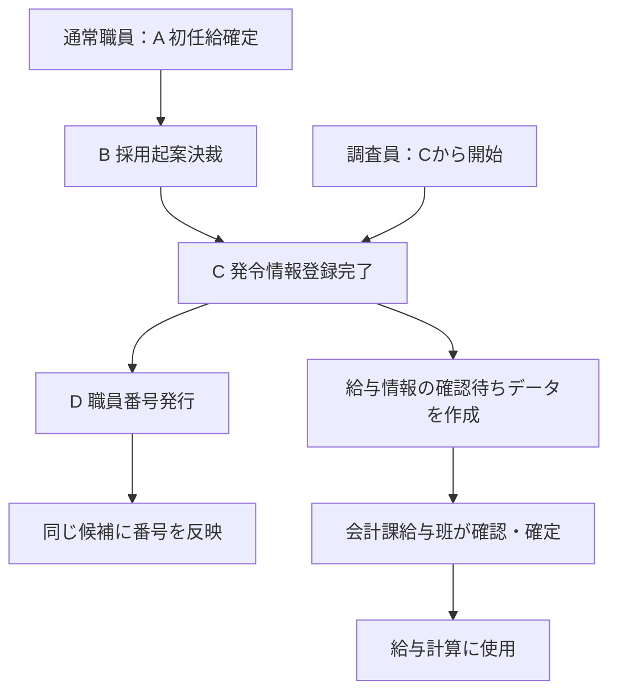
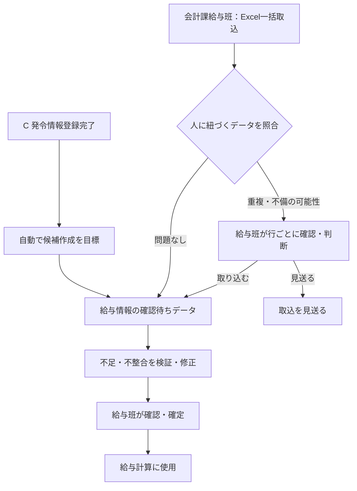
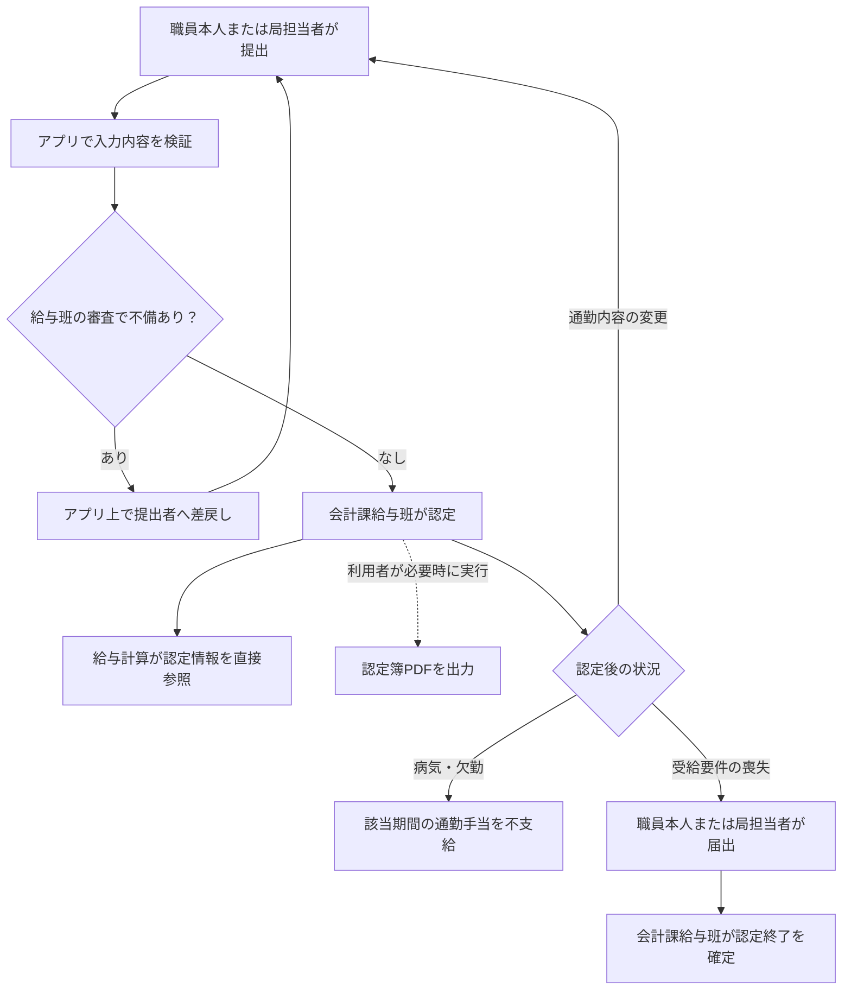
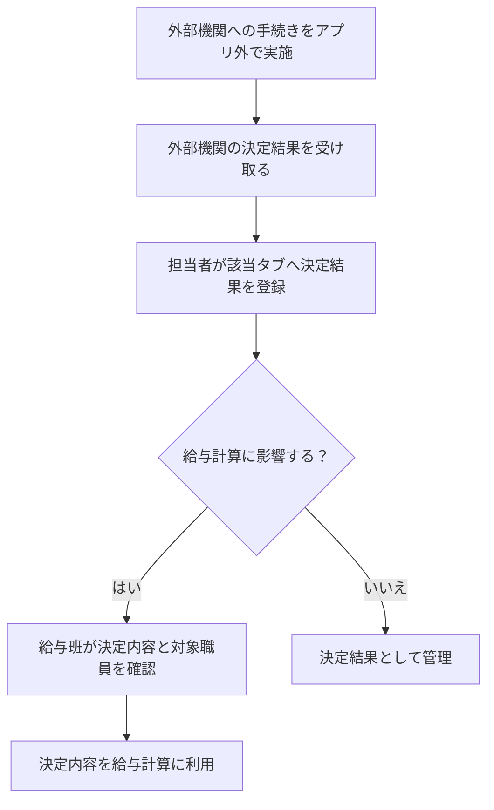

# 非常勤給与アプリ 業務要件（To-Be）

本書は手続きA～Gを通して非常勤給与アプリへの影響を整理し、業務のまとまりごとに章を追加する単一の業務要件書。A～Dは前工程であり、非常勤給与アプリの入力元、受け取るデータ、確定時点、連携条件などを定める。A～Dの異動情報アプリ自体の画面・帳票機能は、非常勤給与アプリの実装要件と区別する。GitHubへの反映も業務単位で行い、業務ごとにファイルを増やさない。業務判断、実装範囲、試験結果は区別する。

A～Gの採用関連フローの初版を整理した段階であり、非常勤給与アプリ全体の業務要件定義は完了していない。末尾の「今後定義する業務」は対象として残し、個別の業務要件を確定済みと扱わない。

参照元は[非常勤職員 採用関連業務フロー（As-Is・To-Be／手続き別）](https://github.com/hirokazu601218/Business-Overview/blob/main/非常勤職員_採用関連業務フロー_As-Is・To-Be_手続き別.md)の各「To-Be」。その後の一問一答で変更・追加した判断は、本書の該当する要件IDを優先する。

| 範囲 | 状態 | 本書で扱う内容 |
| --- | --- | --- |
| A～D 前工程 | 初版。連携詳細は未決 | 非常勤給与アプリへの受渡条件と職員番号の後続反映 |
| E 給与情報の登録 | 初版。検証条件等は未決 | 候補作成、Excel取込、重複注意、修正、給与班の確定 |
| F 通勤手当の認定 | 初版。計算条件等は未決 | 提出、差戻し、認定・変更・終了、認定簿PDF |
| G 外部機関との手続き | 初版。電子連携の可否等は未決 | 電子・紙の決定結果の手動登録と確認。二重申請防止方法は未決 |
| 共通：給与ルール改定・遡及 | 一部の業務判断を確認 | ルール適用、差額の確認、支給・返納 |
| その他の給与業務 | 未確定 | 末尾の「今後定義する業務」を参照 |

## A～D 前工程から非常勤給与アプリへの受渡条件

A～Dの各アプリの画面・帳票そのものではなく、非常勤給与アプリが利用する情報の状態と時点を定義する。通常の非常勤職員と調査員を対象とする。両者とも異動情報アプリのC「発令情報登録完了」を非常勤給与アプリへの通知時点とする。調査員にA・Bは適用しない。

### A～Dの業務フロー（Eへの受渡を含む）

次図は登録候補を作る時点と、職員番号を後から反映する関係を示す。自動通知・反映は目標であり、異動情報アプリとの連携方式と実現可否は未決。

職員番号の発行前でも確認待ちデータを作る。図中のDはEの候補作成とは別の後続処理であり、職員番号の発行を候補作成や確認・確定の前提条件とはしない。F・Gはそれぞれ独立の業務であり、この図では表さない。

| ID | 手続き | 業務要件 |
| --- | --- | --- |
| AD-01 | A 内定手続き | 初任給決定情報は秘書課の確定前に非常勤給与アプリへ渡さない。確定後の情報を利用対象とする。 |
| AD-02 | B 採用起案 | 初任給が確定していても、EASYの採用起案が決裁されるまでは、その職員の給与情報の登録候補を作らない。 |
| AD-03 | C 発令 | 通常の非常勤職員はA・Bを経て、調査員はCから開始するが、いずれも異動情報アプリへの発令情報の登録完了時に非常勤給与アプリへ通知され、登録候補を作る。通常職員の決裁完了は前提条件であり、候補作成の通知時点ではない。 |
| AD-04 | D 職員DB登録・異動情報アプリ更新 | 発令情報の登録完了時点で職員番号が未発行でも登録候補を作る。異動情報アプリが職員の採用ごとに自動採番する識別子で候補を照合し、職員番号発行後に同じ候補へ自動反映することを目標とする。手動紐づけ操作は設けない。 |
| AD-05 | D 職員DB登録・異動情報アプリ更新 | 同じ職員が退職後に再採用された場合は、以前の識別子を再利用せず、新しい識別子を採番する。 |
| AD-06 | B～D 採用取消 | 採用起案の決裁後に採用が取り消された場合、秘書課が異動情報アプリに取消を登録し、非常勤給与アプリが取消情報を受け取ることを目標とする。連携方式と実現可否は未決。 |
| AD-07 | B～E 採用取消後の候補 | 採用取消しは給与支給前に行う。非常勤給与アプリは該当候補を削除せず「採用取消」として履歴を保持し、その候補を給与計算の対象から自動除外する。採用取消しに伴う既支給給与の返納処理は業務要件の対象外とする。 |
| AD-08 | B～E 決裁後の変更 | 採用を取り消さずに決裁後の勤務条件や初任給などが変更された場合、変更前の内容を履歴に残して登録候補を更新する。確定済みの情報を変更した場合はE-08の再確認・再確定を適用する。 |
| AD-09 | C～E 調査員の初任給 | 調査員はAの個別初任給決定を経ず、非常勤給与アプリにあらかじめ登録した調査員用の給与ルールマスタを参照して登録候補の初任給を自動設定する（採用日基準の版選択はPAY-01）。マスタは会計課給与班が登録・改定する。 |
| AD-10 | C～E 調査員ルールの改定 | 調査員の給与ルールが改定されても、改定前に適用した金額は履歴として保持する。新しいルールは設定した適用開始日以降の対象者・期間に適用する。在職者への適用と遡及は共通要件PAY-02/03に従う。 |

### 未決事項

- 採用起案の決裁完了および秘書課の初任給確定を非常勤給与アプリへどのように伝えるか
- 決裁完了後の変更情報の連携方式、履歴の保存粒度、適用日と給与計算済み期間への影響。採用取消時の候補保持と給与計算除外はAD-06/07、変更前の履歴保持はAD-08で確定
- 異動情報アプリの採用ごとの識別子の採番・連携仕様と、職員番号発行後の自動反映の実現可否・失敗時の業務対応
- 職員番号・メールアドレスなどDの発行情報をいつどの方法で取得するか
- 採用取消情報の連携方式、取消の反映時点、連携失敗時の扱い
- 調査員の発令情報の具体的な入力項目、通知・取込方法。候補作成時点はCの発令情報登録完了で確定
- 調査員用給与ルールマスタの具体的な額・区分・適用開始日、例外と改定履歴の管理方法

### 確定根拠

2026-09-27の一問一答で、Aの初任給は秘書課が確定すること、確定前の情報は不要であること、Bの決裁前には候補を作らないこと、当初Bの決裁完了時に候補を作ると理解していたが、後続の回答で通常職員・調査員ともCの発令情報登録完了時に通知・候補作成するよう訂正したこと、Dの職員番号は候補作成後に紐づけることを確認した。後続の確認で、紐づけに採用起案IDを使うという理解を撤回し、異動情報アプリが採用ごとに自動採番する識別子を使い、再採用時は新しい識別子とすること、職員番号の自動反映を目標として手動紐づけ操作は不要であることを確認した。さらに同日の確認で、決裁後の採用取消は秘書課が異動情報アプリへ登録して非常勤給与アプリが受け取り、候補を削除せず履歴を残して給与計算対象から自動除外することを確認した。続く確認で、採用取消しによる既支給給与は発生しないため、その返納処理を要件化しないと確認した。Aに関するアプリ上の送付・修正や画面入力・Excel取込の確認結果は異動情報アプリ側の機能事項であり、本書の非常勤給与アプリ実装要件には含めない。

## E 給与情報の登録

- 状態：将来の業務要件案（業務単位の初版）。未決事項は末尾に明示する。現行アプリの実装・試験済み要件を表すものではない
- 作成日：2026-09-27
- 対象：通常の非常勤職員および調査員。初任給の決め方はAD-09/10に示し、その他の固有の差異は未確認
- 参照：[非常勤職員 採用関連業務フロー（As-Is・To-Be／手続き別）](https://github.com/hirokazu601218/Business-Overview/blob/main/非常勤職員_採用関連業務フロー_As-Is・To-Be_手続き別.md) の「6.2 To-Be」
- 名称：「給与基本マスタアプリ」は本要件以降「非常勤給与アプリ」に統一する。参照元フローの表記変更は別途整合させる

### Eの目的と範囲

異動情報アプリに登録された発令情報等を非常勤給与アプリで再利用し、給与計算に必要な情報の登録候補を作る。不足・不整合を確認・修正したうえで、会計課給与班が内容を確定する。参照元To-BeのEに対応する。

本書の「登録候補」は、Cの発令情報登録完了を受けて作る**給与情報の確認待ちデータ**を指す。給与計算結果ではなく、会計課給与班による確認・確定前の状態である。

調査員の初任給はAの個別決定情報を使わず、会計課給与班が管理するルールマスタから採用日を基準に適用版を選んで設定する（AD-09/10、PAY-01）。

現行アプリの要件定義書は[requirements.md](requirements.md)を参照する。本業務要件は、現行の編集用アプリでテストデータを使って試作・検証する対象として整理する。実運用の異動情報アプリとの連携可否や実データへの書込みは、編集用アプリで検証済みとみなさない。

### Eの役割

| 役割 | 業務上の責任 |
| --- | --- |
| 局担当者 | 不足・不整合の原則的な修正を行う |
| 会計課給与班 | 必要時に取込を操作し、重複の注意を確認して取込を最終判断する。登録内容の確認・確定、必要時の直接修正、確定後の修正の再確認・再確定を行う |

### Eの業務要件

| ID | 要件 |
| --- | --- |
| E-01 | AD-01～03に定める前提・時点に従い、通常職員・調査員ともCの発令情報登録完了時に給与情報の確認待ちデータを作る。自動作成を目標とし、通知・データ取得方式と実現可否は未決とする。 |
| E-02 | 自動連携の実現可否にかかわらず、会計課給与班が、異動情報アプリから出力したExcelを取り込んで給与情報の確認待ちデータを作成できること。複数職員を一括で取り込めること。 |
| E-03 | 取込時の重複判定は、職員本人が存在するかどうかだけで判断せず、当該職員に紐づくデータの内容を照合すること。照合するデータ項目と判定条件は未決とする。 |
| E-04 | 職員に紐づくデータが一致する場合、または重複の可能性がある場合は、「取込済み」「重複可能性あり」等の注意を会計課給与班に表示すること。注意表示を踏まえた取込の最終判断は会計課給与班が行う。人単位で一律に取込を禁止しない。 |
| E-05 | 取得・取込した登録候補について、給与計算に必要な情報の不足・不整合を検証し、修正対象を確認できること。具体的な必須項目および検証条件は未決とする。 |
| E-06 | 不足・不整合は原則として局担当者が修正し、会計課給与班が確認すること。会計課給与班も必要に応じて直接修正できること。局担当者との調整はE-12に従う。 |
| E-07 | 会計課給与班が登録内容を確認し確定すること。 |
| E-08 | 確定後に修正が生じた場合、修正内容を給与計算に反映する前に、会計課給与班による再確認・再確定を必須とすること。 |
| E-09 | 異動情報アプリから届いた変更情報が、非常勤給与アプリ内で会計課給与班が修正した値と食い違う場合、自動上書きしない。差異を表示し、会計課給与班が採用する値を判断する。 |
| E-10 | 給与情報の確認待ちデータは、会計課給与班による確認・確定が済むまで給与計算に使用しない。 |
| E-11 | Excel一括取込で一部の行に不備または重複可能性がある場合、問題のない行は先に取り込み、問題のある行だけ会計課給与班の確認待ちにする。重複の最終取込判断はE-04に従う。 |
| E-12 | 不足・不整合について局担当者との連絡・調整は非常勤給与アプリの外で行う。アプリ内で局担当者へ差し戻す機能は本業務要件に含めない。調整後のデータ修正・給与班の確認はE-06に従う。 |

### Eの業務フロー

自動連携は目標とし、実現可否にかかわらず会計課給与班によるExcel一括取込を用意する。

Excel一括取込では問題のない行を先に取り込み、問題のある行を会計課給与班の確認待ちにする。局担当者との連絡・調整はアプリ外で行い、原則は局担当者が修正し、必要時は会計課給与班も直接修正する。確定後の修正は、給与計算へ反映する前に会計課給与班が再確認・再確定する。

### Eの未決事項

- 発令情報登録完了の通知、通常職員の決裁完了・初任給確定の確認、異動情報アプリ等からのデータ取得方法と自動作成の実現可否
- 異動情報アプリから出力するExcelの列、ファイル様式・取込操作、行ごとの処理結果の表示・再取込方法
- 職員に紐づくデータの照合項目、一致と重複可能性の判定条件、判定後の具体的な登録処理
- 給与計算に必要な項目、必須・不整合の判定条件
- 局担当者と会計課給与班の閲覧・修正範囲、修正通知と履歴
- 確定と再確定の状態管理、給与計算への反映方法
- 元情報と会計課給与班の修正値の差異表示・判断履歴の具体的な扱い
- 調査員に固有の業務上の差異（初任給のマスタ自動設定と改定時の履歴保持はAD-09/10で確定）

### Eの確定根拠

参照元To-BeのEフローを土台とし、2026-09-27の一問一答で次を確認した：自動作成を目標として手動取込も用意すること、重複は人ではなく人に紐づくデータで判断して注意を表示し会計課給与班が最終判断すること、不足・不整合は原則局担当者が修正し会計課給与班も直接修正できること、確定後の修正には会計課給与班の再確認・再確定を要すること。さらに不足情報の局担当者との調整はシステム外で行うこと、確認待ちデータは会計課給与班の確定前には給与計算に使用しないこと、決裁後の変更では旧値を履歴に残すこと、異動情報アプリの変更値と給与班の修正値が食い違う場合は自動上書きせず給与班が判断することを確認した。未決事項は合意済み要件として扱わない。

## F 通勤手当の認定

参照元To-Beの手続きFを土台にする。対象は通常の非常勤職員であり、調査員は対象外。職員本人による入力を認める点とPDFを担当者が必要時に出力する点は、参照元案からの変更である。

| ID | 業務要件 |
| --- | --- |
| F-01 | 通勤届情報は局担当者または職員本人が非常勤給与アプリへ入力・提出できる。 |
| F-02 | 非常勤給与アプリは必須項目・入力内容を検証し、会計課給与班が提出内容を審査できるようにする。具体的な項目と検証条件は未決。 |
| F-03 | 会計課給与班が不備を差し戻す場合、アプリ上で不備内容を示し、原則としてその通勤届を入力・提出した人へ返す。提出者が修正し、再提出する。 |
| F-04 | 会計課給与班が通勤手当を認定する。給与計算は確定した認定情報を直接参照する。認定額を別の給与情報へ重複して転記・保存することは本要件では求めない。支給月と認定期間の対応や遡及等の計算条件は未決。 |
| F-05 | 認定簿PDFは認定時に自動作成せず、利用者がPDF出力を実行したときに作成する。出力操作は会計課給与班、局担当者、職員本人が行える。 |
| F-06 | 認定簿PDFの出力対象は、職員本人は自分の認定簿、局担当者は自分の担当部署の職員の認定簿に限る。会計課給与班の対象範囲は未決。 |
| F-07 | 認定済みの通勤経路・方法等を変更する場合、職員本人または局担当者が変更を提出し、会計課給与班が改めて認定する。 |
| F-08 | 病気・欠勤で通勤しない期間は通勤手当を支給しない。通勤手当の受給要件を喪失した場合は、職員本人または局担当者が届け出て、会計課給与班が認定の終了を確定する。 |

### Fの業務フロー

通常の非常勤職員を対象とする。変更時は改めて通勤届を提出し、会計課給与班が再認定する。

病気・欠勤は期間中の不支給であり、認定終了と区別する。PDFは認定時の自動出力ではなく、会計課給与班・局担当者・職員本人が必要時に実行する。出力できる対象範囲はF-06に従う。

### Fの未決事項

- 通勤届の具体的な入力項目・添付資料・検証条件
- 職員本人の認証方法、提出・出力権限の確認方法、および局担当者の担当部署を判定する根拠
- 会計課給与班が出力できる認定簿の範囲
- 変更・終了の適用開始日、病気・欠勤の期間と支給月との対応、遡及支給の具体的な計算条件
- PDFの正式項目、保存先、出力方式と失敗時の扱い

### Fの確定根拠

2026-09-27の一問一答で、局担当者または職員本人が入力すること、不備は原則提出者へアプリ上で差し戻すこと、給与計算は確定済み認定情報を直接参照すること、PDFは利用者の操作時に出力すること、出力できる3者と職員本人・局担当者の対象範囲を確認した。続く確認で、認定済みの通勤内容を変更する場合は再提出・再認定すること、病気・欠勤は通勤手当の不支給として扱い、受給要件喪失時には届出と給与班の認定終了を行うことを確認した。現行アプリへの実装やテスト合格を示すものではない。

## G 外部機関との手続き

参照元To-Beの手続きGと転職者の住民税手続きに対応する。2026-09-28の確認で、非常勤給与アプリでは電子申請操作と決定結果の自動取込を行わず、決定結果を担当者が登録すると変更した。紙・電子いずれの方法で外部手続きを行った場合も同じ扱いとする。

| ID | 業務要件 |
| --- | --- |
| G-01 | 社会保険、共済組合、ハローワークへの手続きと転職者の住民税手続きを対象に、外部機関の決定結果を非常勤給与アプリで管理する。アプリ内の電子申請操作は設けない。 |
| G-02 | 局担当者または会計課給与班の担当者が、担当した外部手続きの決定結果を非常勤給与アプリへ登録する。具体的な対象範囲と権限は未決。 |
| G-03 | 同じ職員・同じ種類の手続きの二重申請を避けるという業務上の方針は保持する。ただし申請操作・申請進捗の管理をアプリに設けないため、アプリでの自動停止を含む具体的な防止方法は未決。訂正・再申請とその履歴管理は今回のアプリ要件の対象外。 |
| G-04 | 外部機関の決定結果は紙・電子の別にかかわらず担当者が非常勤給与アプリへ登録し、決定内容を確認・管理できるようにする。申請状況・受付結果は管理せず、決定結果の自動取込も行わない。外部機関の決定内容を正として扱う。 |
| G-05 | 決定内容のうち給与計算に影響する情報は、会計課給与班が内容と対象職員を確認するまで給与計算に使用しない。申請内容と食い違う場合も決定内容の採否を給与班が改めて判断する工程は設けない。確認後の適用時点や項目の具体的条件は未決。 |
| G-06 | 紙等で行った外部手続きの決定結果もG-04と同じく、手続きを行った局担当者または会計課給与班の担当者が登録する。申請状況・受付結果は管理しない。証憑の扱いは未決。 |

### Gの業務フロー

決定結果の登録・確認は、SCR-002の「社会保険」または「税固定控除」タブで扱う。手続きの実施方法による画面上の区分や具体的な操作は後続の画面設計で定める。

アプリは申請・受付状況の管理や電子申請操作を行わない。決定内容を正とし、申請内容との差異について給与班が採否を決め直す工程も設けない。二重申請防止の実施方法はG-03の未決事項として残す。

### Gの未決事項

- アプリ外で行う手続きの二重申請をどう防止するか（G-03）。申請・受付状況管理やアプリ内電子申請を追加する前提にはしない
- 決定結果の登録・確認に必要な内容と、決定結果を得られない場合の扱い
- 局担当者と会計課給与班の担当範囲、認証・権限の具体的な条件
- 決定結果の証憑の保存・参照方法
- 決定内容の給与計算への適用時点、外部機関から差し戻された場合の処理
- 調査員など対象者ごとの適用差異

### Gの確定根拠

2026-09-27の一問一答で4区分を対象にすること、局担当者と会計課給与班の両者が関与すること、二重申請を防止すること、給与計算に影響する決定内容は給与班が確認してから使うことを確認した。その後、訂正・再申請とその履歴管理は不要、外部機関の決定内容を正とすること、紙等の手続きは担当者が決定結果を登録することを確認した。2026-09-28の確認で電子・紙とも申請・受付状況の管理は不要、さらに電子申請操作も不要と訂正した。紙・電子の決定結果は担当者が登録し、SCR-002の「社会保険」「税固定控除」タブに分ける。二重申請防止の具体的な方法は、この変更を受けて未決とした。現行アプリへの実装や試験合格を示すものではない。

## 共通｜給与ルールの改定と遡及

A～Gの前後にまたがる給与計算上の業務要件。適用する職員区分や給与項目を、調査員に限定しない。現行SCR-005の内蔵仮例による試算を本番給与計算・遡及の実装済み証拠とはしない。

| ID | 業務要件 |
| --- | --- |
| PAY-01 | 調査員の採用時に初任給を自動設定する際は、採用日を基準として給与ルールマスタの適用版を選ぶ。 |
| PAY-02 | 給与ルールが改定された場合は、調査員に限らず、その改定の対象となる在職者にも適用開始日以降の対象期間から新ルールを適用する。改定前に適用した金額・ルールは履歴として保持する。 |
| PAY-03 | 改定の適用開始日が過去で、既に計算した期間へ影響する場合は、過去の計算結果を上書きせず、旧結果と新ルールによる結果の差額を遡及計算する。 |
| PAY-04 | 遡及差額は会計課給与班が内容を確認・確定してから、支給または返納へ反映する。 |
| PAY-05 | 返納が必要な差額について、会計課給与班が給与相殺または納入告知書による返納のどちらで処理するか判断する。返納方法を機械的に一律決定しない。 |

### 共通の未決事項

- 改定対象となる職員区分・給与項目・期間、およびルールの承認・公開手順
- 在職判定日、採用・退職・再採用・休職など境界条件
- 既支給額と再計算額の差額算出、税・社会保険・端数・返納の扱い
- 遡及差額を反映する支給月、確認時に示す内訳と訂正履歴
- 給与相殺の対象・上限・分割や納入告知書の作成・送付・入金管理の業務条件

### 共通の確定根拠

2026-09-27の一問一答で、調査員の採用時のルール選択は採用日基準、改定ルールは調査員以外の対象在職者にも適用、過去の計算結果は上書きせず差額を遡及計算することを確認した。さらに会計課給与班による差額確認・確定を経て支給・返納に反映し、返納方法は給与相殺か納入告知書かを同班が判断することを確認した。

## 今後定義する業務（未確定）

以下は非常勤給与アプリの業務要件として今後整理する対象であり、業務フロー・担当者・判断条件・計算条件・アプリの機能は未確定。A～Gの初版完了や、上記の給与ルール改定・遡及に関する部分的な確認をもって、これらの業務全体が確定したとは扱わない。業務のまとまりごとに一問一答で定義し、同じ要件書へ反映する。

| 対象業務 | 現在の状態 |
| --- | --- |
| ボーナス | 業務要件未確定 |
| 年末調整 | 業務要件未確定 |
| 差額支給 | 業務要件未確定。給与ルール改定時の遡及差額に関するPAY-03/04は部分的な確認事項 |
| 法定控除の随時改定 | 業務要件未確定 |
| 法定控除の定時決定 | 業務要件未確定 |
| 住民税年度更新 | 業務要件未確定。Gの転職者の住民税手続きとは別の対象 |

2026-09-27の利用者からの追加指定により、上記の業務を未確定の対象として記録した。テーブル・項目定義は別途扱う。
