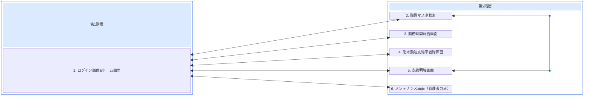
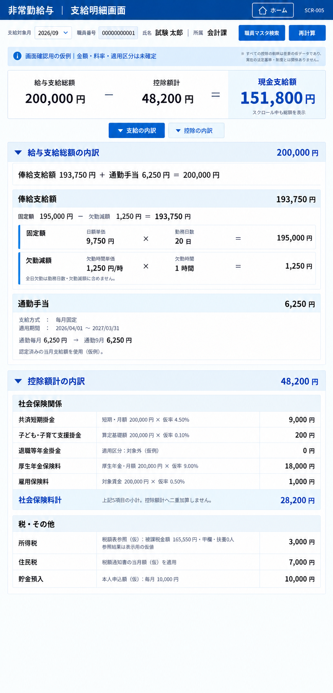

# 画面要件定義書

- 文書版：0.6
- 対象：非常勤給与アプリ
- 定義範囲：画面一覧、画面遷移、操作、引継ぎ情報、権限制御、SCR-005のUI・試算要件
- 本書は画面要件を定義するものであり、実装済みであることを示すものではない。

## 1. 画面一覧

| No. | 画面ID | 画面名 |
|---|---|---|
| 1 | SCR-001 | ログイン画面&ホーム画面 |
| 2 | SCR-002 | 職員マスタ検索 |
| 3 | SCR-003 | 勤務時間報告画面 |
| 4 | SCR-004 | 期末勤勉支給率登録画面 |
| 5 | SCR-005 | 支給明細画面 |
| 6 | SCR-006 | メンテナンス画面 |

ログイン画面とホーム画面は、一つの画面項目（SCR-001）として整理する。以下の画面遷移の起点・戻り先は、SCR-001内のホーム画面とする。ログイン画面とホーム画面の内部遷移や認証の詳細は別途定義する。

## 2. 画面遷移図

第1階層グループを左、第2階層グループを右に配置する。第1階層には画面1を置き、第2階層には画面2・3・4・5・6を上から順に並べる。この縦の並びは配置順であり、2→3→4→5→6という遷移を追加するものではない。

各画面名のボタンでホーム画面から対象画面へ遷移し、各画面の「ホーム」ボタンでホーム画面へ戻る。双方向矢印は往路・復路をまとめて示し、方向別の操作は「3. 画面遷移・操作一覧」に定義する。

Mermaidのブロック図（block-beta）で階層グループと配置順を指定する。第2階層内の2と5の相互遷移も維持する。2と5の間の線は、画面列の右に余白と配線専用列を設けて迂回させ、画面3・4のブロックを横切らない構成とする。右側の丸印は線の折返し点であり、画面や処理を表さない。画面2と5の両端に向かう矢印で相互遷移を示す。

ホーム画面のメンテナンス画面ボタンは、管理者以外には非活性で表示する。画面2～5で扱う職員データの範囲は「5. 権限制御」に従う。

## 3. 画面遷移・操作一覧

### 3.1 ホーム画面からの遷移

ホーム画面に、画面2～6の各画面名を表示したボタンを設置する。

| 遷移元 | ボタン名 | 操作 | 遷移先 | 条件 |
|---|---|---|---|---|
| SCR-001：ホーム画面 | 職員マスタ検索 | クリック | SCR-002：職員マスタ検索 | ログイン済み |
| SCR-001：ホーム画面 | 勤務時間報告画面 | クリック | SCR-003：勤務時間報告画面 | ログイン済み |
| SCR-001：ホーム画面 | 期末勤勉支給率登録画面 | クリック | SCR-004：期末勤勉支給率登録画面 | ログイン済み |
| SCR-001：ホーム画面 | 支給明細画面 | クリック | SCR-005：支給明細画面 | ログイン済み |
| SCR-001：ホーム画面 | メンテナンス画面 | クリック | SCR-006：メンテナンス画面 | ログイン済みかつ管理者。管理者以外はボタン非活性 |

### 3.2 ホーム画面へ戻る遷移

画面2～6の各画面に「ホーム」ボタンを設置する。

| 遷移元 | ボタン名 | 操作 | 遷移先 |
|---|---|---|---|
| SCR-002：職員マスタ検索 | ホーム | クリック | SCR-001：ホーム画面 |
| SCR-003：勤務時間報告画面 | ホーム | クリック | SCR-001：ホーム画面 |
| SCR-004：期末勤勉支給率登録画面 | ホーム | クリック | SCR-001：ホーム画面 |
| SCR-005：支給明細画面 | ホーム | クリック | SCR-001：ホーム画面 |
| SCR-006：メンテナンス画面 | ホーム | クリック | SCR-001：ホーム画面 |

### 3.3 職員マスタ検索と支給明細画面の相互遷移

| 遷移元 | 遷移先 | 引き継ぐ選択情報 | 操作 |
|---|---|---|---|
| SCR-002：職員マスタ検索 | SCR-005：支給明細画面 | 職員番号、支給対象月 | ボタン名・操作方法は別途定義 |
| SCR-005：支給明細画面 | SCR-002：職員マスタ検索 | 職員番号、支給対象月 | 「職員マスタ検索」ボタンをクリック |

対象職員は、ログインアカウントに紐づく所属部署と一致する非常勤職員に限定する。

## 4. 画面間で引き継ぐ情報

| 適用範囲 | 情報の区分 | 項目 | 要件 |
|---|---|---|---|
| ログイン後の全画面間 | ログイン職員のアカウント情報 | 氏名、メールアドレス | 画面遷移後も同じログイン職員の情報を保持する |
| SCR-002 ⇄ SCR-005 | 画面で選択した職員情報 | 職員番号、支給対象月 | 選択した職員・支給対象月を遷移先へ引き継ぐ |

ログイン職員のアカウント情報と、画面で選択した非常勤職員の情報は区別して扱う。所属部署・管理者区分はログインアカウントに紐づけて権限判定に使用し、その取得元・判定方法は別途定義する。

## 5. 権限制御

| 対象 | 要件 |
|---|---|
| 閲覧可能なデータ | ログインアカウントに紐づく所属部署と、非常勤職員の所属部署が一致するデータのみ閲覧可能 |
| 編集可能なデータ | 同じ所属部署の非常勤職員データのみ編集可能。各画面で提供する編集機能の詳細は別途定義 |
| 職員データを伴う画面遷移 | 同じ所属部署の非常勤職員を対象とする場合のみ遷移可能。画面2と画面5の相互遷移にも適用 |
| メンテナンス画面への遷移 | 管理者のみ遷移可能 |
| ホーム画面のメンテナンス画面ボタン | 管理者には活性、管理者以外には非活性で表示 |

所属部署による制限は、検索結果・一覧表示・対象職員の参照・更新・画面遷移に共通して適用する。画面遷移で引き継いだ職員番号だけを根拠に、別部署の職員データを表示・編集できないこと。

管理者が他部署の職員データを扱える例外は、現時点では定義しない。管理者であることによる所属部署制限の解除は、本書の要件に含めない。

## 6. 別途定義する事項

- モーダル、条件分岐、外部処理の詳細。本書で確定した所属部署・管理者の制限を前提とする。
- SCR-005は8章を適用する。その他の画面の入力項目・表示項目・詳細機能は別途定義。
- SCR-002からSCR-005へ遷移する際のボタン名・操作方法。逆方向は8章に定義。
- ログイン認証、所属部署・管理者区分の取得元と判定方法。
- SCR-005以外で職員番号・支給対象月が未選択の場合の動作、未保存データがある場合の遷移時の扱い。

## 7. 変更履歴

| 文書版 | 変更内容 |
|---|---|
| 0.6 | SCR-005の修正画像、配置・計算・項目対応・内蔵データ・操作・YAML受入要件を追加。控除見出し直下の加算式を削除。 |
| 0.5 | GitHubでのMermaid構文エラーを修正。折返し点の空文字ラベルを空白1文字へ変更。 |
| 0.4 | 画面2と5の相互遷移線を、右側の配線専用列と折返し点を経由する経路へ変更。画面の配置順・遷移要件は維持。 |
| 0.3 | 階層グループを導入。左に第1階層（画面1）、右に第2階層（画面2～6）を置き、第2階層を2・3・4・5・6の順に縦配置。既存の遷移・権限制御は維持。 |
| 0.2 | 画面2を画面3の左へ配置。ホームの各画面名ボタン、各画面のホームボタン、アカウント・選択職員情報の引継ぎ、所属部署制限、管理者限定メンテナンス遷移を定義。別途定義事項を整理。 |
| 0.1 | 指定された6画面と7方向の遷移を初版として定義。 |

## 8. SCR-005 支給明細画面：Canvas UI作成要件

### 8.1 適用範囲と参照資料

2026/09/18の修正デザインを、次回の貼付用YAML／Power Fx作成の基準とする。今回の成果は要件と画像であり、YAML実装・Studio検証・公開・Dataverse変更は未実施。

- [確定配置のデザイン案 PNG](../design/images/scr-005-payroll-detail-v1.png)
- [B案デザイン基準](../design/design-system.md)
- [旧2画面プロトタイプ](../prototypes/attendance-payroll-prototype.md)：勤務日数・欠勤時間の集計方法を参考にする。SCR-005の旧レイアウトと「基本額−欠勤控除＋超過勤務手当」の合計は本節に置き換える。旧YAMLが本節対応済みであるとは扱わない。
- [通勤テーブル定義](../design/dataverse-commute.md)、[基準給与簿項目定義](../../config/dataverse/payrollledger-columns.json)

画像は配置の参考。数値・文字列・データ型・状態・操作は本書を正とし、画像を背景に貼る実装ではなく、各表示をCanvasコントロールとして構成する。画像の職員番号の桁数を転記せず、実装では12桁文字列を使用する。

### 8.2 表示順・構成

| 要件ID | 領域 | 表示・構造 |
|---|---|---|
| SCR005-UI-001 | ヘッダー | 「非常勤給与 ｜ 支給明細画面」、ホーム、画面ID「SCR-005」。画面IDは右上のみ |
| SCR005-UI-002 | 対象・操作 | 支給対象月、職員番号、氏名、所属、職員マスタ検索、再計算。氏名・所属・金額・単価は参照表示。対象職員は検索画面で選択する |
| SCR005-UI-003 | 仮例の案内 | 内蔵データでは上部に「画面確認用の仮例｜金額・料率・適用区分は未確定」。下端には同趣旨の補記を置かない |
| SCR005-UI-004 | 上部サマリー | 「給与支給総額 − 控除額計 ＝ 現金支給額」を金額付きで表示。現金支給額を強調。本文スクロール中も見える固定領域に置く |
| SCR005-UI-005 | 内訳操作 | 「支給の内訳」「控除の内訳」で対応する本文の開閉を切替。初期は両方展開。開閉状態は文字・アイコンでも示す |
| SCR005-UI-006 | 支給見出し | 「給与支給総額の内訳」と右端に給与支給総額 |
| SCR005-UI-007 | 支給の式 | 見出しの直下、俸給支給額の前の白背景に「俸給支給額 193,750円 ＋ 通勤手当 6,250円 ＝ 200,000円」。実装では動的な金額 |
| SCR005-UI-008 | 俸給支給額 | 見出しに俸給支給額。内部に「固定額 − 欠勤減額 ＝ 俸給支給額」、その下に固定額と欠勤減額の2段を入れ子で表示 |
| SCR005-UI-009 | 固定額 | 項目名、日額単価、×、勤務日数、＝、算出額 |
| SCR005-UI-010 | 欠勤減額 | 項目名、欠勤時間単価、×、欠勤時間、＝、算出額。「全日欠勤は勤務日数・欠勤減額に含めません」の案内 |
| SCR005-UI-011 | 通勤手当 | 見出しと当月額、支給方式、適用期間、認定済み当月支給額の参照根拠。毎月固定の例は「通勤毎月 6,250円 → 通勤9月 6,250円」 |
| SCR005-UI-012 | 控除見出し | 「控除額計の内訳」、対象区分「当給与期間分」、右端に控除額計。直下は「社会保険関係」。間に控除額の足し算式を置かない |
| SCR005-UI-013 | 社会保険関係 | 8.4の先頭5項目を「項目名／算出根拠／金額」の3列で表示し、最後に社会保険料計の小計 |
| SCR005-UI-014 | 税・その他 | 所得税、住民税、貯金預入を同じ3列で表示。貯金預入が本文の最終行 |

**表示しないもの：** 通勤手当の後の給与支給総額カード、税・その他の後の控除額計カード、控除見出し直下の加算式、最下部の現金支給額カード、最下部の「計算根拠・料率は仮例～定義します」の補記、右下の画面ID。上部サマリー・各内訳見出しの金額・社会保険料計は維持する。

### 8.3 計算・集計と表示の分離

| 要件ID | 項目 | 計算・扱い | 仮例 |
|---|---|---|---|
| SCR005-CALC-001 | 勤務日数 | 選択職員・対象勤務月の登録済み日別明細のうち通常勤務分が0より大きい日を数える。1日1件を前提に重複を検出 | 20日 |
| SCR005-CALC-002 | 固定額 | 日額単価 × 勤務日数。1日所定7時間45分＝465分 | 9,750 × 20＝195,000円 |
| SCR005-CALC-003 | 欠勤減額 | 職員基本情報の欠勤時間単価 × 勤務した日の控除対象欠勤分合計 ÷ 60 | 1,250 × 1時間＝1,250円 |
| SCR005-CALC-004 | 俸給支給額 | 固定額 − 欠勤減額 | 193,750円 |
| SCR005-CALC-005 | 給与支給総額 | 俸給支給額 ＋ 通勤手当 | 200,000円 |
| SCR005-CALC-006 | 社会保険料計 | 本試作では8.4の先頭5項目の合計。独立した追加控除項目ではない | 28,200円 |
| SCR005-CALC-007 | 控除額計 | 社会保険料計 ＋ 所得税 ＋ 住民税 ＋ 貯金預入。計算は行うが加算式の行は画面に出さない | 48,200円 |
| SCR005-CALC-008 | 現金支給額 | 給与支給総額 − 控除額計 | 151,800円 |

- 全日欠勤は勤務日数から除外し、欠勤減額にも重ねて含めない。実勤務20日と別に全日欠勤日がある場合、固定額は日額×20日。
- 勤務日の不足は欠勤として確認・記録された分を対象とする。年休等の有給区分を無条件に欠勤へ置換しない。旧試作の勤務日は通常勤務分＋欠勤分＝465分を前提とする。
- 欠勤時間単価は独立した値であり、画面で日額÷7.75を再計算しない。[未反映タスク #51](https://github.com/hirokazu601218/PowerAppsCanvasAppUI/issues/51)に従い、次回の職員基本テーブル編集時に追加する。実テーブル反映・読戻し証跡が揃うまで完了にしない。
- 分は内部で整数として保持し、表示は「1時間」「0.5時間」等とする。「60分÷60」は表示しない。循環小数は「約」で区別し、表示値を再計算に使わない。
- 端数処理は途中では行わず、最終合計額の円未満を切り捨てる。本試作では最終合計を現金支給額とし、非負の計算結果に最後に一度だけ `RoundDown(現金支給額の未丸め値, 0)` を適用する。中間値に小数があるときは小数または概数表示であることを明示し、整数の厳密等式に見せない。
- 控除の本番料率・対象区分・課税範囲・法定の個別端数処理は未確定。画像の率で本番計算を確定しない。負の最終額や返納・追給の業務処理も別途定義し、本試作では対象外の状態を表示する。
- 最新指定の給与支給総額は俸給支給額＋通勤手当。旧試作の超過勤務手当は今回の画面・合計には加えない。将来の支給項目拡張は別要件とする。

### 8.4 控除の項目名・根拠・データ対応

名称は基準給与簿の「〇〇・当給与期間分」の〇〇を使用する。「返納・追給分」は混在させない。以下の論理名は既存定義の参照先であり、試作コレクションから実テーブルへの接続実装を意味しない。

| 表示名 | 既存論理名 | 画面の算出根拠（すべて仮例） | 金額 |
|---|---|---|---:|
| 共済短期掛金 | `crb3c_mutual_short_current` | 短期・月額 200,000円 × 仮率4.50% | 9,000円 |
| 子ども・子育て支援掛金 | `crb3c_mutual_childcare_current` | 算定基礎額 200,000円 × 仮率0.10% | 200円 |
| 退職等年金掛金 | `crb3c_retirement_contribution_current` | 適用区分：対象外（仮例） | 0円 |
| 厚生年金保険料 | `crb3c_pension_insurance_current` | 厚生年金・月額 200,000円 × 仮率9.00% | 18,000円 |
| 雇用保険料 | `crb3c_employment_insurance_current` | 対象賃金 200,000円 × 仮率0.50% | 1,000円 |
| 社会保険料計 | `crb3c_social_total_current` | 上記5項目の小計。控除額計へ二重加算しない | 28,200円 |
| 所得税 | `crb3c_income_tax_current` | 税額表参照（仮）：被課税金額165,550円・甲欄・扶養0人。参照結果は表示用の仮値 | 3,000円 |
| 住民税 | `crb3c_resident_tax_current` | 税額通知書の当月額（仮）を適用 | 7,000円 |
| 貯金預入 | `crb3c_savings_current` | 本人申込額（仮）：毎月10,000円 | 10,000円 |

対象外の項目も行を残し、0円と対象外の理由を示す。欠落データは0円と区別する。基準給与簿には介護掛金・健康保険料等の他項目もあるが、この9行のデザインには含めない。本番の社会保険料計を常にこの5項目だけで再計算できるとは扱わず、対象項目の拡張・既存小計との整合を本番接続前に定義する。

算出根拠は金額から逆算して捏造しない。基準給与簿の金額列だけでは料率・通知書・税額表の参照条件が分からないため、内蔵試作では根拠情報も別途保持する。

### 8.5 データ契約と通勤手当

今回のUIはアプリ内蔵の架空データで作成可能とする。未定義の実テーブル作成は行わない。共通の初期化箇所にデータを集約し、ラベルやボタンへ同じ数値を重複直書きしない。

| データ群（試作名） | 必要な項目・型 |
|---|---|
| 職員 `colStaff` | StaffNo：12桁文字列、氏名・所属：文字列、DailyRate・AbsenceHourlyRate：数値、所定勤務分：整数465 |
| 勤務 `colAttendance` | StaffNo、勤務日：Date、RegularMinutes・AbsenceMinutes：整数、日区分、登録版 |
| 月登録 `colMonths` | StaffNo、勤務月：月初Date、登録済み状態・登録版。0日で登録した月と未登録月を区別 |
| 通勤 `colCommute` | 職員番号、支給対象月、認定ID、支給方式、適用開始日・終了日、通勤毎月、対象月の支給予定額、根拠表示 |
| 控除 `colDeductions` | 職員番号、支給対象月、項目コード、表示順、グループ、項目名、適用状態、根拠種別、基礎額・率（任意）、参照条件／通知書等の根拠文字列、金額。社会保険料計は別途導出し二重集計しない |
| 計算結果 | 対象キー、入力登録版、未丸めの固定額・欠勤減額・俸給・通勤・給与総額・控除小計・控除総額・現金支給額、最終切捨て値、計算状態 |

- 試作では支給対象月と勤務月を同月で関連付ける。本番の締め・翌月支払等の対応は別途定義する。
- 通勤の既存列：支給方式 `crb3c_method`、適用開始日 `crb3c_startdate`、適用終了日 `crb3c_enddate`、通勤毎月 `crb3c_monthly`、通勤9月 `crb3c_month09`。他月も既存の月別列を使用する。
- 9月仮例：毎月固定、適用2026/04/01～2027/03/31、通勤毎月6,250円、通勤9月6,250円。給与総額へは当月額を一度だけ加算する。2つの6,250円を加算しない。
- 半年定期・毎月精算をこの毎月固定式で代替しない。月途中の変更、複数認定、期間重複の採用規則は未確定として、該当時は要確認にする。未登録と認定済み0円を区別する。
- 選択キーは職員番号＋対象月。氏名では結合しない。選択・取得・再計算にも本書5章の所属制限を適用し、ログイン者情報と対象職員情報を混同しない。

### 8.6 操作・状態

| 要件ID | 操作・状態 | 振る舞い |
|---|---|---|
| SCR005-ACT-001 | ホーム | SCR-001へ戻る。ログイン者情報を保持 |
| SCR005-ACT-002 | 職員マスタ検索 | SCR-002へ遷移し、選択職員番号・支給対象月を引き継ぐ。SCR-002から戻る時も選択を反映 |
| SCR005-ACT-003 | 初期表示 | 有効な対象があればデータ確認後に計算表示。未選択なら選択案内を出し再計算を無効化。無関係の職員を自動選択しない |
| SCR005-ACT-004 | 再計算 | 現在の内蔵データから検証・再計算。処理中は連打を防止。データの登録やDataverseへの書込みは行わない |
| SCR005-ACT-005 | 対象・版変更 | 職員・対象月・勤務登録版が変わった時点で旧結果を無効化し、再計算を促す。旧結果を新しい対象の数値として残さない |
| SCR005-ACT-006 | 未登録・不足・失敗 | 未登録勤務、欠勤単価未設定、通勤・控除データ欠落、重複等は理由を表示し、総額は「—」。未登録を0円扱いしない |
| SCR005-ACT-007 | 折りたたみ | 支給・控除を独立して開閉。見出し金額と上部サマリーは残す。閉じた領域の高さ・空白を除去し、Tab対象から外す |
| SCR005-ACT-008 | 金額0 | 登録済みかつ必要情報が揃った0円は「0円」。欠勤なしでも欠勤0時間・減額0円の行を残す |

この画面は表示・試算用とし、保存・確定・支払実行は含めない。内蔵データはアプリ終了・初期化で失われる試作であることを実装説明に記載する。

### 8.7 YAML構成・デザイン・受入条件

- YAMLはPower Appsへ貼付できるコンテナー単位で作り、初期化Power Fx、必要変数、配置先、依存する遷移先画面を併記する。内部名は既存 `scrPayroll` との対応を明示する。コントロール版・対応プロパティは実装時のStudioで確認する。
- 固定のヘッダー／対象情報／サマリー領域と、縦スクロールする内訳領域を分ける。内訳は縦の自動レイアウト、各計算行は横配置を基本とし、固定座標だけで長文を切らない。画像は全体像を示すもので実際の画面高さではない。
- B案の色・余白・文字規則を共通トークンとして使用する。モダンコントロールを優先し、画像の強い太字を全項目へ転記しない。金額は右寄せ、番号は文字列、対象月はyyyy/MM、期間日付はyyyy/MM/dd。
- 標準デスクトップ幅1366pxを基準に、狭幅では操作列・式を折り返す。本文文字を縮小して押し込まない。固定領域が本文を覆わず、最終の貯金預入までスクロール到達できること。200%拡大・Tab移動・フォーカス・読み上げ・配色も確認する。
- 数値は数値型で計算し、ラベルだけで通貨書式・単位を付ける。式のオペランドと各金額は共通の計算結果を参照する。
- 実装時の受入ケース：①仮例200,000−48,200＝151,800、②欠勤なし、③全日欠勤を勤務日数と欠勤控除へ二重計上しない、④一部欠勤30分、⑤中間小数と最終切捨て、⑥未登録と登録済み0の区別、⑦対象・登録版変更時の旧結果消去、⑧社会保険料計の二重加算防止、⑨折りたたみ時の空白除去、⑩削除指定6要素の非表示、⑪他部署の参照拒否、⑫長い根拠文・画面末尾の見切れ防止。
- 完了判定はYAML構文だけでなくStudio貼付・コンパイル・操作・見た目の確認を含める。本要件追記時点ではこれらは未実施。
