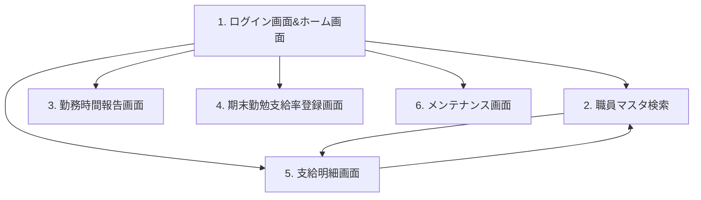

# 画面要件定義書

- 文書版：0.1
- 対象：非常勤給与アプリ
- 定義範囲：画面一覧および画面間の遷移
- 本書は画面要件を定義するものであり、実装済みであることを示すものではない。

## 1. 画面一覧

| No. | 画面ID | 画面名 |
|---|---|---|
| 1 | SCR-001 | ログイン画面&ホーム画面 |
| 2 | SCR-002 | 職員マスタ検索 |
| 3 | SCR-003 | 勤務時間報告画面 |
| 4 | SCR-004 | 期末勤勉支給率登録画面 |
| 5 | SCR-005 | 支給明細画面 |
| 6 | SCR-006 | メンテナンス画面 |

ログイン画面とホーム画面は、現段階では一つの画面項目（SCR-001）として整理する。両者の内部遷移や認証の詳細は本書では定義しない。

## 2. 画面遷移図

矢印は遷移方向を表す。職員マスタ検索と支給明細画面の間は、相互に遷移できる。

## 3. 画面遷移一覧

| No. | 遷移元 | 遷移先 |
|---|---|---|
| 1 | SCR-001：ログイン画面&ホーム画面 | SCR-002：職員マスタ検索 |
| 2 | SCR-001：ログイン画面&ホーム画面 | SCR-003：勤務時間報告画面 |
| 3 | SCR-001：ログイン画面&ホーム画面 | SCR-004：期末勤勉支給率登録画面 |
| 4 | SCR-001：ログイン画面&ホーム画面 | SCR-005：支給明細画面 |
| 5 | SCR-001：ログイン画面&ホーム画面 | SCR-006：メンテナンス画面 |
| 6 | SCR-002：職員マスタ検索 | SCR-005：支給明細画面 |
| 7 | SCR-005：支給明細画面 | SCR-002：職員マスタ検索 |

## 4. 未定義事項

以下は今後定義する。未定義であることは、その機能や遷移を禁止することを意味しない。

- 各画面からホーム画面へ戻る遷移。
- 遷移を実行するボタン名・操作方法。
- 画面間で引き継ぐ情報（選択職員、対象年月、検索条件など）。
- 権限による表示・遷移制御。
- モーダル、条件分岐、外部処理。
- 各画面の入力項目・表示項目・詳細機能。

## 5. 変更履歴

| 文書版 | 変更内容 |
|---|---|
| 0.1 | 指定された6画面と7方向の遷移を初版として定義。 |
