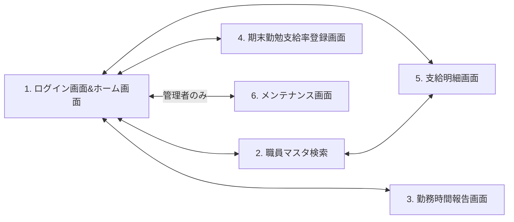

# 画面要件定義書

- 文書版：0.2
- 対象：非常勤給与アプリ
- 定義範囲：画面一覧、画面遷移、操作、引継ぎ情報、権限制御
- 本書は画面要件を定義するものであり、実装済みであることを示すものではない。

## 1. 画面一覧

| No. | 画面ID | 画面名 |
|---|---|---|
| 1 | SCR-001 | ログイン画面&ホーム画面 |
| 2 | SCR-002 | 職員マスタ検索 |
| 3 | SCR-003 | 勤務時間報告画面 |
| 4 | SCR-004 | 期末勤勉支給率登録画面 |
| 5 | SCR-005 | 支給明細画面 |
| 6 | SCR-006 | メンテナンス画面 |

ログイン画面とホーム画面は、一つの画面項目（SCR-001）として整理する。以下の画面遷移の起点・戻り先は、SCR-001内のホーム画面とする。ログイン画面とホーム画面の内部遷移や認証の詳細は別途定義する。

## 2. 画面遷移図

各画面名のボタンでホーム画面から対象画面へ遷移し、各画面の「ホーム」ボタンでホーム画面へ戻る。双方向矢印は往路・復路をまとめて示し、方向別の操作は「3. 画面遷移・操作一覧」に定義する。

画面2は画面3の左に配置する。Mermaid内の不可視リンク（~~~）は配置調整用であり、画面2から画面3への遷移を意味しない。

ホーム画面のメンテナンス画面ボタンは、管理者以外には非活性で表示する。画面2～5で扱う職員データの範囲は「5. 権限制御」に従う。

## 3. 画面遷移・操作一覧

### 3.1 ホーム画面からの遷移

ホーム画面に、画面2～6の各画面名を表示したボタンを設置する。

| 遷移元 | ボタン名 | 操作 | 遷移先 | 条件 |
|---|---|---|---|---|
| SCR-001：ホーム画面 | 職員マスタ検索 | クリック | SCR-002：職員マスタ検索 | ログイン済み |
| SCR-001：ホーム画面 | 勤務時間報告画面 | クリック | SCR-003：勤務時間報告画面 | ログイン済み |
| SCR-001：ホーム画面 | 期末勤勉支給率登録画面 | クリック | SCR-004：期末勤勉支給率登録画面 | ログイン済み |
| SCR-001：ホーム画面 | 支給明細画面 | クリック | SCR-005：支給明細画面 | ログイン済み |
| SCR-001：ホーム画面 | メンテナンス画面 | クリック | SCR-006：メンテナンス画面 | ログイン済みかつ管理者。管理者以外はボタン非活性 |

### 3.2 ホーム画面へ戻る遷移

画面2～6の各画面に「ホーム」ボタンを設置する。

| 遷移元 | ボタン名 | 操作 | 遷移先 |
|---|---|---|---|
| SCR-002：職員マスタ検索 | ホーム | クリック | SCR-001：ホーム画面 |
| SCR-003：勤務時間報告画面 | ホーム | クリック | SCR-001：ホーム画面 |
| SCR-004：期末勤勉支給率登録画面 | ホーム | クリック | SCR-001：ホーム画面 |
| SCR-005：支給明細画面 | ホーム | クリック | SCR-001：ホーム画面 |
| SCR-006：メンテナンス画面 | ホーム | クリック | SCR-001：ホーム画面 |

### 3.3 職員マスタ検索と支給明細画面の相互遷移

| 遷移元 | 遷移先 | 引き継ぐ選択情報 | 操作 |
|---|---|---|---|
| SCR-002：職員マスタ検索 | SCR-005：支給明細画面 | 職員番号、支給対象月 | ボタン名・操作方法は別途定義 |
| SCR-005：支給明細画面 | SCR-002：職員マスタ検索 | 職員番号、支給対象月 | ボタン名・操作方法は別途定義 |

対象職員は、ログインアカウントに紐づく所属部署と一致する非常勤職員に限定する。

## 4. 画面間で引き継ぐ情報

| 適用範囲 | 情報の区分 | 項目 | 要件 |
|---|---|---|---|
| ログイン後の全画面間 | ログイン職員のアカウント情報 | 氏名、メールアドレス | 画面遷移後も同じログイン職員の情報を保持する |
| SCR-002 ⇄ SCR-005 | 画面で選択した職員情報 | 職員番号、支給対象月 | 選択した職員・支給対象月を遷移先へ引き継ぐ |

ログイン職員のアカウント情報と、画面で選択した非常勤職員の情報は区別して扱う。所属部署・管理者区分はログインアカウントに紐づけて権限判定に使用し、その取得元・判定方法は別途定義する。

## 5. 権限制御

| 対象 | 要件 |
|---|---|
| 閲覧可能なデータ | ログインアカウントに紐づく所属部署と、非常勤職員の所属部署が一致するデータのみ閲覧可能 |
| 編集可能なデータ | 同じ所属部署の非常勤職員データのみ編集可能。各画面で提供する編集機能の詳細は別途定義 |
| 職員データを伴う画面遷移 | 同じ所属部署の非常勤職員を対象とする場合のみ遷移可能。画面2と画面5の相互遷移にも適用 |
| メンテナンス画面への遷移 | 管理者のみ遷移可能 |
| ホーム画面のメンテナンス画面ボタン | 管理者には活性、管理者以外には非活性で表示 |

所属部署による制限は、検索結果・一覧表示・対象職員の参照・更新・画面遷移に共通して適用する。画面遷移で引き継いだ職員番号だけを根拠に、別部署の職員データを表示・編集できないこと。

管理者が他部署の職員データを扱える例外は、現時点では定義しない。管理者であることによる所属部署制限の解除は、本書の要件に含めない。

## 6. 別途定義する事項

- モーダル、条件分岐、外部処理の詳細。本書で確定した所属部署・管理者の制限を前提とする。
- 各画面の入力項目・表示項目・詳細機能。
- 職員マスタ検索と支給明細画面を相互に遷移する際のボタン名・操作方法。
- ログイン認証、所属部署・管理者区分の取得元と判定方法。
- 職員番号・支給対象月が未選択の場合の動作、未保存データがある場合の遷移時の扱い。

## 7. 変更履歴

| 文書版 | 変更内容 |
|---|---|
| 0.2 | 画面2を画面3の左へ配置。ホームの各画面名ボタン、各画面のホームボタン、アカウント・選択職員情報の引継ぎ、所属部署制限、管理者限定メンテナンス遷移を定義。別途定義事項を整理。 |
| 0.1 | 指定された6画面と7方向の遷移を初版として定義。 |
