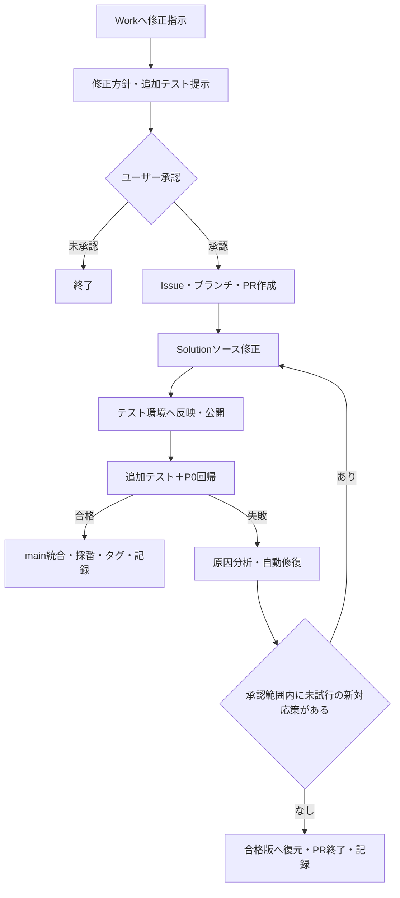

# Power Apps無人修正・テスト・公開基盤 要件定義書 v1.03

更新日：2026-09-15  
対象リポジトリ：`hirokazu601218/PowerAppsCanvasAppUI`

## 1. 目的

ChatGPT Sol Workに対する自然言語の修正指示を起点として、職員マスタ検索Power Appsのソース修正、テスト環境への反映、無人E2Eテスト、失敗原因の分析と自動修復、合格版の保存・公開・版管理・実行記録を一連で実施できる基盤を構築する。

ユーザーはスマートフォンから修正内容を指示し、修正方針を1回承認する。承認後は、承認範囲内の処理をテスト用公開まで無人で継続する。

## 2. 現状と課題

### 2.1 構築済み

- 公開済みテストアプリ：`ハンドメイド職員マスタ検索`
- App ID：`0e5f5c05-b67d-4a27-af71-ebe5e5381221`
- 環境ID：`2fa12587-ea8f-ee93-ac2f-054f6b7fe2bb`
- GitHub ActionsとMicrosoft Power Platform Playwright samplesによる無人E2E
- 専用テスト利用者によるヘッドレス認証
- 既存P0回帰テスト
- スクリーンショット、動画、トレース等の証跡取得
- 固定Issueへの結果通知

### 2.2 不足

- URL直接指定による無変更Solutionのexport/import/publish基線は成立したが、編集可能Canvasソースから意味差分なくアプリを再構成する方式は未確定である。
- 変更要求ごとの追加テスト生成、失敗分析、自動修復、合格版への復元がない。
- 指示単位のIssue、作業ブランチ、PR、成功版タグを連携する仕組みがない。
- GitHub上のv1.11とP0合格済み公開アプリが同一内容か未確認である。

## 3. 基本方針

1. GitHubのmainをソースと文書の共有正本とする。
2. P0合格済み公開アプリを初期基準としてSolution化し、Dataverse URL直接指定の無変更export/import/publish基線を維持したうえで、既存GitHub v1.11との差分を確認する。
3. Canvas appの外部編集方式は無変更配布基線から分離して選定し、隔離テスト環境で意味差分のない再構成を実証してから採用する。ネイティブGit統合は前提条件と費用を満たす段階まで保留する。
4. `pac canvas pack/unpack` を中核方式にせず、PAC CLI 2.12.2で確認済みの同一失敗を単純再試行しない。
5. GitHub Actionsは決定的なビルド、Solution反映、テスト、証跡作成を担当する。
6. ChatGPT Sol Workは要求整理、修正方針提示、ソース修正、テスト追加、失敗分析、自動修復、結果報告を統括する。
7. テスト用アプリと本番アプリの公開権限を分離し、本番公開は自動化しない。
8. 資格情報、実データ、環境固有の秘密値をGitHubへコミットしない。

## 4. 対象範囲

### 4.1 初期対象

- 職員マスタ検索アプリ
- 同アプリを含むアンマネージドSolution
- 画面定義、App定義、Power Fx、Solution内の必要部品
- GitHub Actions、追加E2Eテスト、既存P0回帰テスト
- 指示単位のIssue、作業ブランチ、PR、Gitタグ
- 実行概要、全試行、証跡リンク、復元記録
- 個別承認済みの隔離テストアプリに対する専用テスト利用者の `CanView` 初期設定と読戻し検証

現行の実装は、保持した元msappに対する既存コントロール・既存プロパティの承認済み変更を対象とする。新規コントロールや構造変更を一般コンパイルする機能は含まず、未対応の変更は配布前に停止する。Workが要求の分析と修復判断を担当し、Actionsは決定的な実行と復元を担当する。詳細は [運用手順](../operations/staff-master-unattended-runbook.md) を参照する。

### 4.2 将来対象

設定追加により、同一リポジトリ内の別Power Appsを対象へ追加できる構造とする。

### 4.3 対象外

- 本番アプリの自動公開
- Power Platform環境設定の自動変更
- 利用者、ロール、権限の自動変更（ただし、個別承認済みの隔離テストアプリに対する専用テスト利用者の `CanView` 初期設定・冪等確認を除く）
- 接続、接続資格情報、テナント認証ポリシーの自動変更
- 実データを使った無人テスト
- 承認範囲を超える仕様変更

## 5. 全体フロー

## 6. 機能要件

| ID | 要件 |
|---|---|
| AUT-001 | このWorkへの自然言語の修正指示を処理の起点とする。 |
| AUT-002 | 実行前に、目的、変更対象、変更内容、影響範囲、追加テスト、対象外を含む修正方針を提示する。 |
| AUT-003 | ユーザーの明示承認を取得するまでGitHubおよびPower Appsを変更しない。 |
| AUT-004 | 承認後は、承認範囲内の修正、自動修復、再テスト、テスト用公開まで追加確認なしで継続する。 |
| AUT-005 | 承認範囲外の部品、環境、権限、接続の変更が必要になった場合は処理を停止して確認する。 |
| AUT-006 | 指示ごとにGitHub Issueを作成し、要求、修正方針、承認記録、実行状態を保持する。 |
| AUT-007 | 指示ごとにmainから作業ブランチを作成し、PRを作成する。mainを直接編集しない。 |
| AUT-008 | P0合格済み公開アプリをアンマネージドSolutionへ追加し、承認済みの再構成可能な形式でGitHubへ初期取込みする。ネイティブGit統合は基本方針3のとおり保留する。 |
| AUT-009 | 初期取込み時に公開アプリ由来ソースと既存GitHub v1.11を比較し、差分と採否を記録する。 |
| AUT-010 | GitHubのSolutionソースからテスト用Solutionを再現可能にパックする。 |
| AUT-011 | 専用サービスプリンシパルを使用して、テスト環境へのSolution反映と公開を無人実行する。 |
| AUT-012 | サービスプリンシパルのID、秘密値、テナント情報はGitHub SecretsまたはVariablesで管理し、ログへ出力しない。 |
| AUT-013 | 修正指示ごとに受入条件を作り、必要な追加テストを実装する。 |
| AUT-014 | 各候補版について、指示別追加テストと既存P0回帰テストの両方を実行する。 |
| AUT-015 | 追加テストまたはP0回帰テストのいずれかが不合格の場合、候補版を合格としない。 |
| AUT-016 | 失敗時は、テストケースID、失敗工程、期待値、実結果、エラー、スクリーンショット、トレースを用いて原因を分析する。 |
| AUT-017 | 原因が承認範囲内のアプリ、Power Fx、Solution部品にある場合は修正し、Solution反映から再実行する。 |
| AUT-018 | 同一原因は「テストケースID＋失敗工程＋正規化したエラー内容」で識別する。 |
| AUT-019 | 同一原因が2回連続しても、承認範囲内に未試行で実質的に異なる対応策がある場合は、既試行との差を記録して続行する。同じ対応策の単純反復は禁止し、新対応策がない場合に自動修復を停止する。 |
| AUT-020 | 自動修復停止時は、テスト用アプリを直前の合格版へ自動復元する。 |
| AUT-021 | 停止時は失敗記録をIssueとPRへ残し、PRを閉じ、作業ブランチは保持する。 |
| AUT-022 | 全テスト成功時だけPRをmainへ自動統合し、成功版を0.01刻みで採番して同名のGitタグを付ける。現行v1.11の次はv1.12とする。 |
| AUT-023 | 成功時はテスト用アプリを保存・公開し、公開版、コミット、タグ、Actions実行を相互に追跡可能にする。 |
| AUT-024 | Issueへ修正概要、変更ファイル、全試行、各原因、修復内容、テスト結果、復元または公開結果、PR、コミット、タグ、Actions、証跡リンクを記録する。 |
| AUT-025 | 個別承認された場合に限り、固定した隔離テスト環境・App ID・専用テスト利用者を対象に `CanView` を冪等付与し、読戻し検証する。`CanEdit`、別アプリ、別利用者への拡大は拒否する。 |

## 7. 非機能要件

| ID | 区分 | 要件 |
|---|---|---|
| NFR-001 | セキュリティ | テスト利用者とSolution配布用サービスプリンシパルを分離し、必要最小限の権限を付与する。 |
| NFR-002 | セキュリティ | 認証失敗時にMFA、Security Defaults、条件付きアクセス、利用者権限を自動変更しない。 |
| NFR-003 | 監査性 | 指示、承認、変更、試行、結果、公開・復元の時系列をIssueで永久保存する。 |
| NFR-004 | 証跡 | スクリーンショット、動画、トレース、PlaywrightレポートをActions artifactとして14日保持する。 |
| NFR-005 | 再現性 | mainのSolutionソース、Gitタグ、設定ファイルから成功版を再構築できる。 |
| NFR-006 | 復旧性 | 各実行開始前に直前合格タグを記録し、その版へ自動復元できる。 |
| NFR-007 | 排他制御 | 同一アプリへの修正・配布ワークフローは同時実行せず、後続実行を待機または停止する。 |
| NFR-008 | 完全性 | Solutionのパック、インポート、公開、E2Eの各結果を個別に判定し、未実行を合格として扱わない。 |
| NFR-009 | 障害分離 | GitHub、Power Platform、認証、ネットワーク等の基盤障害をアプリ不具合と区別する。 |
| NFR-010 | 安全停止 | 権限不足、秘密値欠落、外部サービス停止、承認範囲外変更、復元失敗時は自動変更を継続せずIssueへ記録する。 |
| NFR-011 | 保守性 | 対象アプリ、Solution、URL、テストセットを設定ファイル化し、将来アプリを追加できる。 |
| NFR-012 | 操作性 | 最終結果はこのWorkで、結果、版、公開状態、試行回数、Issue、PR、Actions、残件を短く報告する。 |
| NFR-013 | 権限境界 | 隔離テストアプリの共有処理は対象環境、App ID、利用者、`CanView` を固定し、付与前後の値を検証する。テナント管理ロール、Client Secret、基準・本番アプリの共有設定を変更しない。 |

## 8. 状態管理

| 状態 | 意味 |
|---|---|
| PLANNED | 修正方針を提示済み、承認待ち |
| APPROVED | ユーザー承認済み |
| MODIFYING | ソース・追加テストを修正中 |
| DEPLOYING | Solutionをテスト環境へ反映・公開中 |
| TESTING | 追加テストとP0回帰を実行中 |
| REPAIRING | 原因分析と自動修復中 |
| SUCCEEDED | 全テスト成功、main統合・タグ・公開・記録完了 |
| RESTORED | 修復停止後、直前合格版への復元完了 |
| BLOCKED | 権限、接続、基盤障害、範囲外変更等で停止 |
| RESTORE_FAILED | 合格版への復元に失敗し、人による対応が必要 |

## 9. 合否基準

### 9.1 個別変更

次をすべて満たした場合だけ合格とする。

1. 承認された受入条件をすべて満たす。
2. 指示別追加テストがすべて成功する。
3. 既存P0回帰テストがすべて成功する。
4. Solutionのパック、反映、公開が成功する。
5. テスト対象のApp ID、環境ID、コミットが記録と一致する。
6. Issue、PR、Actions、証跡が相互参照できる。

### 9.2 基盤完成

次を実証した場合に基盤完成とする。

1. 公開アプリをSolution化してGitHubへ取り込める。
2. 作業ブランチ上の小変更をテストアプリへ自動反映できる。
3. 成功ケースで追加テストとP0回帰を通過し、main統合、v1.12タグ、公開、Issue記録まで完了できる。
4. 意図的な不合格ケースで原因分析と自動修復を1回以上実行できる。
5. 同一原因が反復した場合に同じ対応策を繰り返さず、未試行の新対応策があれば続行し、対応策が尽きた停止ケースでは合格版への復元、PR終了、ブランチ保持、Issue記録を確認できる。
6. 承認範囲外変更と認証失敗で安全に停止できる。

## 10. 前提・初期設定

- Power Platform環境でDataverse SolutionとDataverse URL直接指定のexport/importが利用できること。
- 公開アプリの所有者または共同所有者権限を持つ利用者が、初回のSolution追加を実施できること。
- 専用サービスプリンシパルをMicrosoft Entra IDへ登録し、対象環境へ追加できること。
- GitHub Actionsから使用するサービスプリンシパルへSolution反映に必要な最小権限を付与できること。
- 隔離テストアプリのP0に必要な場合、ユーザーの個別承認後に専用テスト利用者へ `CanView` を設定できること。
- 既存P0テスト用Secretsが有効であること。
- Solution内に実データや資格情報を格納しないこと。

## 11. 未実装事項

本書更新時点では次が未実施である。

- 公開アプリ由来ソースと既存GitHub v1.11の差分照合
- PAC CLI 2.12.2のCanvas pack失敗を回避する、編集可能Canvasソースからの再構成・公開方式の選定と実証
- 指示別Issue、ブランチ、PR、採番、タグの自動化
- 原因指紋、自動修復、復元処理
- 小変更を含む成功シナリオと、意図的失敗・復元シナリオの基盤受入試験

## 12. 公式技術根拠

- [Power Apps：Canvas app source code files](https://learn.microsoft.com/en-us/power-apps/maker/canvas-apps/power-apps-yaml)
- [Power Platform：Git integration overview](https://learn.microsoft.com/en-us/power-platform/alm/git-integration/overview)
- [Power Platform CLI：pac solution](https://learn.microsoft.com/en-us/power-platform/developer/cli/reference/solution)
- [Power Platform CLI：pac auth](https://learn.microsoft.com/en-us/power-platform/developer/cli/reference/auth)
- [Power Apps：Canvas app export/import overview](https://learn.microsoft.com/en-us/power-apps/maker/canvas-apps/export-import-app)
- [Power Apps PowerShell support](https://learn.microsoft.com/en-us/power-platform/admin/powerapps-powershell)
- [Set-AdminPowerAppRoleAssignment](https://learn.microsoft.com/en-us/powershell/module/microsoft.powerapps.administration.powershell/set-adminpowerapproleassignment?view=pa-ps-latest)

## 変更履歴

| 版 | 日付 | 内容 |
|---|---|---|
| 1.03 | 2026-09-15 | 承認済みCLI代替経路とAUT-008の整合、現行ブリッジの対応範囲、WorkとActionsの役割を明記 |
| 1.02 | 2026-09-15 | 個別承認済みの隔離テストアプリに限る専用テスト利用者のCanView初期設定、固定境界、読戻し検証を追加。URL直接指定の無変更配布基線成立を反映 |
| 1.01 | 2026-09-15 | 同一原因が2回続いても、承認範囲内の未試行の新対応策があれば継続する規則へ更新 |
| 1.00 | 2026-09-15 | ユーザーとの要件確認結果を初版として整理 |
