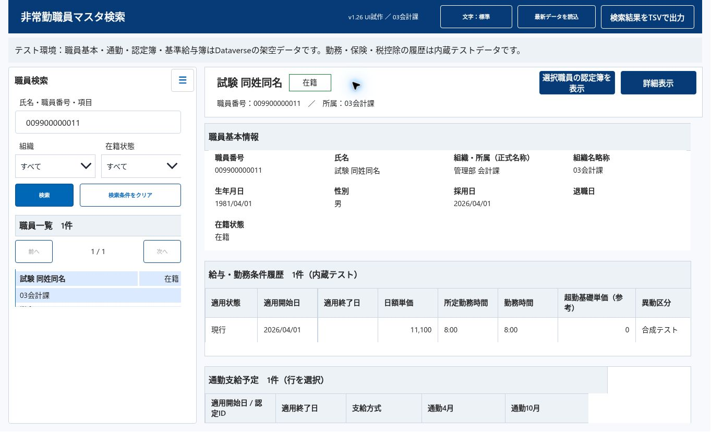

# 現行v1.26プロファイルでの追加検証（2026-09-19）

## 結果
累積 **PASS66 / NOT_RUN14 / BLOCKED4 / FAIL2 / EXCLUDED9**。全件完了ではない。旧版の継承結果と現行プロファイル結果を区別する。

今回DATA-04、PATCH-03、PATCH-04を現行プロファイルで追加合格。旧v1.11の新規画面貼付や任意のYAML部品置換が合格したとは扱わない。

- DATA-04：給与調整額-12,345、在宅勤務0、退職日空欄、300文字備考の全文到達。総額242,655、控除10,000、差引/振込232,655を独立期待値と照合。コピー用テキスト欄のControl+End/ArrowUpによる全文表示を本Workの画面で目視確認。標準ツールチップの表示は確認できず、タイトル属性だけで合格にしない。
- DATA-05部分：給与163項目の見出し・値・順序・X/幅を独立した元項目定義とfixtureに照合し全一致。全セクション統合と本番未確定列は合格を主張しない。
- PATCH-03：実Studioの読戻しに対し、基準一致で適用、同一targetの二重適用でALREADY_APPLIED/write=false。Screen1の657部品は全文一致。異なるローカル文字列の静的対照はBASELINE_MISMATCH/write=false。
- PATCH-04：D2試験を元App.Formulas19443文字へ復元・保存・公開。Screen1全1444226文字も完全一致。公開Playerの通常7件004選択、011検索1件/右サマリー011を確認。後続の二重適用確認は非公開、終了時に再び元式へ完全復元保存。

## 試験データ補正
初回D2試験では指定総額と差引を更新し、振込額・被課税金額は元fixtureのままだった。この不一致は試験データの問題で製品不具合ではない。後続試験では振込額232655・被課税金額242655へ補正して公開し、163項目を全一致確認した。法定計算の正解を示さない。

## 復元とアクセス
Microsoftの再認証を完了した後に公開Playerの署名済み画面を確認。Studio操作が自動承認で「未保存状態の喪失リスク」として拒否された際は、GitHubの元式を読戻して19443文字一致を確認し、直接保存という安全な操作で解消。拒否を迂回する操作なし。

検証専用コピーは通常データ・一般・03会計課ホームへ復帰。公開版は基準へ復元済み。元アプリ定義、Dataverse、権限、料金設定は変更していない。#62/#64/#66は記録のみ、修正/再試験なし。PDF生成・印刷・保存、HTML帳票PoCなし。バックグラウンドの実行なし。

## 証跡
- d2-expected.json：独立した境界値
- d2-App.Formulas.fx / baseline-App.Formulas.fx：試験/復元式
- d2-patch-manifest.json / property-patch-guard.mjs：単一プロパティ差分の対象と停止条件
- evidence.json：公開画面、163項目、二重適用、復元の実測
- restored-search.png：個人アカウント領域を除いた復元済み011検索画面

## 残18項目
| ID | 判定 | 残る条件 |
|---|---|---|
| SRC-02 | NOT_RUN | 現行部品版と全プロパティの独立台帳を整え照合。 |
| DEP-01 | NOT_RUN | 専用複製の空画面で貼付導入し公式エラー・警告を記録。 |
| DEP-03 | NOT_RUN | 専用複製で旧版と候補画面の非破壊共存を確認。 |
| INIT-02 | NOT_RUN | PDFを除き、別の新規アプリセッションで再起動後の全初期条件を照合。既存試験は同じpageでの再navigation。 |
| DATA-05 | NOT_RUN | 全セクションの見出し・値・型・順序を独立台帳と統合照合。 |
| DETAIL-04 | NOT_RUN | 通勤を含む全履歴の左右端、列位置、全セルを照合。 |
| LED-05 | NOT_RUN | 閉じた後のフォーカス復帰はv1.25で確認済み。#62に該当するTab背面移動は対応不要。残る背面クリック不可の全条件の証跡整理のみ。 |
| VIS-01 | NOT_RUN | 8条件の全画面画像・全モーダルを基準に照合。 |
| VIS-02 | NOT_RUN | 氏名・所属の8条件は確認済み。長い備考の全文到達が未検証のため項目全体は未完。 |
| VIS-04 | NOT_RUN | 8条件ですべての履歴の縦横スクロールと最終セルを確認。 |
| VIS-05 | BLOCKED | 現行v1.22の承認済み画像ベースライン未確立 |
| VIS-06 | NOT_RUN | 文字の実寸、強弱、余白の校正と人による見やすさ確認。 |
| ACC-03 | NOT_RUN | 3モーダルの起点復帰は合格。#62のTab背面移動は対応不要として保留。残りの操作順と可視フォーカスの未記録分を整理。全面合格にはしない。 |
| ACC-04 | BLOCKED | Cloud Browserで200%ズーム操作が反映されず。viewport縮小を代用PASSにしない |
| ACC-06 | BLOCKED | 実支援技術を使う人による読上げ評価が未実施 |
| PATCH-02 | NOT_RUN | 専用複製で差分適用後の2形式比較・スモーク。 |
| OPS-02 | NOT_RUN | スマホでサニタイズ済み要約と代表画像の閲覧を確認。 |
| HAR-03 | BLOCKED | 通知幅故障注入の適合した方法を確立する。 |

基準追加の許可待ちは解除済み。人の可読性/読上げ/スマホ確認、承認画像、独立コンテキストと指定表示条件は未充足。全プロパティ独立台帳、導入・併存・完全版との比較、全セクション項目照合、Notify幅変異も残る。
