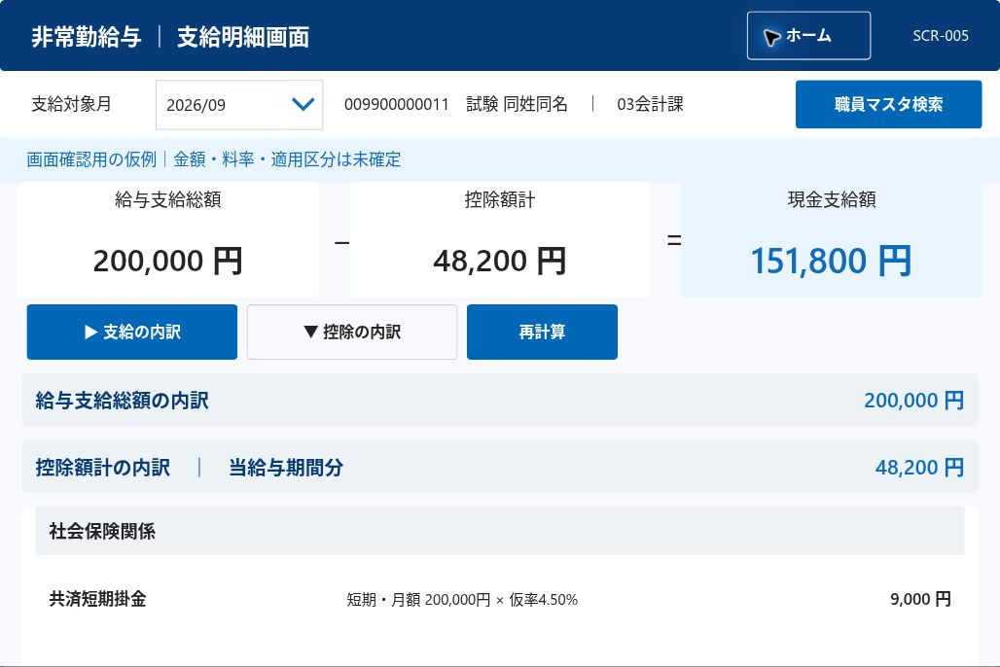

# v1.22 → v1.23 全回帰・複数幅検証（Issue #54）

## 判定

全回帰の最終完了判定は未達。自動化した実行セットと、試験仕様書95項目の充足率は別に扱う。全期待値を確認していない項目をPASSにしない。

- 開始：2026-09-18 04:23:59 UTC。停止期限：05:23:59 UTC（60分を延長しない）。
- 対象：StaffMaster-Automation-Test、公開UI試作v1.22と回帰修正版v1.23。Dataverseは架空fixture、追加5画面は承認済みダミー計算・仮登録。
- 権限追加・実テーブル書込みなし。Issue #51 ABS-RATE-001は未反映のまま。

## 実行記録

| 実行 | 対象 | 結果 | 内容 |
|---|---|---|---|
| ローカル基盤 | 現行main | 50/50 PASS | `python -m unittest discover -s tests/automation -v` |
| [35307403100](https://github.com/hirokazu601218/PowerAppsCanvasAppUI/actions/runs/35307403100) | 公開v1.22 | 15 PASS / 9 FAIL（24件） | 初回。旧認定簿部品名、隠れた操作部品の期待値、画面遷移待ちの試験コード不一致を検出。小数点表示のアプリ不具合も検出 |
| [35308661584](https://github.com/hirokazu601218/PowerAppsCanvasAppUI/actions/runs/35308661584) | 公開v1.23 第1候補 | 19 PASS / 6 FAIL（25件） | 8条件＋追加5画面×4幅、選択残留修正はPASS。未反映の初期化・113列書式、帳票試験コードの残り不一致を検出 |
| [35309682325](https://github.com/hirokazu601218/PowerAppsCanvasAppUI/actions/runs/35309682325) | 公開v1.23 最終候補 | 実行中 | 全7プロパティ読戻し一致後の最終試験。結果確定後に追記 |

初回FAILを後続PASSで消去しない。試験コード修正は、現行v1.21の読戻しソースと実機表示を根拠に実施。値照合の期待値をアプリの誤表示に合わせる変更はしていない。

## 複数幅・文字サイズ

| 対象 | 条件 | 判定済み実行 |
|---|---|---|
| 職員検索 | 1366×768 / 1920×1080 × 標準/大文字 × 検索欄開/閉（8条件） | 第1・第2回とも8/8 PASS |
| ホーム、勤務時間報告、期末勤勉支給率、支給明細、メンテナンス | 900×600 / 1100×800 / 1366×768 / 1920×1080（5画面×4幅=20表示） | 第2回4/4パラメーター試験、20/20表示の幾何学検査PASS |

確認内容：基本9項目のラベル/値配置、横スクロール最終給与項目、氏名サマリー固定、閉じる到達、追加画面の主要ボタン重なり、支給サマリー固定、内訳最下項目到達。viewport・DPR・ブラウザー版・フォントは第2回以降の`*-environment.json`に保存。ブラウザー100%・Linux既定倍率。200%ブラウザーズームは別途BLOCKEDで、幅縮小や帳票倍率200%を代用しない。

上記は最終候補のStudio実画面。上部サマリーと操作ボタンを目視確認。20表示分のActions画像すべてを目視済みという意味ではない。

## 修正

1. BUG-SELECTION-001：011の支給明細→検索0件→ホーム→支給明細で旧職員と金額が残った。UiSelectedとUiTargetKeyを検索の共通選択状態へ統一。最終候補では管理者の仮入力初期化も同じ選択を解除。追加の回帰ケースを実装。
2. BUG-DECIMAL-001：給与詳細112/113列の整数0が「0.」になる。整数は`#,##0`、小数は最大10桁の既存書式で表示。独立fixtureの「0」という期待値を維持。

## 公開・ソース

v1.23第1候補は04:52:50 UTC、最終候補は05:08:43 UTCのPublish successfulを確認。最終候補はApp checker数式エラー0、7変更プロパティすべてStudio読戻しと一致。

- ソース：`src/screen-ui/v1.23/patches.json`、`manifest.json`、`studio-readback/`。
- 最終試験コード：Git SHA `f05ea7ef8a812ac86d772bd475cd37721108332b`。
- 既存v1.21の651コントロールを保持、v1.22ナビ6個と合わせScreen1は657個。残り3画面の未変更ソースはv1.22の読戻しを参照。
- 公式msappの再ダウンロード比較、隔離複製への復元試験は未実施。旧canvas-v3を現行版として再配布しない。

## 全仕様の残件

[95項目の一覧](spec-case-audit.md) / [機械可読データ](spec-case-audit.json)。部分実施は注記し、全期待結果が揃わなければNOT_RUN。主な制約は、保存先フロー、20/21/40名や長文の専用fixture、200%拡大、実支援技術、OS印刷、画像ベースライン、復元・故障注入用複製。これらが残るためCORE/REPORT/ACCESSの全面合格を宣言しない。

Actions証跡は各runの`screens-regression-<run_id>`に保存（14日）。番号・氏名・金額は架空fixture。画面のアカウント表示だけをマスク。trace/video/認証stateは成果物に含めない。MCPのZIP取得は返却URLがCloudflare 403となり、この作業環境へのZIP取り込みはBLOCKED。機械判定ログは取得済みで、未取得画像を目視済みとは扱わない。
