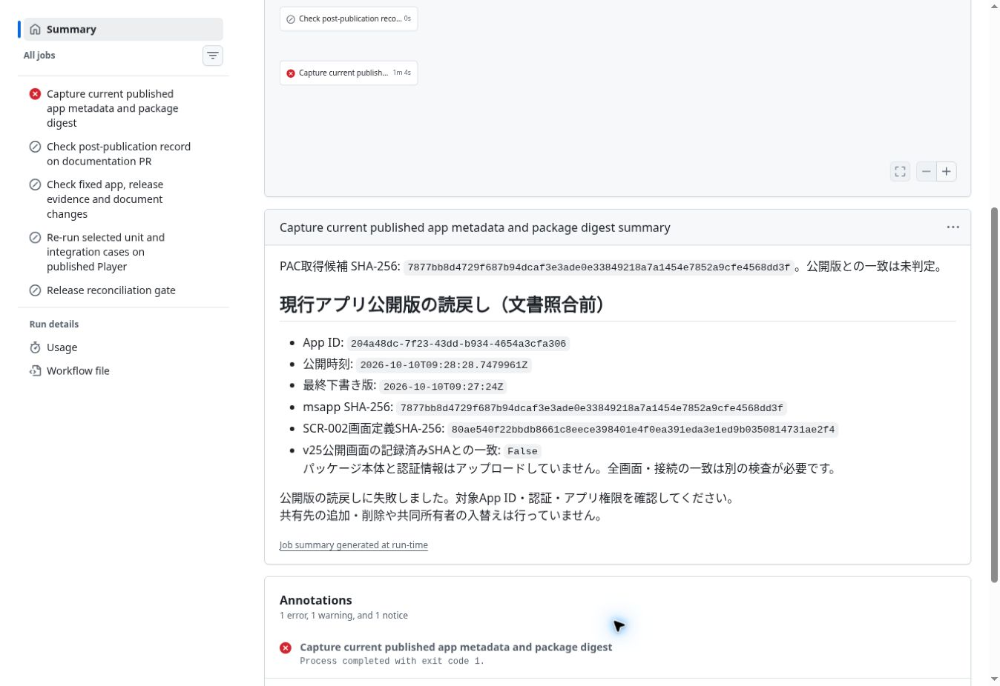

# DOT-001 正式P/Hの読戻し

[Actions run 38049776822](https://github.com/hirokazu601218/PowerAppsCanvasAppUI/actions/runs/38049776822)、head `949a0b5f2445be273504975c938480da7b09719a`。開始11:49 UTC、PAC download完了11:50:46 UTC、旧guard FAIL11:50:48 UTC。対象Appは固定。文書・アプリ・データ・フロー・権限・secretを変更しない既存readback_only=true。

- 正式P：`2026-10-10T09:28:28.7479961Z`。
- 最終下書き：`2026-10-10T09:27:24Z`（P以前）。
- 安定PAC H：`7877bb8d4729f687b94dcaf3e3ade0e33849218a7a1454e7852a9cfe4568dd3f`。
- metadata Ready、fixed app URI、before/after一致は完全summaryに達する前のworkflow assertionsが通過したことをコードとsummaryで確認。環境固有URIは転記しない。
- SCR002実SHA：`80ae540f22bbdb8661c8eece398401e4f0ea391eda3e1ed9b0350814731ae2f4`。旧v25期待SHAとの不一致で採取jobとrunはFAIL。guard変更・再試行なし。
- Hは独立PAC実測後に引継ぎMaker hashとの一致を確認。引継ぎの二画面parsed-source比較と同じパッケージであることを示す。全選定22pathの実比較表や業務受入PASSの代用にはしない。

選定15ケースの3試験ファイルとfull workflowを読んだ。検索・表示・メモリ内fixture切替、再計算表示とスクロールに限定し、永続データ書込み／アプリ公開は含まない。外部同意は検出時に停止する。正式postpublish JSONに必要な選定22pathの実比較証拠をこの採取runだけで作れないため、宣言だけのMATCHを追加せずfull reconciliationはNOT_RUN。引継ぎの手動部分PASS、焦点見切れ／履歴AXの残件は保持。

## 文書・HTML更新後の検査

- 正本文書出典commit：6d203bf29887598555e9eb17383cb433c5228691。生成物commit：8d1a557dac77b62cc7ac30a0423e61386f5990fa、tree c4926ef93db2961aa8372e8840a0527ed5fdbd4d。ローカル全差分とリモートtree一致。
- review46ページ・相対リンク2316・生成一致PASS。要件HTML16ファイル、リンク／画像の相対参照433・出典SHA PASS。
- 単一HTML62資料・3,800,163 bytes、内部参照・重複ID・生成一致PASS。出典画像の相対パスが元Markdown位置のままだったため、HTML配置先から解決するよう生成器を修正し、単一HTMLへ画像を埋め込んだ。
- 既存review15件・governance3件、選定／公開後gateの既存単体23件PASS。試験選定は文書差分のみでsource/test/case空。
- 配置検査の初回FAIL：新run recordの必須versionを欠落。正式Pをversionへ追記して訂正。検査条件・workflow変更なし。
- 実描画・クリック・iPhone実機はNOT_RUN。クラウドブラウザーがfileプロトコルを拒否したため、ローカルHTML表示を迂回せず静的検査結果だけを記録。
