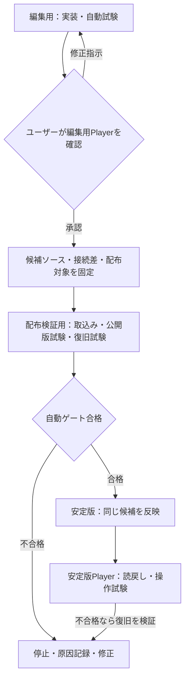

> **廃止済みの運用案（2026-09-26）**。現在は[単一アプリ運用](../../../docs/operations/single-app-workflow.md)を適用する。この文書の3アプリへの配布手順を新規作業に使用しない。以下は2026-09-25時点の経緯として保存する。

# 3アプリ運用・画面確認後の自動配布フロー

> 対象：非常勤給与アプリのSCR-002・SCR-005等の画面変更。2026-09-25にユーザーが確定した運用順序。これは運用要件であり、安定版への自動配布が成立したという実施記録ではない。

## 1. 役割と対象

| 役割 | アプリ | 固定App ID・扱い |
|---|---|---|
| 編集用 | `自動開発_職員マスタ検索_STUDIO_EDIT` | `204a48dc-7f23-43dd-b934-4654a3cfa306`。画面の構築、隔離テストデータでの機能・回帰試験、ユーザーの画面確認に使う |
| 配布検証用 | `DEPLOYPROBE_AUTOPUBLISH_20260924` | `c5dece33-b799-43be-a55b-3344c83979d9`。固定した候補の配布手順、読戻し、失敗時復旧を試す。利用者向けの安定版ではない |
| 安定版 | 現行 `自動開発_職員マスタ検索` | 現行App ID `362ac991-eead-4f07-8373-afdb3ebfdba1`。最終的な利用者向けアプリ。別Workで編集用アプリのコピーを将来の安定版にする案を検討中のため、最終的なApp ID・Solution構成はその判断後に固定する |

GitHubの作業ブランチとアプリのコピーは異なる。3アプリは別ID、別のデータ接続・権限・公開状態を持ち、自動同期されない。編集用のCRUDは隔離したテストレコードに限定し、安定版のDataverseテーブルへは誤接続・誤書込みを許さない。表示・機能の候補は共通ソースで管理し、環境固有の接続差は意図した差分として記録する。

過去の別コピー `DEPLOYPROBE20260924`（`bd256de5-c7a5-4487-9aef-91ee26d4c946`）やハンドメイド版は標準の3アプリ経路に含めない。既存アプリの削除はこの方針から自動的には決まらず、依存・復旧手段・利用状況を確認した別判断とする。安定版と同じSolution範囲の試験に一時コピーが必要なら、一時用途・対象・後片付けを別途記録し、常用の4アプリ目としない。

## 2. 変更の通過順

| 順 | 担当 | ゲート・証跡 |
|---:|---|---|
| 1 | Work | 編集用で実装し、Studio数式・指示別試験・既存P0・対象権限・隔離データへの保存を確認する。未実装のDataverse編集を「保存成功」と表示しない |
| 2 | ユーザー | 編集用の公開Playerで画面・主要操作を確認し、修正指示または次段階への明示承認を返す。Workは候補版、対象画面、残件、次の反映先を提示する |
| 3 | Work | 承認された候補のソース・実行定義・接続差・配布対象App ID・Solution範囲を固定する。承認後にUIまたは機能を変更したら、変更内容に応じて編集用の試験とユーザー確認へ戻る |
| 4 | Work | 配布検証用へ候補を反映し、取込み前の対象ID・差分・必要なDataverse参照・Solution範囲を機械照合する。取込み後はサーバー読戻しと公開Playerの変更・P0を確認し、失敗を意図した復旧試験で元内容へ戻せることを検証する |
| 5 | Work | 安定版固有のSolution構成、接続、権限、公開挙動で配布経路が資格認定された場合だけ、固定候補を安定版へ反映する。検証用の合格を安定版用ガード解除の根拠にしない |
| 6 | Work | 安定版のソース・実行定義・Dataverse参照、公開Playerの画面と主要操作を独立に照合する。不一致なら定めた復旧手順で元内容へ戻し、復旧後Playerまで確認してユーザーへ結果を報告する |

ユーザーの画面確認は編集用で行い、同じ変更を配布検証用と安定版で人手による同内容審査を繰り返さない。一方、後段の自動読戻し・実画面試験は省略しない。次段階への承認は、提示した候補と配布先・影響範囲に限って有効であり、配布先変更、新しいデータ書込み権限・料金・セキュリティ影響、想定外のSolution部品変更は別判断とする。

## 3. 公開境界と停止条件

- この検証環境では、非管理Solutionのimport直後に配布検証アプリがLiveになった。したがって「取込み後、未公開下書きで止めてから確認する」工程を前提にしない。候補固定、ユーザー確認、配布対象の機械検査を**各取込み前**に完了する。配布先ごとの挙動は実測して記録する。
- 取込み後の照合が不合格なら復旧を実行して**元の内容**とPlayer動作を検証する。ただし、一時的に不適合版が利用者に見える時間をゼロには保証できない。履歴の同一版番号へ戻すこととも区別する。
- 2026-09-25時点で、配布検証用への1プロパティ改訂・ライブ反映・失敗時復旧は実証済み。一方、現行安定版のSolutionはCanvasを含むRootComponent計10件であり、Canvas 1件だけの配布検証用Solutionと範囲が違う。**安定版の自動配布資格は未成立**、ガードは有効のまま。別Workで検証中の結果を待ち、合格条件と最終App IDが確定するまで安定版への自動importを起動しない。
- 編集用でのユーザー確認は安定版での業務受入や公開後検証の代替ではない。実機・200%表示・性能・未確定のDataverseテーブル／編集項目などは対象機能ごとの残件として明記する。

## 4. 関連資料

- [画面要件定義書](../../../docs/requirements/screen-requirements.md)：今回の画面変更と編集・読み取り区分。
- [Work運用方針](../../../docs/operations/work-policy.md)：作業・承認・報告の共通規則。
- [無人修正・テスト公開手順](staff-master-unattended-runbook.md)：実行ゲートと結果報告。ただし本書の「ユーザーの画面確認→候補固定→配布検証」を当該変更に追加する。
- [最新の作業状況](../../../docs/handoff/STATUS.md)と[軽量版PR #73](https://github.com/hirokazu601218/PowerAppsCanvasAppUI/pull/73)：配布資格・アプリ構成の実績。履歴記録と今回確定した将来運用を混同しない。
